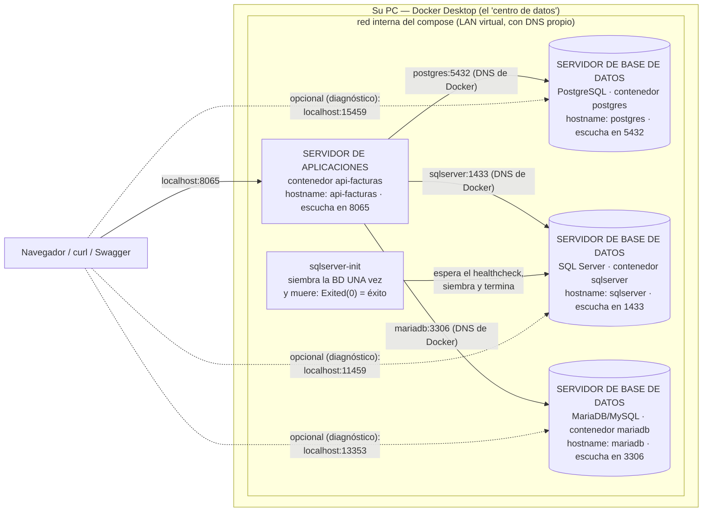

# Conceptos de Docker — imagen, contenedor, volumen, compose y Kubernetes

> Documento conceptual del curso. En la v1 usted ya usó Docker (el
> `docker compose up -d --build` que levanta la BD y la API); aquí está el
> mapa completo de conceptos, con los ejemplos de este proyecto.

---

## 1. ¿Qué problema resuelve Docker?

"En mi máquina sí funciona." Cada estudiante tiene un PC distinto (Windows,
versiones, configuraciones) y un software como PostgreSQL instalado a mano
se comporta distinto en cada uno. Docker empaqueta el software **con todo
su entorno** en una unidad estándar que corre igual en cualquier máquina.
En este curso: nadie instala PostgreSQL ni .NET — todos corren **los mismos
contenedores**.

## 2. Imagen

Una imagen es una **plantilla inmutable y empaquetada**: un sistema de
archivos congelado (SO base + programa + librerías + configuración) más
metadatos (qué comando arrancar, qué puerto expone).

- **Inmutable**: una vez construida, no cambia. Cambiar algo = construir
  OTRA imagen.
- Se construye en **capas** (cada instrucción de un `Dockerfile` es una
  capa que se cachea — por eso las reconstrucciones son rápidas).
- Viene de un **registro** o se construye localmente. Este proyecto usa de
  ambas: `postgres:16-alpine` viene del registro de
  Microsoft; la de la API **se construye** con el `Dockerfile` de
  `api_facturas/` (base: `dotnet/sdk:10.0`).

**Analogía:** la imagen es el **molde de la galleta**.

## 3. Contenedor

Un contenedor es una **instancia viva de una imagen**: un proceso corriendo
con su propio sistema de archivos, red y espacio de procesos, aislado del
resto de su PC.

- De una imagen salen **muchos contenedores** (galletas del mismo molde).
  En los proyectos gemelos del curso pasa de verdad: el motor y su
  inicializador son DOS contenedores de la MISMA imagen. Aquí PostgreSQL
  no necesita inicializador — pero nada impide levantar dos `postgres`
  del mismo molde.
- Es **efímero y desechable**: `docker compose down` los destruye sin
  drama, y `up -d` los recrea idénticos.
- **No es una máquina virtual**: comparte el kernel del host con
  aislamiento de procesos. Por eso arranca en segundos (y PostgreSQL
  alpine pesa ~50 MB: motores hay de todos los tamaños — SQL Server, que
  llegará en otra versión, pide ~2 GB él solito).

**Analogía:** el contenedor es la **galleta**.

## 4. Volumen (y el estado)

Si los contenedores son desechables… ¿dónde viven los datos? En
**almacenamiento que sobrevive al contenedor**:

| Mecanismo | Qué es | En este proyecto |
|---|---|---|
| **Volumen nombrado** | Espacio administrado por Docker, montado dentro del contenedor | `pgdata` — los datos de PostgreSQL (por eso `down`/`up` los conserva) |
| **Bind mount** | Una carpeta de SU disco montada dentro del contenedor | `./api_facturas:/app` (el código entra al contenedor y `dotnet watch` lo vigila) · `./db/bdfacturas_postgres.sql:…initdb.d/…:ro` (el script que la BD auto-ejecuta al nacer, solo lectura) |
| **Volumen anónimo** | Un hueco sin nombre que "tapa" una subcarpeta del bind mount | `/app/bin` y `/app/obj` — los compilados de Linux quedan DENTRO del contenedor, sin mezclarse con los de Windows |

**La regla de oro que ata los tres conceptos:** *la imagen es inmutable, el
contenedor es desechable, y el volumen es lo único que debe importarte
perder.*

```
Dockerfile   →  IMAGEN      →  CONTENEDOR   →  VOLUMEN
(receta)        (molde)        (galleta)       (la memoria)
             docker build    docker run       -v / volumes
```

> **La sorpresa que confunde a todo el mundo:** el volumen sobrevive
> INCLUSO a borrar la carpeta del proyecto. Si usted borra la carpeta,
> vuelve a hacer `git clone` y ejecuta `docker compose up -d --build`,
> la BD arranca **con los datos de la última vez** — no con las semillas.
> ¿Por qué? El volumen no vive en la carpeta: vive en el área de Docker,
> identificado por el nombre del proyecto compose (= el nombre de la
> carpeta). Misma carpeta → mismo nombre → mismo volumen de siempre.
>
> | Comando | ¿Y los datos? |
> |---|---|
> | `docker compose up -d --build` | Se conservan |
> | `docker compose down` | Se conservan |
> | borrar la carpeta y re-clonar | **Se conservan** (el volumen no estaba ahí) |
> | `docker compose down -v` | **SE BORRAN** — el único que resetea |
>
> Para una demo con las semillas exactas:
> `docker compose down -v` y luego `docker compose up -d --build`.

### El despliegue de ESTE proyecto, dibujado (Mermaid)

Todo lo anterior, junto: lo que `docker compose up -d` levanta aquí es un
**sistema de servidores en miniatura** — cada contenedor es un servidor
con su propio hostname, unidos por la red interna del compose:



**Guía de lectura:** los servicios se hablan entre sí **por nombre**
(el DNS interno de Docker resuelve `postgres`, `api-facturas`, etc. a la
IP del contenedor — jamás `localhost`, que dentro de un contenedor es él
mismo). Hacia su PC solo existen las puertas `localhost:PUERTO` que el
compose publica. Por eso este mismo diseño se despliega igual en un
servidor real: cambiar de máquina no cambia la arquitectura.


## 5. Docker Compose (el "un solo comando" del proyecto)

**Compose** es la respuesta **declarativa** a "¿cómo levanto varios
contenedores en orden, con sus puertos, volúmenes y dependencias?": un
archivo `docker-compose.yml` declara el estado deseado del sistema y
`docker compose up -d` lo materializa. Es **declarativo, no imperativo**:
usted no escribe los pasos, escribe el resultado (el mismo espíritu de SDD).

### El `docker-compose.yml` de ESTE proyecto, por piezas

**El motor (imagen del registro + volumen + healthcheck):**

```yaml
  postgres:
    image: postgres:16-alpine
    environment:
      POSTGRES_PASSWORD: "Diseno123!"
      POSTGRES_DB: bdfacturas_postgres_local
    volumes:
      - pgdata:/var/lib/postgresql/data   # volumen nombrado: los datos sobreviven
      - ./db/bdfacturas_postgres.sql:/docker-entrypoint-initdb.d/bdfacturas_postgres.sql:ro
    ports:
      - "15459:5432"                 # "puerto en su PC : puerto interno"
    healthcheck:                     # ¿la BD ya RESPONDE consultas?
      test: ["CMD-SHELL", "pg_isready -U postgres -d bdfacturas_postgres_local"]
```

**La particularidad (agradable) de PostgreSQL:** ejecuta AUTOMÁTICAMENTE
los scripts montados en `/docker-entrypoint-initdb.d/` la primera vez
(cuando el volumen de datos nace vacío) — por eso este proyecto no
necesita contenedor inicializador. Otros motores (SQL Server, cuando
llegue) no tienen ese mecanismo y exigen un contenedor que se conecte,
corra el script UNA vez y muera: un patrón de Docker que este curso
conocerá por contraste.

**La API (imagen construida + código montado + hot-reload):**

```yaml
  api-facturas:
    build: ./api_facturas            # se construye con SU Dockerfile
    volumes:
      - ./api_facturas:/app          # guardar un .cs → dotnet watch recompila
      - /app/bin                     # volúmenes anónimos: compilados de Linux
      - /app/obj                     #   sin mezclarse con los de Windows
    ports:
      - "8065:8065"
    environment:
      # El host es el NOMBRE del servicio (postgres), no localhost:
      ConnectionStrings__Postgres: "Host=postgres;Port=5432;…"
    depends_on:
      postgres:
        condition: service_healthy
        # ↑ arranca cuando la BD ya RESPONDE (y ya se sembró sola)
```

Las tres ideas que este archivo demuestra:

1. **Dos redes de nombres**: hacia su PC, puertos publicados
   (`localhost:8065`, `localhost:15459`); entre contenedores, nombres de
   servicio (`postgres:5432`). El mismo motor tiene dos "direcciones"
   según quién lo llame.
2. **Dependencias con condiciones**: `service_healthy` (el motor
   responde) — la API no arranca "por azar" sino cuando su prerequisito
   está listo. (`service_completed_successfully`, la condición para
   contenedores que terminan, llegará con el inicializador de SQL Server.)
3. **Desarrollo dentro del contenedor**: código montado + `dotnet watch` =
   guardar recompila, sin reconstruir la imagen. Solo se reconstruye
   (`--build`) cuando cambian el `.csproj` o el Dockerfile.

### Contenedores huérfanos y `--remove-orphans`

Compose recuerda qué contenedores creó para este proyecto (los marca con el
nombre de la carpeta). Si el `docker-compose.yml` **deja de declarar** un
servicio que antes existía, su contenedor queda **huérfano** y Compose lo
avisa al arrancar. No estorba (está detenido), pero ocupa disco. La
limpieza:

```powershell
docker compose up -d --remove-orphans   # levanta lo declarado Y borra los huérfanos
```

Importante: borra los **contenedores** sobrantes, no los **volúmenes** —
los datos de la BD siguen ahí (sección 4).

## 6. Kubernetes (y por qué este curso NO lo necesita)

Kubernetes (K8s) es el orquestador de contenedores **a escala de clúster**:
reparte contenedores entre muchas máquinas, escala réplicas según demanda,
reprograma lo que se cae. Compose y K8s no compiten: Compose orquesta **en
una máquina**; K8s orquesta **un clúster**.

| Kubernetes resuelve… | ¿Existe ese problema aquí? |
|---|---|
| Repartir contenedores entre muchas máquinas | No — todo corre en su PC |
| Escalar a N réplicas cuando sube el tráfico | No — el "tráfico" es usted con curl |
| Alta disponibilidad (un nodo muere → reprogramar) | No — si su PC se apaga, se acabó la clase |
| Despliegue continuo sin caída | No — "actualizar" es guardar y que recompile |
| Secretos, RBAC, múltiples equipos | No — credenciales didácticas, un usuario |

**La regla profesional:** Compose para desarrollo local y sistemas de un
host; Kubernetes cuando se necesita más de una máquina. **El puente
conceptual:** ambos son YAML declarativo describiendo estado deseado —
quien domina un compose ya entiende la mitad conceptual de K8s.

## 7. Los comandos que este curso usa (el "pastel" — en inglés: cheat sheet)

```powershell
docker ps                        # qué está corriendo (con -a: también lo detenido)
docker stop X / docker start X   # apagar / encender (los datos se conservan)
docker logs X                    # ver la salida del contenedor (errores incluidos)
docker exec X comando            # ejecutar algo DENTRO del contenedor
# … y los de todos los días en este proyecto:
docker compose up -d --build     # materializar el docker-compose.yml (con rebuild)
docker compose ps -a             # estado de los servicios (el init debe estar Exited 0)
docker compose logs api-facturas # la salida de un servicio (errores incluidos)
docker compose down [-v]         # apagar todo (-v: borrar también los volúmenes = reset BD)
docker compose up -d --remove-orphans  # además, borrar contenedores huérfanos (sección 5)
```

## 8. ¿Hace falta una cuenta de Docker?

**No.** Las imágenes que usa este proyecto son **públicas**: se descargan sin
registrarse, sin iniciar sesión y sin pagar nada.

Al abrir Docker Desktop puede aparecer una ventana pidiendo *Sign in* o
*Create an account*. **Ciérrela, o escoja «Continue without signing in».**
Todo funciona igual.

### ¿Y si ya tiene cuenta y entra con ella?

**También funciona**, y hasta ayuda un poco: Docker Hub le da un límite de
descargas más alto a quien tiene la sesión abierta que a quien descarga de
forma anónima.

Lo que **no** conviene es ponerse a **crear** una cuenta cuando ya está
trabajando. Son minutos gastados en algo que no hacía falta, y en una clase o
en una entrega esos minutos se sienten.

### Lo único que sí es obligatorio

**Que Docker Desktop esté encendido.** Ábralo y espere a que termine de
arrancar: el icono de la ballena, abajo a la derecha, deja de moverse.

Si Docker está apagado, cualquier comando responde algo así:

```
error during connect: ... the docker daemon is not running
```

Ese mensaje **no es un problema del proyecto**: es Docker que no está
corriendo. Enciéndalo y repita el comando.

---

## 9. Referencias

1. Docker — *Docker overview*: <https://docs.docker.com/get-started/docker-overview/>
2. Docker — imágenes y contenedores: <https://docs.docker.com/get-started/docker-concepts/the-basics/what-is-a-container/>
3. Docker — volúmenes: <https://docs.docker.com/engine/storage/volumes/>
4. Docker Compose: <https://docs.docker.com/compose/>
5. Kubernetes — *Overview*: <https://kubernetes.io/es/docs/concepts/overview/>
6. En este repositorio: el `docker-compose.yml` de la raíz (comentado) y
   el [README](../README.md).
