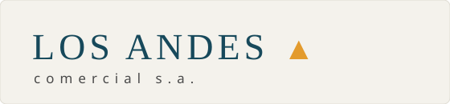
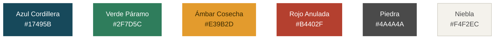

# Manual de Identidad Visual Corporativa — Comercial Los Andes S.A.

> **Marca HIPOTÉTICA del curso.** Comercial Los Andes S.A. es la empresa
> semilla (`E001`) de `bdfacturas`: una comercializadora que factura
> productos de tecnología. Este manual define su identidad para que el
> **front (v6)** no se decore al gusto de cada quien: la marca también es
> especificación. Estructura calcada de un manual de identidad real
> (portada → logosímbolo → planimetría → paleta → grises → tipografía →
> usos → aplicaciones → anotaciones).

---

## 1. El logosímbolo

La marca es **tipográfica**: "LOS ANDES" en versalitas serif + el ▲ (la
montaña) en Ámbar Cosecha — el único adorno permitido. En el front se
construye con texto y CSS; estos SVG son la referencia oficial:

| Positivo (fondos claros) | Negativo (el header del front) |
|:---:|:---:|
|  |  |

**Versión mínima** (favicon/pestaña, y por debajo del tamaño mínimo):

## 2. Planimetría, tamaño mínimo y área de reserva

- **Área de reserva:** alrededor del logosímbolo se reserva un espacio
  igual a la altura de la letra "A" del logotipo (el valor X del manual).
  En el front: `padding` del encabezado ≥ 16 px a cada lado.
- **Tamaño mínimo en pantalla:** 120 px de ancho la versión horizontal;
  por debajo de eso se usa la versión mínima (▲).

## 3. Paleta de colores institucionales

| Color | Hex | Papel en el front |
|---|---|---|
| **Azul Cordillera** | `#17495B` | Primario: encabezado, títulos, botones principales |
| **Verde Páramo** | `#2F7D5C` | Éxito: confirmaciones, estado "activa" |
| **Ámbar Cosecha** | `#E39B2D` | Acento: el ▲ de la marca, foco y resaltados |
| **Rojo Anulada** | `#B4402F` | Peligro: errores, botón de anular/eliminar, estado "anulada" |
| **Piedra** | `#4A4A4A` | Texto secundario y descriptor de la marca |
| **Niebla** | `#F4F2EC` | Fondo general de las páginas |
| **Blanco** | `#FFFFFF` | Tarjetas, tablas y formularios |

**La paleta, en color:**

Proporción de uso (la regla 60/30/10): 60% Niebla/Blanco (fondos),
30% Azul Cordillera (estructura), 10% Ámbar y estados (acentos).

## 4. Escala de grises y positivo/negativo

- **Escala de grises** (impresión sin color): el Azul Cordillera se
  reemplaza por negro al 80%, el Ámbar por una trama al 30%:

  
- **Positivo:** logotipo Azul Cordillera sobre fondo claro (Niebla/Blanco).
- **Negativo:** logotipo Blanco sobre fondo Azul Cordillera (así va en el
  encabezado del front). El ▲ conserva SIEMPRE el Ámbar en ambos casos.

## 5. Tipografía

| Uso | Familia | Regla |
|---|---|---|
| Logotipo y títulos (h1/h2) | **Georgia** (serif, versalitas en el logotipo) | El aire clásico del manual: seriedad |
| Texto, tablas y formularios | **Segoe UI / system-ui** (sans) | Legibilidad en pantalla |
| Datos monoespaciados (códigos, totales) | **Consolas** | Los números se alinean |

## 6. Usos incorrectos (prohibiciones)

1. NO deformar ni inclinar el logotipo; NO cambiar sus colores.
2. NO poner el logotipo sobre fotografías ni sobre fondos que no sean
   Niebla, Blanco o Azul Cordillera.
3. NO usar el Ámbar como color de texto largo (es acento, no lectura).
4. NO introducir colores fuera de la paleta (si un estado nuevo necesita
   color, se decide aquí primero — el manual también se versiona).

## 7. Aplicaciones digitales (el front del proyecto)

- **Encabezado:** barra Azul Cordillera con el logosímbolo en negativo a
  la izquierda y el usuario autenticado a la derecha.
- **Botones:** primario Azul Cordillera · éxito Verde Páramo · peligro
  Rojo Anulada; esquinas 4 px; texto Blanco.
- **Tablas:** encabezado Azul Cordillera con texto Blanco; filas alternas
  Blanco/Niebla; estado "anulada" en Rojo Anulada.
- **Formularios:** tarjeta Blanca sobre fondo Niebla; el foco de los
  campos en Ámbar Cosecha; errores en Rojo Anulada con texto, no solo
  color.
- **Mensajes:** éxito Verde Páramo · error Rojo Anulada — siempre con
  borde y texto (accesibilidad: el color solo no comunica).

## 8. Anotaciones

1. Toda pieza del front lleva el logosímbolo en el encabezado; el ▲ es la
   versión mínima para la pestaña del navegador.
2. Este manual rige desde la v6 y las versiones siguientes lo heredan;
   cambiarlo es una decisión registrada (4_research del kit vigente).
3. La implementación de referencia vive en `front_flask/static/css/marca.css`
   — las variables CSS llevan los nombres de esta paleta.
