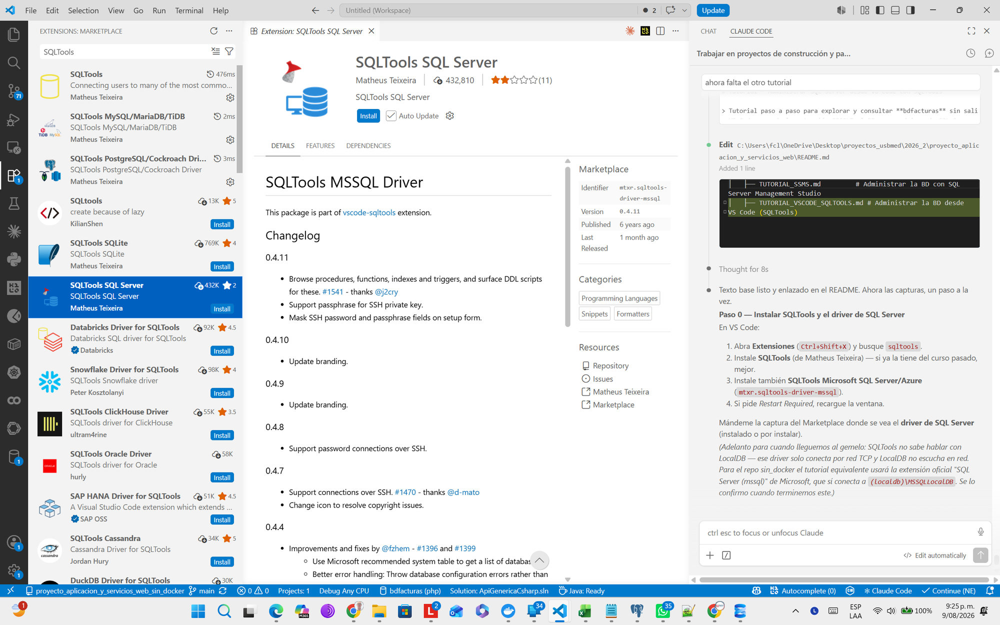
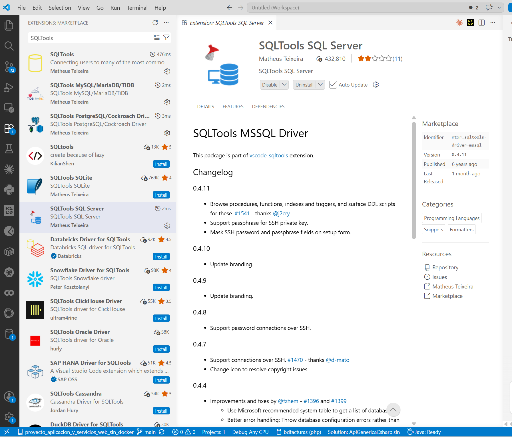
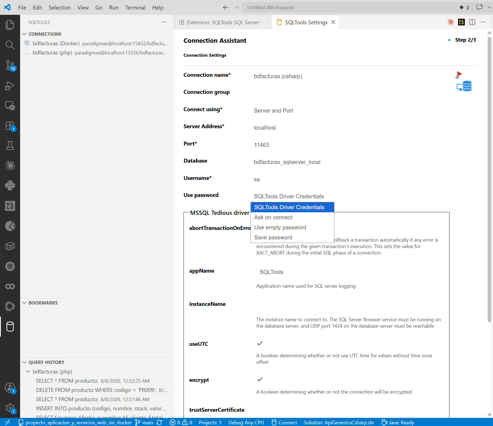
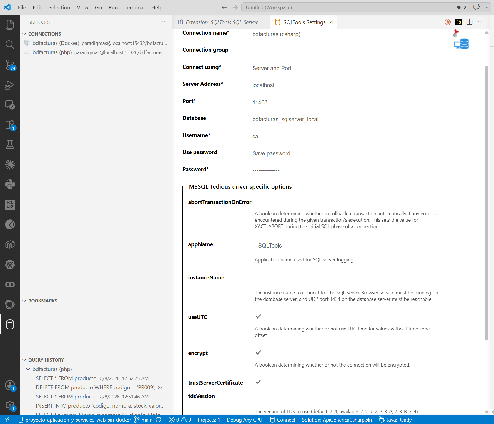
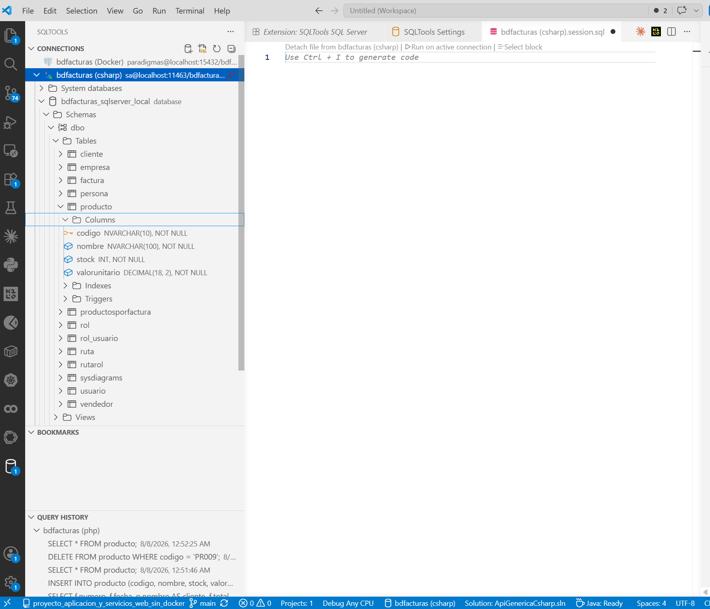
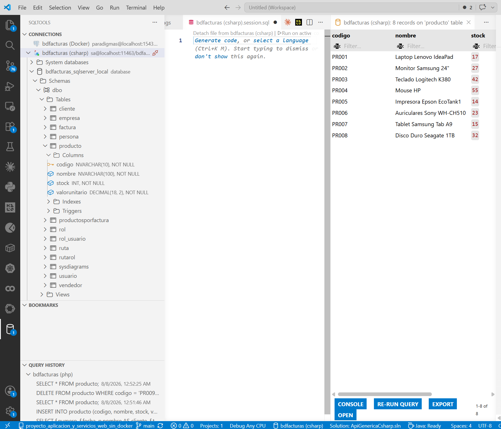
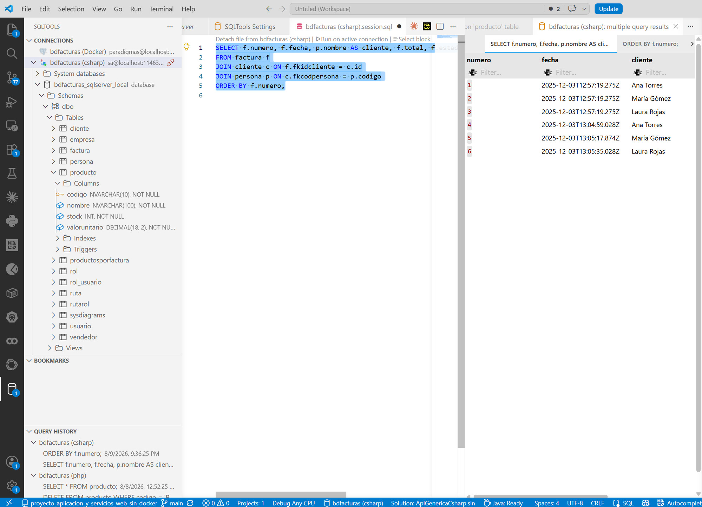
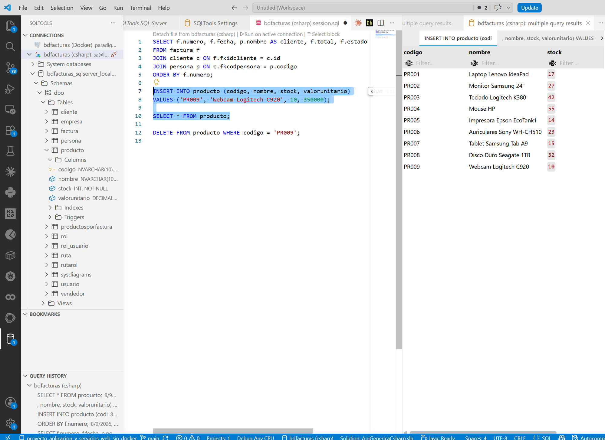
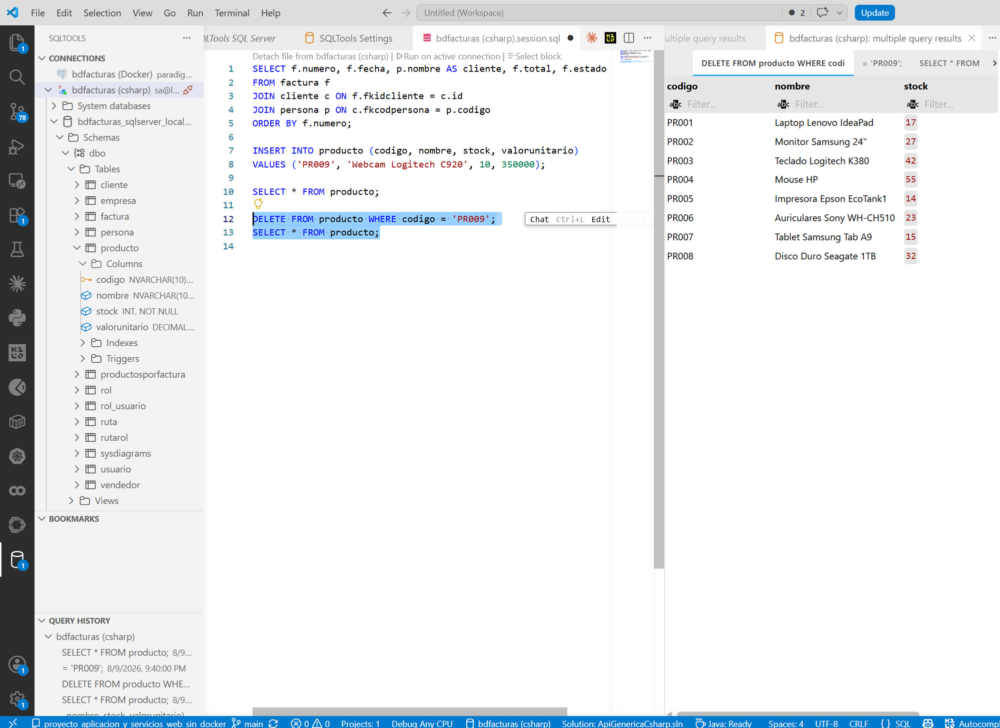

# Tutorial — Administrar PostgreSQL desde VS Code con SQLTools

> Tutorial paso a paso para explorar y consultar **bdfacturas** sin salir de
> VS Code, usando la extensión **SQLTools** con su driver de PostgreSQL.
> Es el camino "de programador": la base de datos en el editor donde ya
> está su código — ideal para consultar mientras programa. (Si prefiere
> una herramienta dedicada, pgAdmin o DBeaver sirven igual con los
> mismos datos de conexión.)
>
> **Prerrequisitos:** VS Code en Windows y el proyecto corriendo
> (`docker compose up -d --build` desde la raíz — ver el
> [README](../README.md)). PostgreSQL queda publicado en `localhost:15459`.

---

## Paso 0 — Instalar SQLTools y su driver de PostgreSQL

Abra la vista de **Extensiones** (`Ctrl+Shift+X`) y busque `sqltools`.
Instale **dos** extensiones (ambas de Matheus Teixeira):

1. **SQLTools** (`mtxr.sqltools`) — el administrador de bases de datos.
2. **SQLTools PostgreSQL** (`mtxr.sqltools-driver-pg`) — el conector
   para PostgreSQL (en el Marketplace aparece como *SQLTools
   PostgreSQL/Cockroach Driver*):



Ojo al elegir: en la lista hay varias extensiones parecidas — la del
curso es la de **Matheus Teixeira**, la misma casa de SQLTools (la
página lo dice: *"This package is part of vscode-sqltools"*; verifique
el identificador `mtxr.sqltools-driver-pg` en el panel Marketplace).

> 💡 **¿Y esa calificación tan baja?** El driver aparece con pocas
> estrellas y apenas un puñado de reseñas — casi todas quejas viejas por
> un error de conexión con PostgreSQL moderno: el del **certificado
> autofirmado y el cifrado**. Ese problema tiene arreglo de una casilla
> (la opción `trustServerCertificate` del paso 1) y este tutorial lo
> deja configurado desde el principio.

> ¿Por qué dos extensiones? SQLTools funciona con **drivers por motor**
> — el mismo patrón del proyecto: un núcleo genérico + un adaptador por
> base de datos. En la lista se ven los demás drivers (PostgreSQL,
> MySQL, SQLite…): si un curso suyo usa otro motor, se instala su
> driver y TODO lo demás de este tutorial sigue igual.

Instalado se ve así (fíjese en el identificador y la versión en el
panel Marketplace):



Si el driver muestra **"Restart Required"**, haga clic ahí (o
`Ctrl+Shift+P` → `Reload Window`): la ventana se recarga en segundos.
Al volver, aparece el **ícono de cilindro** (base de datos) en la barra
lateral izquierda — es SQLTools.

> ⚠️ **El tropiezo clásico:** si instala solo SQLTools y da *Add New
> Connection*, el asistente se queda en *"Couldn't find any installed
> drivers"*. No es un error de la BD: falta la segunda extensión (el
> driver). Instálela y recargue la ventana (`Ctrl+Shift+P` →
> `Reload Window`) — el asistente no detecta drivers sin recargar.

---

## Paso 1 — Crear la conexión a la BD del proyecto

Clic en el **cilindro** de la barra lateral y luego en **Add New
Connection**. El asistente muestra los motores que el driver instalado
sabe hablar — elija **MSSQL**.

Llene el formulario con los datos del `docker-compose.yml`:

| Campo | Valor | Por qué |
|---|---|---|
| Connection name | `bdfacturas (csharp)` | Libre — cómo se verá en el panel |
| Connect using | `Server and Port` | Conexión directa por red |
| Server Address | `localhost` | El puerto está publicado hacia SU PC |
| Port | `15459` | El puerto del host del compose (`15459:1433`) |
| Database | `bdfacturas_postgres_local` | La BD que crea el inicializador |
| Username | `sa` | Usuario administrador del contenedor |
| Use password | `Save password` | Didáctico: credenciales de juguete |
| Password | `Diseno123!` | La del compose |



Y más abajo, en la sección **MSSQL Tedious driver options** (las
opciones específicas del driver, visibles en la captura):

| Opción | Valor | Por qué |
|---|---|---|
| `encrypt` | ✅ (viene marcado) | La conexión viaja cifrada |
| `trustServerCertificate` | ✅ **márquelo usted** | El mismo *Trust Server Certificate* de pgAdmin: el contenedor usa certificado autofirmado — sin esto el test falla |

> El puerto es la clave: **15459, no 1433**. Dentro de la red de Docker
> la BD escucha en 1433, pero hacia su PC el compose la publica en 15459
> (las "dos direcciones" que explica
> [CONCEPTOS_DOCKER.md](CONCEPTOS_DOCKER.md)). La API usa la interna;
> usted, desde Windows, la publicada.

Así se ve el formulario completo, con las opciones del driver abajo
(`encrypt` y `trustServerCertificate` marcados):



Abajo del formulario: **TEST CONNECTION** debe responder *"Successfully
connected!"* en verde; luego **SAVE CONNECTION** y **CONNECT NOW**.

> **Si le sale este error al conectar o al hacer TEST:**
>
> ```
> Error opening connection Failed to connect to localhost:15459
> - self signed certificate; if the root CA is installed locally,
> try running Node.js with --use-system-ca
> ```
>
> Es el certificado autofirmado del contenedor: la conexión quedó SIN el
> `trustServerCertificate`. Arréglelo en este orden:
>
> 1. **Verifique el check:** clic derecho en la conexión (panel del
>    cilindro) → **Edit connection** → baje hasta *MSSQL Tedious driver
>    options* → marque `trustServerCertificate` → **SAVE CONNECTION** y
>    pruebe de nuevo.
> 2. **Si el error sigue** (algunas versiones recientes del driver ignoran
>    el check del asistente): edite la conexión directamente en el
>    settings.json — `Ctrl+Shift+P` → *Preferences: Open User Settings
>    (JSON)* → busque `sqltools.connections` y deje su conexión con el
>    bloque `mssqlOptions` así:
>
>    ```json
>    "sqltools.connections": [
>      {
>        "name": "bdfacturas (csharp)",
>        "driver": "MSSQL",
>        "server": "localhost",
>        "port": 15459,
>        "database": "bdfacturas_postgres_local",
>        "username": "sa",
>        "password": "Diseno123!",
>        "mssqlOptions": { "encrypt": true, "trustServerCertificate": true }
>      }
>    ]
>    ```
>
>    Guarde el archivo y conéctese de nuevo (no hace falta reiniciar VS Code).
> 3. **Si TAMBIÉN falla con el settings.json** (regresión conocida de
>    versiones recientes del driver): instale una versión anterior de la
>    extensión del driver — panel de **Extensiones** (`Ctrl+Shift+X`) →
>    busque **SQLTools Microsoft PostgreSQL/Azure** → clic en el
>    engranaje ⚙ → **Install Specific Version…** → elija una versión
>    anterior a la instalada. VS Code la deja fijada y no la vuelve a
>    actualizar sola.
> 4. **Último recurso** (solo válido porque esta BD es local y de juguete):
>    en el bloque del paso 2 cambie a `"encrypt": false` — sin cifrado no
>    hay certificado que validar. En un servidor real NUNCA se apaga el
>    cifrado; se instala un certificado de verdad.

> En el panel CONNECTIONS pueden convivir varias conexiones suyas a
> distintos servidores — cada una con su motor y su puerto, todas
> conectables a la vez.

---

## Paso 2 — Explorar la base de datos

Con la conexión activa, expanda el árbol en el panel CONNECTIONS:

**bdfacturas (csharp)** → **bdfacturas_postgres_local** → **Schemas**
→ **dbo** → **Tables**, y dentro de **producto** → **Columns**:



Para leer en el árbol:

- En PostgreSQL las tablas viven dentro de un **esquema** — el del
  curso es `dbo`, el esquema por defecto (por eso en pgAdmin las tablas se
  llaman `dbo.producto`).
- En **producto**: la llavecita junto a `codigo` es la **PK**; cada
  columna muestra su tipo y su `NOT NULL` (`NVARCHAR(10)`, `INT`,
  `DECIMAL(18,2)`).
- La tabla también expone sus **Indexes** y sus **Triggers** — los
  triggers de facturación están ahí, visibles desde el editor.
- SQLTools abre además una pestaña `bdfacturas (csharp).session.sql`:
  un archivo de borrador para escribir SQL contra esta conexión (lo
  usamos en el paso 3). Está ignorado en `.gitignore` — es suyo, no del
  repositorio.

Ahora pase el mouse sobre la tabla **producto** y haga clic en el icono
de la **lupa** (magnifier) junto al nombre: SQLTools abre una pestaña
con las filas de la tabla — los **8 productos** de fábrica en una
grilla con filtro por columna y botones **EXPORT** y **RE-RUN QUERY**:



---

## Paso 3 — Consultar con SQL propio

En la pestaña **`bdfacturas (csharp).session.sql`** (si la cerró: clic
derecho en la conexión → *New SQL File*) escriba:

```sql
SELECT f.numero, f.fecha, p.nombre AS cliente, f.total, f.estado
FROM factura f
JOIN cliente c ON f.fkidcliente = c.id
JOIN persona p ON c.fkcodpersona = p.codigo
ORDER BY f.numero;
```

Para ejecutar: deje el cursor sobre la consulta y presione
**`Ctrl+E` `Ctrl+E`** (dos veces seguidas — es un "acorde" de teclas), o
use el enlace **Run on active connection** que aparece arriba del
archivo. Deben salir las 6 facturas con su cliente en una grilla.

> `Ctrl+E Ctrl+E` ejecuta **la consulta donde está el cursor** (o el
> texto seleccionado). Con varias consultas en el mismo archivo,
> seleccione la que quiere y ejecute solo esa.



Para leer en esta pantalla:

- Las **6 facturas** con el nombre del cliente resuelto por el doble
  JOIN (factura → cliente → persona): eso que la tabla guarda como
  `fkidcliente = 3` la consulta lo vuelve "Laura Rojas".
- El panel **QUERY HISTORY** (abajo a la izquierda) va guardando cada
  consulta ejecutada — puede volver a cualquiera con doble clic.

> 💡 Si la pestaña de resultados dice **"multiple query results"** y la
> consulta salió partida en pedazos, es porque ejecutó con el texto
> **seleccionado** y SQLTools partió la selección donde no era. Sin
> problema: los resultados buenos están en la primera sub-pestaña — y
> la próxima vez ejecute con el **cursor** sobre la consulta, sin
> seleccionar nada.

---

## Paso 4 — Insertar y eliminar con SQL

El ciclo completo de escritura, desde el mismo archivo. Escriba estas
consultas DEBAJO de la anterior (cada una se ejecuta por separado):

```sql
INSERT INTO producto (codigo, nombre, stock, valorunitario)
VALUES ('PR009', 'Webcam Logitech C920', 10, 350000);

SELECT * FROM producto;

DELETE FROM producto WHERE codigo = 'PR009';
```

1. Cursor sobre el **INSERT** → `Ctrl+E Ctrl+E` → responde *1 row affected*.
2. Cursor sobre el **SELECT** → `Ctrl+E Ctrl+E` → la grilla muestra
   **9 productos** (apareció PR009):



3. Cursor sobre el **DELETE** → `Ctrl+E Ctrl+E` → *1 row affected*; repita
   el SELECT: **8 productos** otra vez:



En la última captura se lee la historia completa: el **QUERY HISTORY**
registra INSERT → SELECT (con 9) → DELETE → SELECT, y la grilla final
vuelve a los **8 productos** — el ciclo de escritura completo sin salir
del editor.

> El mismo respeto que en pgAdmin: DELETE **siempre con WHERE**. Y la misma
> moraleja: entre el paso 1 y el 3, PR009 también existía para la API
> (`http://localhost:8065/api/producto/PR009`) — un solo dato, muchos
> clientes.

---

## Cierre — ¿pgAdmin o SQLTools?

Los dos hablan el mismo SQL con la misma BD; cambia el contexto:

| | pgAdmin | SQLTools |
|---|---|---|
| Dónde vive | Aplicación de escritorio aparte | Dentro de VS Code |
| Instalación | Instalador de Microsoft | 2 extensiones + conexión |
| Fuerte en | Administrar: diagramas, backup/restore, editar con formularios | Consultar mientras programa; el SQL queda en un archivo |
| Ideal para | Entender y administrar la BD | El día a día escribiendo la API |

No hay que elegir: en este curso conviven. Y la lección de fondo es la
misma de los dos tutoriales: **la base de datos es una sola** — pgAdmin,
SQLTools y la API de C# son solo tres clientes distintos del mismo SQL
Server del compose.

## Resumen

| Paso | Qué aprendió |
|---|---|
| 0 | Instalar SQLTools + driver de PostgreSQL (y el tropiezo del driver faltante) |
| 1 | Crear la conexión (localhost:15459) con test y guardarla |
| 2 | Explorar el árbol: tablas, columnas, PK; la lupa |
| 3 | SQL propio con `Ctrl+E Ctrl+E`: el JOIN de 3 tablas |
| 4 | Ciclo de escritura: INSERT → verificar → DELETE con WHERE |
