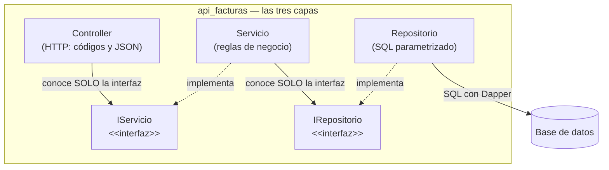

# Constitución del proyecto

> **Documento permanente.** Estas reglas rigen TODAS las versiones del
> curso. Cada versión tiene además su propia especificación en
> [versiones/](versiones/0_mapa_versiones.md); ante conflicto, la
> constitución gana.

---

## Artículo 1 — El curso es POR VERSIONES y la especificación manda

- El sistema se construye por **versiones incrementales** (v1, v2, …), cada
  una con su spec kit propio (documentos 2 a 8). Una versión está TERMINADA
  solo cuando pasa sus criterios de aceptación; entonces se hace commit,
  **tag** (`v1`, `v2`, …) y solo después se escribe la spec siguiente.
- **No se anticipa** (**YAGNI**, *You Aren't Gonna Need It* — "no lo vas a
  necesitar"): nada de fábricas multi-motor, capas "por si acaso" ni tablas
  de más antes de la versión que las pida. El código de cada versión solo
  puede nombrar lo que su spec nombra.
- El repositorio siempre contiene la **versión en curso, funcionando**.

## Artículo 2 — Stack: C# y ASP.NET Core, con el SQL a la vista

- Lenguaje **C#** sobre **ASP.NET Core** (.NET 10): controladores con
  atributos, inyección de dependencias del framework, `async/await` en todo
  el acceso a datos.
- **SIN ORM de entidades** (sin Entity Framework): el SQL se escribe
  A MANO, visible y SIEMPRE parametrizado (`@parametro` — nunca
  concatenar valores). El ejecutor es **Dapper** (micro-ejecutor sobre
  ADO.NET): mapea fila→objeto pero JAMÁS genera SQL por nosotros — si
  una consulta existe, está escrita en el repositorio.
- Paquetes externos permitidos en la v1 (y ninguno más sin que una spec
  lo pida): `Npgsql` (el cliente oficial del motor), `Dapper` (el
  micro-ejecutor) y `Swashbuckle.AspNetCore` (Swagger).

## Artículo 3 — Arquitectura en capas con interfaces, desde el día 1

```
HTTP → Controller (valida el body contra la PETICIÓN del verbo → 422)
     → IServicioProducto      (interfaz — reglas de negocio)
     → IRepositorioProducto   (interfaz — el servicio no sabe qué motor hay)
     → RepositorioProducto<Motor>  (Dapper, SQL a mano parametrizado)
     → la base de datos
```

- El controlador no toca SQL; el servicio no conoce HTTP ni el motor; el
  repositorio no conoce HTTP. Los contratos son `interface` de C#.
- **Solo el ensamblador** (la sección de registro de dependencias en
  `Program.cs`) conoce clases concretas. Todo lo demás recibe interfaces
  por constructor.
- El negocio comunica problemas con excepciones
  (`ArgumentException` → 400 · `NoEncontradoExcepcion` → 404) y el
  controlador las traduce a HTTP.

**La regla del Artículo 3, dibujada** (las flechas son las ÚNICAS
dependencias permitidas — cruzar capas o saltárselas viola la
constitución):



(Los diagramas de este proyecto son **Mermaid**: texto plano que GitHub
dibuja y que una IA lee como parte de la especificación.)

## Artículo 4 — Un solo comando

`docker compose up -d --build` deja TODO el sistema de la versión
funcionando, desde la primera versión. El código va montado como volumen y
corre con `dotnet watch`: guardar un `.cs` recompila y reinicia solo.

## Artículo 5 — La base de datos viene DADA

La BD `bdfacturas` se crea **COMPLETA** (12 tablas, triggers, SPs, datos de
ejemplo) desde la v1, con los scripts provistos en `db/` — se copian, no se
generan. Lo que crece por versiones es la API. El código de cada versión
solo puede nombrar las tablas que su spec le permite.

## Artículo 6 — Todo en español, comentado para principiantes

- Nombres, rutas, mensajes, comentarios y documentación: **en español**.
- El código lleva **comentarios línea a línea**: qué significa cada
  construcción del lenguaje y para qué sirve aquí. El repositorio es
  material de estudio, no solo software.

## Artículo 7 — Contratos exactos

Los endpoints, formatos y códigos de estado de cada versión están en su
`6_contracts.md` y se cumplen **al pie de la letra** — incluido el
contraste didáctico PUT (reemplazo completo → 422 si falta un campo) vs
PATCH (parcial → 200 con el mismo body).

## Artículo 8 — Convenciones fijas

| Cosa | Convención |
|---|---|
| Puertos del proyecto | API facturas **8065** · PostgreSQL **15459** (reservados: front 8030, PostgreSQL 15462, MariaDB 13336) |
| Rutas | `/` (diagnóstico) · `/swagger` (documentación interactiva) · `/api/producto` (v1) |
| Nombres | PascalCase en español; interfaces con prefijo `I`; carpetas `Controllers/ Modelos/ Peticiones/ Servicios/ Repositorios/ Excepciones/ pruebas/` (`Modelos/` = clases entidad; `Peticiones/` = el body de cada verbo) |
| Sobre de respuesta | Lecturas: `{tabla, limite, total, datos}` · Errores: `{estado, mensaje, detalle}` (+ `errores:[…]` en el 422) |
| Errores | Body inválido (la petición) → **422** · `ArgumentException` → **400** · `NoEncontradoExcepcion` → **404** · `NpgsqlException` y demás → **500** |
| Credenciales (didácticas) | BD: `sa` / `Diseno123!` · base `bdfacturas_postgres_local` |
