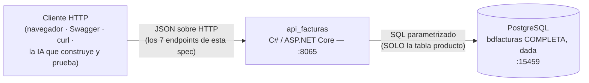

# Especificación — Versión 1 del proyecto: api_facturas con producto + PostgreSQL

> **Versión 1** del desarrollo incremental ([mapa de versiones](../0_mapa_versiones.md)).
> Rige la constitución del proyecto: [../../1_constitution.md](../../1_constitution.md).
> En v1 el sistema completo ES esto: **no existe frontend, y la API solo conoce una entidad y un motor.** (La BD `bdfacturas`
> sí se crea COMPLETA desde el inicio — es infraestructura dada, ver
> [5_data_model.md](5_data_model.md); lo que crece por versiones es la API.)
>
> | Documento de esta versión | Contenido |
> |---|---|
> | **2_spec.md** (este) | QUÉ construir en v1 y sus criterios de aceptación |
> | [3_plan.md](3_plan.md) | CÓMO: stack, estructura y diseño de las capas |
> | [4_research.md](4_research.md) | Decisiones y alternativas *(lectura opcional)* |
> | [5_data_model.md](5_data_model.md) | La BD completa (dada) y la tabla `producto` |
> | [6_contracts.md](6_contracts.md) | Los 7 endpoints con formatos exactos |
> | [7_quickstart.md](7_quickstart.md) | Arranque y smoke test |
> | [8_tasks.md](8_tasks.md) | Orden de construcción por fases verificables |
> | [HISTORIAS_DE_USUARIO.md](HISTORIAS_DE_USUARIO.md) | Las MISMAS exigencias como historias de usuario (tarjetas con criterios) |

---

## 1. Propósito de la v1

Construir la **primera rebanada vertical (corte vertical)** de la API de
facturación en **C# / ASP.NET Core**: el CRUD completo de **una sola
entidad (`producto`)** contra **un solo motor (PostgreSQL)** — pero con la
**arquitectura en capas completa desde el primer día**: controlador →
servicio → repositorio, comunicados por **interfaces de C#**.

> **¿Qué es una "rebanada vertical"?** En lugar de construir el sistema por
> capas horizontales ("primero TODOS los repositorios, luego TODOS los
> servicios…" — donde nada funciona hasta el final), se construye un corte
> que **atraviesa todas las capas de arriba a abajo** para UNA funcionalidad.
> Como una rebanada de pastel: un solo corte, pero con todas las capas.
>
> ```
> ┌─────────────────────────── el sistema completo ───────────────────────────┐
> │  CONTROLLER  │ producto █ │ persona    │ factura    │ ...las demás (v2)   │
> │  SERVICIO    │ producto █ │ persona    │ factura    │ ...                 │
> │  REPOSITORIO │ producto █ │ persona    │ factura    │ ...                 │
> │  BD          │ producto █ │ persona    │ factura    │ ...                 │
> └──────────────┴─────▲──────┴────────────┴────────────┴─────────────────────┘
>                      └── la v1 ES esta rebanada: funciona de punta a punta
> ```
>
> Ventaja: algo funciona **desde la v1** y la arquitectura queda validada —
> si las capas encajan para `producto`, las siguientes rebanadas (v2) caen
> en surcos ya hechos.

La v1 es pequeña a propósito: su valor no está en la funcionalidad sino en
dejar el **esqueleto arquitectónico correcto** sobre el que las versiones
siguientes agregan tablas (v2), motores (v3, v4) y el
frontend Flask (Jinja2) (v6) **sin reescribir lo construido**.

**El contexto de la v1 en un diagrama** (nivel más alto del diseño: el
sistema, sus vecinos y nada más):



**Cómo leer un diagrama de contexto:** las CAJAS son quién participa
(el cilindro es la convención para una base de datos); las FLECHAS son
las conversaciones que cruzan la frontera del sistema, con su idioma
escrito encima. La caja del centro es **lo único que esta versión
construye**: el cliente es de afuera, y la BD viene dada (Artículo 5).
En una frase: *alguien le habla JSON a la API por el 8065, y la API le
habla SQL parametrizado a una BD que ya existe — nada más pasa en la v1.*


## 2. Alcance

**Incluye:**
- CRUD de `producto`: listar, obtener por código, crear, reemplazar,
  actualizar parcialmente, eliminar.
- **Modelo entidad** (`Producto`): la clase con las 4 propiedades tipadas
  (en C#, las propiedades `{ get; set; }` SON los getters/setters del
  lenguaje).
- **Una petición por verbo como frontera de entrada** (`ProductoCrear`,
  `ProductoReemplazo`, `ProductoActualizar`): declaran sus reglas con
  anotaciones (`[Required]`, `[Range]`, `[StringLength]`) y ASP.NET valida
  el body contra ellas → **422 con lista de errores** antes de tocar el
  controlador.
- Capas con interfaces: `IRepositorioProducto` implementada por
  `RepositorioProductoPostgres` (Dapper: SQL a mano); el servicio
  depende de la interfaz.
- Configuración por `appsettings.json`, sobrescribible por variables de
  entorno (`ConnectionStrings__Postgres`) — la vía natural en Docker.
- **Un solo comando** (Artículo 4): `docker-compose.yml` con PostgreSQL +
  su inicializador + la API, de modo que `docker compose up -d --build`
  deja todo funcionando.
- Endpoint `/` de diagnóstico y **documentación interactiva Swagger** en
  `/swagger` (Swashbuckle): los endpoints se ven y se prueban desde el
  navegador.

**No incluye (y es deliberado — ver [mapa de versiones](../0_mapa_versiones.md)):**
- **Ningún frontend** (Flask (Jinja2) llega en v5).
- Endpoints para otras entidades (v2) — las otras 11 tablas EXISTEN en la
  BD, pero el código de la v1 solo puede nombrar `producto`.
- Otros motores y la fábrica de repositorios (v3, v4).
- ORM de entidades (Entity Framework) y autenticación — no son de la
  v1 (Dapper NO es ORM de entidades: es el micro-ejecutor de la
  constitución, Artículo 2).

## 3. Requisitos funcionales

> La v1 usa **los cinco verbos HTTP** (GET, POST, PUT, PATCH, DELETE) y las
> **tres vías de envío de datos**: parámetro de ruta (`/{codigo}`), query
> string (`?limite=N`) y body JSON. Es parte del objetivo didáctico.

### RF1 — Listar productos (GET + query string)
`GET /api/producto` → 200 con envoltura `{tabla, limite, total, datos:[…]}`.
- Query param opcional `limite` (entero > 0, por defecto 1000).
- Tabla vacía → **204** sin cuerpo.

### RF2 — Obtener por código (GET + parámetro de ruta)
`GET /api/producto/{codigo}` → 200 con el producto; inexistente → 404.

### RF3 — Crear producto (POST + body)
`POST /api/producto` con body validado por la petición **ProductoCrear**
(`codigo` 1–10 caracteres, `nombre` no vacío, `stock` entero ≥ 0,
`valorunitario` numérico ≥ 0 — todos obligatorios).
Éxito → 200 `{estado, mensaje}`; body inválido → **422 con la lista de
errores**; código duplicado → 500 con el error del motor en `detalle`.

### RF4 — Reemplazar producto (PUT + body completo)
`PUT /api/producto/{codigo}` con body de la petición **ProductoReemplazo**:
**todos los campos obligatorios** (`nombre`, `stock`, `valorunitario`) —
PUT reemplaza el recurso completo; omitir un campo es 422, no "dejarlo como
estaba". Devuelve `filasAfectadas`; código inexistente → 404.

### RF5 — Actualizar parcialmente (PATCH + body parcial)
`PATCH /api/producto/{codigo}` con body de la petición **ProductoActualizar**:
**campos opcionales** — solo se modifican los enviados (cada uno validado
si llega). Es el contraste didáctico con PUT. Devuelve `filasAfectadas`;
inexistente → 404; body vacío → 400.

### RF6 — Eliminar producto (DELETE)
`DELETE /api/producto/{codigo}`. Devuelve `filasEliminadas`;
inexistente → 404.

### RF7 — Diagnóstico
`GET /` → JSON con mensaje, versión (`"v1"`) y la ruta de los contratos.

## 4. Requisitos no funcionales

- **RNF1 — Capas estrictas:** el controlador no toca SQL; el servicio no
  conoce HTTP ni el motor; el repositorio no conoce HTTP. Contratos con
  `interface` de C#.
- **RNF2 — SQL a la vista:** el SQL se escribe a mano y Dapper solo lo
  ejecuta y mapea (sin Entity Framework); paquetes: `Npgsql`, `Dapper`
  y `Swashbuckle` (Artículo 2).
- **RNF3 — SQL SIEMPRE parametrizado** (`@parametro`); nada de concatenar
  valores.
- **RNF4 — Asíncrona:** todo el acceso a datos con `async/await`.
- **RNF5 — Errores uniformes:** `{estado, mensaje, detalle}` (y
  `errores:[…]` en el 422); ArgumentException→400 ·
  NoEncontradoExcepcion→404 · NpgsqlException y demás→500.
- **RNF6 — Sin anticipación:** ni fábrica multi-motor ni selección de motor
  en v1 (los introduce la v3 cuando exista el segundo motor).

## 5. Criterios de aceptación

> Estos criterios también están expresados como **historias de usuario**
> (formato de tarjeta del curso, con personajes del dominio) en
> [HISTORIAS_DE_USUARIO.md](HISTORIAS_DE_USUARIO.md) — misma exigencia,
> dos lenguajes: el de la spec (para construir) y el de la historia
> (para conversar con el usuario). Si alguna vez se contradicen, se
> corrige una de las dos EN EL MISMO COMMIT.

1. **`docker compose up -d --build` — un solo comando —** deja corriendo
   PostgreSQL (inicializado con el script provisto: 12 tablas), y la API;
   `GET http://localhost:8065/` responde el JSON de diagnóstico. Guardar un
   `.cs` recompila y reinicia solo (dotnet watch).
2. `GET /api/producto` devuelve los 8 productos de ejemplo con
   `{tabla:"producto", total:8, datos:[…]}`, y `GET /api/producto?limite=3`
   devuelve exactamente 3.
3. `GET /api/producto/PR001` devuelve la Laptop Lenovo; `/api/producto/PR999`
   responde 404 con mensaje claro.
4. Ciclo completo con los 5 verbos: `POST` crea `PR009` → `PUT` lo reemplaza
   completo → `PATCH` le cambia solo el stock → `GET` lo confirma → `DELETE`
   lo elimina, y un segundo `DELETE` responde 404. Además, un `PUT` sin el
   campo `nombre` responde 422 (reemplazo completo) mientras el mismo body
   en `PATCH` responde 200 (parcial) — la diferencia entre ambos verbos.
5. La validación de la petición es la frontera: `POST` con `stock: -5` o sin
   `nombre` → 422 con `errores:[…]`; `POST` con `stock: 7.5` o `"texto"` →
   422 (**el tipo también es regla**: la petición declara `int?`); código
   duplicado → 500 con el error del motor en `detalle`.
6. **Prueba de capas:** `dotnet run --project pruebas` (o vía
   `docker compose exec`) ejecuta el servicio con un repositorio FALSO en
   memoria — sin PostgreSQL — y todas las verificaciones pasan.

## 6. Clarificaciones

> **Qué es esta sección:** el registro de las ambigüedades detectadas ANTES
> de planear, con la respuesta que se acordó y su razón. Es **la compuerta
> 1** del método (ver [SDD_SPECKIT](../../../SDD_SPECKIT.md)): mientras
> quede un `[NECESITA ACLARACIÓN: …]` en los requisitos de arriba, esta
> versión no pasa a la planeación.
>
> Las entradas de abajo se reconstruyeron **al cerrar la versión**, a
> partir de las decisiones que sus propios contratos ya dejaban fijadas.
> De aquí en adelante esta sección se llena **en vivo**, antes del
> `3_plan.md` — que es como debe ser.

| # | La pregunta | La respuesta acordada, con su razón | Dónde quedó |
|---|---|---|---|
| C1 | El listado sin filas, ¿es un error o un resultado? | Un resultado: **204 sin cuerpo**. Vacío no es error. | RF de listar · contrato del `GET` |
| C2 | `?limite=0` o negativo, ¿422 o 400? | **400**: la FORMA del dato es correcta (sí es un entero); lo que se rompe es una regla de negocio. El 422 se reserva para el body mal formado. | Contrato del `GET` · convenciones |
| C3 | Un número con decimales o texto donde va un entero, ¿lo rechaza la API o lo deja llegar a la BD? | Lo rechaza la **petición** con 422: el TIPO también es regla, y el valor nunca llega a la BD. | Criterios de aceptación · contrato del `POST` |
| C4 | Crear con una llave que ya existe, ¿409 o 500? | **500**, con el error del motor en `detalle`: la llave la defiende la BD, no la API. Convertirlo en 409 sería lógica de negocio que esta versión no pide. | Convenciones de error · contrato del `POST` |
| C5 | `PATCH` con el body vacío, ¿200 sin hacer nada, o error? | **400**: pedir una actualización sin decir qué actualizar es una regla de negocio rota. | Contrato del `PATCH` |

**Cómo se escribe una entrada nueva:** la pregunta tal como se hizo (no
"revisar el borrado", sino "¿físico o lógico?"), la respuesta **con su
razón**, y el documento donde quedó plasmada. Si la respuesta cambia un
requisito, se corrige el requisito allá arriba: esta sección lo registra,
no lo reemplaza.

## 7. Definición de TERMINADA

Esta versión está terminada — y solo entonces se escribe la spec de la
siguiente — cuando:

1. Todos los **criterios de aceptación** pasan, verificados con el smoke
   test de [7_quickstart.md](7_quickstart.md), **corrido por una persona**.
   "Me funciona" no es evidencia.
2. La lista de [9_checklist.md](9_checklist.md) está en verde y firmada.
3. No queda ningún `[NECESITA ACLARACIÓN: …]` en este documento.
4. Se hace commit y **tag** de la versión, según la
   [constitución](../../1_constitution.md).
