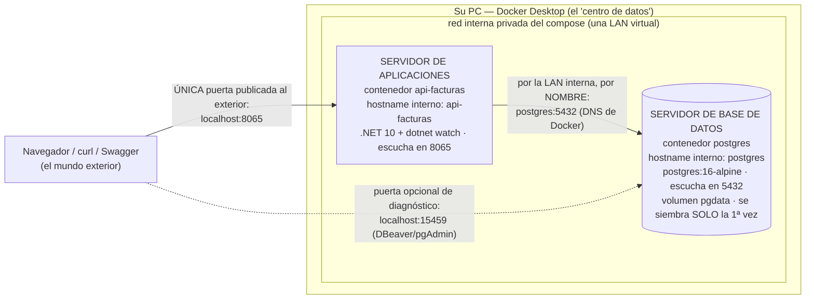
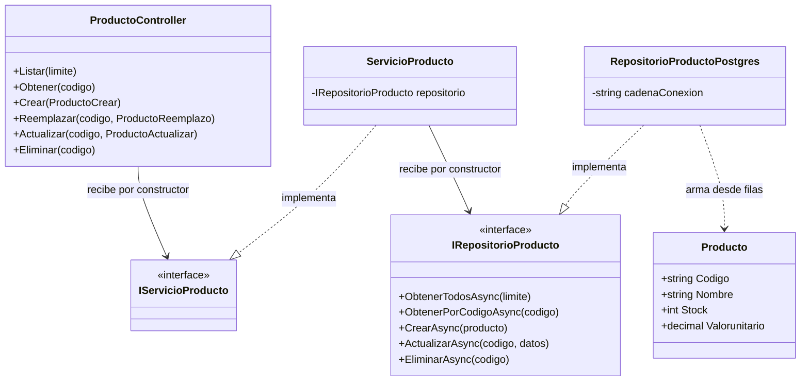
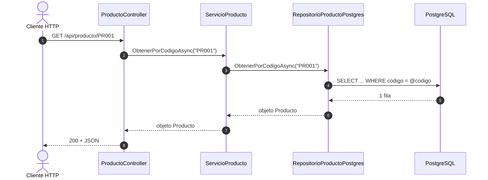

# Plan técnico — Versión 1: producto + PostgreSQL (C#/ASP.NET Core)

> **Versión 1** · CÓMO construir lo especificado en [2_spec.md](2_spec.md).
> El porqué de cada decisión: [4_research.md](4_research.md) · contratos
> exactos: [6_contracts.md](6_contracts.md) · orden: [8_tasks.md](8_tasks.md).

---

## 1. Stack

| Pieza | Elección | Por qué |
|---|---|---|
| Lenguaje / framework | **C# sobre ASP.NET Core (.NET 10)** | El stack del curso; controladores con atributos, DI integrada, async nativo |
| Acceso a datos | **Dapper** sobre `Npgsql`, con SQL parametrizado a mano | SQL visible — Dapper mapea fila→objeto pero NO genera SQL (Art. 2, D1) |
| Validación | **Una petición por verbo** con anotaciones (`[Required]`, `[Range]`…) | El framework valida el body contra la petición y responde 422 — la petición ES la frontera |
| Motor (v1) | **PostgreSQL 2022** (contenedor oficial) | El motor natural del ecosistema .NET; los otros llegan en v3/v4 |
| Contenedor de la API | `mcr.microsoft.com/dotnet/sdk:10.0` + `dotnet watch` | Guardar un `.cs` recompila y reinicia solo (ciclo de desarrollo del curso) |

## 2. Estructura de carpetas

```
(raíz del proyecto)
├── docker-compose.yml                # UN comando: postgres + api (crece por versiones)
├── db/
│   └── bdfacturas_postgres.sql       # la BD completa, PROVISTA (se copia, no se genera)
└── api_facturas/
    ├── ApiFacturas.csproj            # el proyecto .NET (paquetes: Npgsql y Swashbuckle)
    ├── Program.cs                    # punto de entrada: ENSAMBLADOR (DI) + 422 + rutas
    ├── appsettings.json              # cadena de conexión (default localhost:15459)
    ├── Dockerfile                    # sdk:10.0 + dotnet watch (puerto 8065)
    ├── Modelos/
    │   └── Producto.cs               # el MODELO = la ENTIDAD: 4 propiedades tipadas
    ├── Peticiones/
    │   ├── ProductoCrear.cs          # petición del POST (todo obligatorio)
    │   ├── ProductoReemplazo.cs      # petición del PUT (todo obligatorio, sin código)
    │   └── ProductoActualizar.cs     # petición del PATCH (todo opcional)
    ├── Controllers/
    │   └── ProductoController.cs     # HTTP: atributos de verbo, try/catch → códigos
    ├── Servicios/
    │   ├── IServicioProducto.cs      # interface del servicio
    │   └── ServicioProducto.cs       # reglas de negocio; recibe IRepositorioProducto
    ├── Repositorios/
    │   ├── IRepositorioProducto.cs   # interface: 5 métodos de datos (async)
    │   └── RepositorioProductoPostgres.cs   # Dapper + SQL a mano parametrizado
    ├── Excepciones/
    │   └── NoEncontradoExcepcion.cs  # la excepción de negocio que el controller vuelve 404
    └── pruebas/
        ├── PruebaCapas.csproj        # proyecto de consola aparte (criterio 6)
        └── Programa.cs               # el servicio con un repositorio falso, sin BD
```

## 3. Arquitectura en capas (flujo de una petición)

```
HTTP → ASP.NET routing        (los atributos [HttpGet]/[HttpPost]… deciden el método)
     → validación de la PETICIÓN (anotaciones de la petición del verbo → 422 automático)
     → ProductoController     (try/catch: traduce excepciones a códigos HTTP)
     → IServicioProducto      (interfaz — reglas de negocio)
     → IRepositorioProducto   (interfaz — el servicio no sabe qué motor hay detrás)
     → RepositorioProductoPostgres (Dapper + parámetros @)
     → PostgreSQL
```

**Regla de dependencias:** controller → servicio → interfaz de repositorio.
Solo el ENSAMBLADOR (la sección de DI de `Program.cs`) conoce clases
concretas.

### 3.1 Los planos del diseño (Mermaid: texto que la IA también lee)

**Arquitectura de despliegue** — lo que levanta `docker compose up -d`
es un **sistema de servidores en miniatura**: cada contenedor se comporta
como un servidor independiente, con su propio nombre de host, conectados
por una red interna privada — igual que en un centro de datos, pero
dentro de su PC:



**Guía de lectura:** son DOS servidores, no un programa. La API no busca
la BD en `localhost` sino en el hostname `postgres` — Docker tiene su
propio DNS y resuelve el nombre del servicio a la IP interna del
contenedor, como en una red de servidores real. Hacia afuera solo se
publican las puertas que el compose declara (`8065` para usar el
sistema; `15459` solo para inspeccionar la BD con una herramienta). Por
eso el MISMO diseño que corre en su PC se despliega igual en un servidor
de verdad: cambiar de máquina no cambia la arquitectura.

**Diagrama de clases de la rebanada producto** — las dependencias cruzan
por INTERFACES (la D de SOLID, visible):



**Secuencia del camino feliz** — `GET /api/producto/PR001` viajando por
las capas (compárela con las secuencias de ERROR en
[6_contracts.md](6_contracts.md)):



## 4. Decisiones de diseño clave

### 4.1 Interfaces de C# desde v1
```csharp
public interface IRepositorioProducto
{
    Task<List<Producto>> ObtenerTodosAsync(int limite);   // lista de objetos Producto
    Task<Producto?> ObtenerPorCodigoAsync(string codigo); // el modelo, o null
    Task CrearAsync(Producto producto);                   // recibe el modelo
    Task<int> ActualizarAsync(string codigo, Dictionary<string, object> datos); // PUT y PATCH
    Task<int> EliminarAsync(string codigo);
}
```
El servicio recibe **la interfaz** por constructor (la inyecta el
ensamblador). Esto es lo que compra la v3: un segundo motor será otra clase
con `: IRepositorioProducto`. Las lecturas devuelven **objetos del modelo**;
`ActualizarAsync` va con diccionario porque un PATCH puede traer solo
algunos campos.

### 4.2 La validación vive en las PETICIONES (una por verbo)
ASP.NET valida el body contra la petición del verbo ANTES de ejecutar el
método del controlador — el 422 sale solo (personalizado en `Program.cs`
para responder `{estado, mensaje, errores:[…]}`):

- `ProductoCrear`      → POST: todos obligatorios (con código)
- `ProductoReemplazo`  → PUT: todos obligatorios (el código va en la URL)
- `ProductoActualizar` → PATCH: todos opcionales (se valida lo que llegue)

Reglas: `codigo` 1–10 caracteres · `nombre` no vacío · `stock` entero ≥ 0 ·
`valorunitario` numérico ≥ 0. **El tipo también es regla**: `stock` es
`int?` — un `7.5` o un `"texto"` no encajan y caen en 422. (El body vacío
en PATCH es 400 y lo decide el **servicio**: no es un problema de forma
sino de regla de negocio.)

### 4.3 El ensamblador: la sección de DI de Program.cs
```csharp
builder.Services.AddScoped<IRepositorioProducto>(
    _ => new RepositorioProductoPostgres(cadenaConexion));
builder.Services.AddScoped<IServicioProducto, ServicioProducto>();
```
Sin fábrica multi-motor ni selección: v1 tiene UN motor y el código lo dice.
Cuando v3 agregue PostgreSQL, **solo esta sección** se convierte en la
fábrica real — controllers y servicios no se tocan (ese es el examen de la
v3).

### 4.4 SQL del repositorio (Dapper, siempre parametrizado)
```sql
SELECT codigo, nombre, stock, valorunitario FROM producto ORDER BY codigo LIMIT @limite
SELECT … WHERE codigo = @codigo
INSERT INTO producto (codigo, nombre, stock, valorunitario) VALUES (@codigo, @nombre, @stock, @valorunitario)
UPDATE producto SET … WHERE codigo = @codigo_clave   -- los campos que lleguen (PUT: los 3; PATCH: los enviados)
DELETE FROM producto WHERE codigo = @codigo
```
- `LIMIT @limite` es el Top-N del dialecto PostgreSQL (va al FINAL del
  SELECT y acepta parámetro).
- Dapper ejecuta ese SQL tal cual: `QueryAsync<Producto>` para lecturas
  (mapea columna→propiedad por nombre) y `ExecuteAsync` para
  escrituras (devuelve filas afectadas). Conexión por operación con
  `await using`; todo `async`.
- El SET del UPDATE se arma solo con columnas que salen de las PETICIONES
  (lista blanca), nunca con claves del cliente.
- Detalle amable del motor: en PostgreSQL, las filas afectadas de un UPDATE
  cuentan las que CUMPLIERON el WHERE (aunque el valor nuevo sea igual al
  viejo) — un PATCH con el mismo valor reporta 1 fila, sin trucos.

### 4.5 Traducción de excepciones a HTTP (en el controller)
| Situación | HTTP |
|---|---|
| (Body con errores de forma — lo responde el framework con la lista) | 422 |
| `ArgumentException` (regla de negocio: límite ≤ 0, body vacío en PATCH) | 400 |
| `NoEncontradoExcepcion` (código inexistente) | 404 |
| `NpgsqlException` y cualquier otra | 500 (mensaje del motor en `detalle`) |

Cada método del controller lleva su propio `try/catch` plano, de arriba a
abajo — sin indirecciones.

### 4.6 PostgreSQL se siembra SOLO (sin inicializador)
PostgreSQL ejecuta automáticamente los scripts montados en
`/docker-entrypoint-initdb.d/` la PRIMERA vez (cuando su volumen está
vacío): el compose monta `db/bdfacturas_postgres.sql` ahí y no necesita
ningún contenedor extra. La API arranca con `depends_on: condition:
service_healthy` — cuando la BD ya RESPONDE (y por tanto ya se sembró).
(Otros motores, como SQL Server, NO tienen este mecanismo y exigen un
contenedor inicializador: esa lección llegará con el segundo motor.)

## 5. Docker: un solo comando desde v1

La constitución (Artículo 4) manda: `docker compose up -d --build` deja TODO
funcionando. En v1 eso son **dos servicios**: `postgres` (15459 al host,
se siembra solo) y `api-facturas` (8065, código montado +
`dotnet watch`, `bin/` y `obj/` en volúmenes anónimos para no mezclar
compilados de Linux con los de Windows). El detalle línea por línea está en
el `docker-compose.yml` de la raíz, comentado.

## 6. Chequeo de constitución

> **La compuerta 2** del método (ver [SDD_SPECKIT](../../../SDD_SPECKIT.md)):
> antes de pasar a `8_tasks.md` se revisa la
> [constitución](../../1_constitution.md) **artículo por artículo**. Si algo
> no cumple, o se corrige el plan, o se enmienda la constitución. Nunca se
> deja pasar "por esta vez".

| Artículo | Cómo lo cumple esta versión |
|---|---|
| **1** — El curso es POR VERSIONES y la especificación manda | El alcance de esta versión es el que declara [2_spec.md](2_spec.md) §2, y **no anticipa** nada de las siguientes. Cierra con commit y tag. |
| **2** — Stack: C# y ASP.NET Core, con el SQL a la vista | C# sobre ASP.NET Core, SQL escrito a mano y **siempre parametrizado**, sin ORM de entidades. Los paquetes son los que el artículo permite (§1 de este plan). |
| **3** — Arquitectura en capas con interfaces, desde el día 1 | Controlador → interfaz de servicio → interfaz de repositorio → repositorio (§3 de este plan). Solo el ensamblador conoce clases concretas. |
| **4** — Un solo comando | `docker compose up -d --build` deja la versión funcionando (§5 de este plan). |
| **5** — La base de datos viene DADA | La BD `bdfacturas` viene dada por los scripts de `db/`; esta versión solo nombra las tablas que su alcance le permite ([5_data_model.md](5_data_model.md)). |
| **6** — Todo en español, comentado para principiantes | Nombres, rutas y mensajes en español, con comentarios línea a línea en el código. |
| **7** — Contratos exactos | [6_contracts.md](6_contracts.md) fija verbos, rutas, códigos y formatos exactos, incluidos los desenlaces de error. |
| **8** — Convenciones fijas | Puertos, rutas, sobre de respuesta y catálogo de errores, tal como los fija el artículo. |

**Complejidad justificada:** si esta versión se desvía de algún artículo,
la desviación va aquí, con la alternativa más simple que se descartó y por
qué no sirvió. Sin desviaciones anotadas, se entiende que no las hay.
