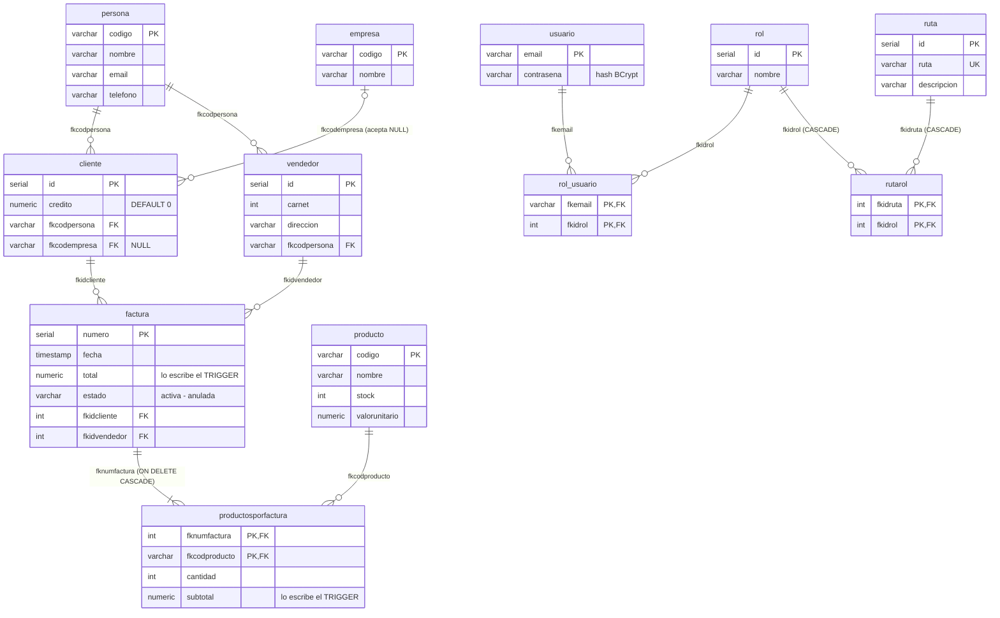

# Modelo de datos — Versión 1: la BD completa (dada) y la tabla producto

> **Versión 1** · La base de datos NO se diseña en esta versión: **viene
> dada** ([4_research.md](4_research.md) D4). Este documento describe lo que
> hay y lo único que la v1 puede tocar.

---

## 1. La base de datos `bdfacturas` (dada, completa)

El script **provisto** `db/bdfacturas_postgres.sql` (dialecto PostgreSQL) crea la
base `bdfacturas_postgres_local` completa. PostgreSQL lo ejecuta SOLO la
PRIMERA vez (está montado en `/docker-entrypoint-initdb.d/` y corre
cuando el volumen de datos nace vacío).

**12 tablas** en dos módulos:

```
FACTURACIÓN                          SEGURIDAD (RBAC)
persona ←── cliente ←── factura      usuario ──┐
   ↑          ↑            ↑                   ├── rol_usuario ── rol
empresa ──────┘       productosporfactura      │                   │
vendedor ── persona        ↑                   ruta ── rutarol ────┘
                        producto
```

Además: **triggers** que mantienen `factura.total` y `producto.stock` al
insertar/editar/borrar renglones del detalle, y **procedimientos
almacenados** de consulta — todos esperando a las versiones siguientes.

**Datos de ejemplo:** 8 productos (PR001…PR008), 6 personas, 6 facturas con
detalle, usuarios y roles. Credenciales de BD (didácticas): `sa` /
`Diseno123!`.

**El diagrama entidad-relación de bdfacturas** (las 12 tablas — la v1
solo puede TOCAR `producto`, pero el diseño completo se conoce desde el
día 1):



## 2. Lo ÚNICO que la v1 puede nombrar: la tabla `producto`

| Columna | Tipo (PostgreSQL) | Regla |
|---|---|---|
| `codigo` | `VARCHAR(10)` | **PK** — texto de 1 a 10 caracteres |
| `nombre` | `VARCHAR(100)` | No nulo, no vacío |
| `stock` | `INT` | No nulo, ≥ 0 (regla de la API) |
| `valorunitario` | `DECIMAL(18,2)` | No nulo, ≥ 0 (regla de la API) |

En C#, esa fila viaja como el modelo entidad:

```csharp
public class Producto
{
    public required string Codigo { get; set; }
    public required string Nombre { get; set; }
    public int Stock { get; set; }
    public decimal Valorunitario { get; set; }   // decimal = el tipo para dinero
}
```

## 3. Las dos murallas de validación

1. **La API** (las peticiones por verbo con anotaciones): forma, tipos y
   rangos → 422 con lista de errores, ANTES de tocar la BD.
2. **La BD** (PK, NOT NULL, FK y triggers): la última línea de defensa —
   un código duplicado viola la PK y el motor lo rechaza aunque la API
   tuviera un bug (la API lo reporta como 500 con el error del motor).

## 4. Reglas de esta versión

- El código de la v1 **solo puede nombrar `producto`** — las otras 11
  tablas existen pero son territorio de la v2 en adelante.
- La BD **no se modifica**: ni columnas nuevas, ni índices, ni datos
  semilla distintos. Si algo parece faltar, es de otra versión.
- El reset completo es de Docker, no de SQL:
  `docker compose down -v && docker compose up -d` (borra el volumen y el
  inicializador vuelve a crear todo).
