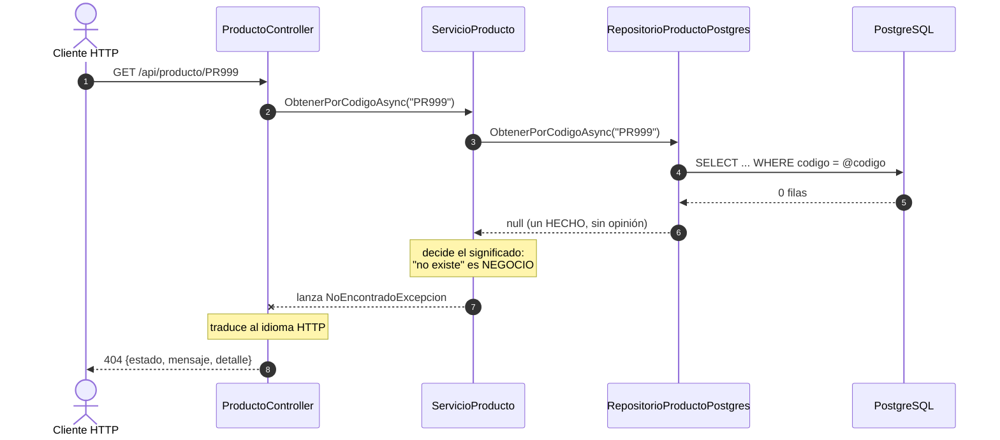
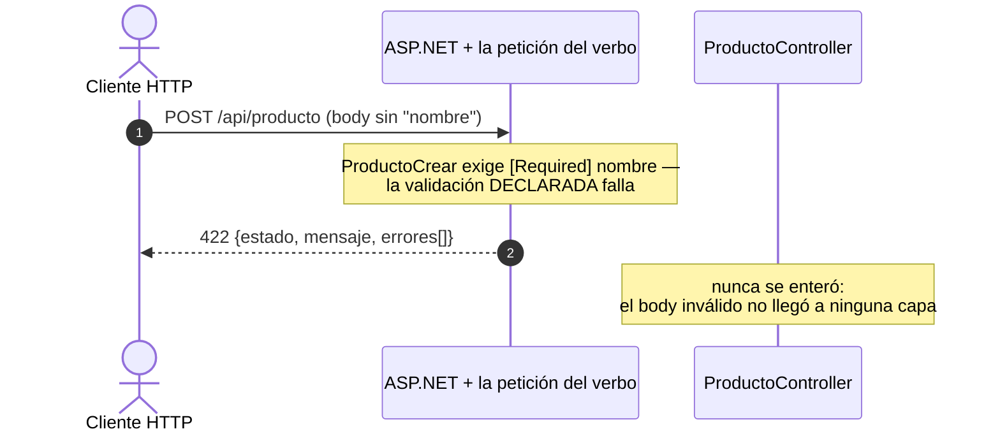

# Contratos HTTP — Versión 1: los 7 endpoints con formatos exactos

> **Versión 1** · Base: `http://localhost:8065`. Estos contratos se cumplen
> **al pie de la letra** (constitución, Artículo 7): mismos verbos, rutas,
> códigos y formatos.

---

## 0. Convenciones globales

- Lecturas con **envoltura**: `{tabla, limite, total, datos:[…]}`.
- Errores SIEMPRE `{estado, mensaje, detalle}`; el 422 lleva además
  `errores:[…]` (la lista de mensajes de la validación de la petición).

| Situación | HTTP |
|---|---|
| Body inválido según la **petición del verbo** | **422** con `errores:[…]` |
| Regla de negocio rota (límite ≤ 0, PATCH sin campos) | **400** |
| El producto no existe | **404** |
| La BD rechaza (PK duplicada) o falla | **500** (error del motor en `detalle`) |

## 0.1 Las dos secuencias que explican los códigos de error

**El 404 — cada capa aporta exactamente lo suyo** (dato → hecho, negocio
→ decisión, HTTP → código):



**El 422 — la frontera corta ANTES del controlador** (por eso ninguna
capa del proyecto contiene ese if):



## 1. `GET /` — Diagnóstico

```
→ 200 {"mensaje":"API Facturas funcionando","version":"v1","contratos":"docs/spec_kit/versiones/v1_producto_postgres/6_contracts.md"}
```

Además: `GET /swagger` abre la **documentación interactiva** (Swagger UI) —
todos estos endpoints se ven y se prueban desde el navegador.

## 2. `GET /api/producto[?limite=N]` — Listar

```
GET /api/producto?limite=3
→ 200 { "tabla":"producto", "limite":3, "total":3,
        "datos":[ {"codigo":"PR001","nombre":"Laptop Lenovo IdeaPad","stock":17,"valorunitario":2500000.00}, … ] }
→ 204 (sin cuerpo) si la tabla está vacía
→ 400 si limite <= 0
```

## 3. `GET /api/producto/{codigo}` — Obtener uno

```
GET /api/producto/PR001
→ 200 {"codigo":"PR001","nombre":"Laptop Lenovo IdeaPad","stock":17,"valorunitario":2500000.00}

GET /api/producto/PR999
→ 404 {"estado":404,"mensaje":"Producto no encontrado.","detalle":"No existe un producto con codigo = PR999"}
```

## 4. `POST /api/producto` — Crear (body completo, con código)

Body (petición `ProductoCrear` — todos obligatorios):

```
POST /api/producto   body {"codigo":"PR009","nombre":"Webcam","stock":10,"valorunitario":350000}
→ 200 {"estado":200,"mensaje":"Producto creado exitosamente."}

body {"codigo":"PR009","stock":-5}          ← sin nombre, stock negativo
→ 422 {"estado":422,"mensaje":"Datos inválidos.",
       "errores":["El campo nombre es obligatorio.",
                  "El campo stock debe ser un entero mayor o igual a 0.", …]}

body {"codigo":"PR001", …}                  ← código duplicado (PK)
→ 500 con el error del motor en detalle
```

**El tipo es regla:** `stock: 7.5` o `stock: "texto"` → 422 (la petición
declara `int?` y el valor no encaja).

## 5. `PUT /api/producto/{codigo}` — Reemplazo COMPLETO

Body (petición `ProductoReemplazo` — TODOS obligatorios; el código va en la URL):

```
PUT /api/producto/PR009   body {"nombre":"Webcam HD","stock":12,"valorunitario":380000}
→ 200 {"estado":200,"mensaje":"Producto reemplazado exitosamente.","filasAfectadas":1}

body {"stock":99}                           ← faltan campos: PUT es TODO o 422
→ 422 con la lista de campos faltantes
→ 404 si el código no existe
```

## 6. `PATCH /api/producto/{codigo}` — Actualización PARCIAL

Body (petición `ProductoActualizar` — todos opcionales; se escribe SOLO lo enviado):

```
PATCH /api/producto/PR009   body {"stock":99}      ← el MISMO body que arriba
→ 200 {"estado":200,"mensaje":"Producto actualizado exitosamente.","filasAfectadas":1}

body {}                                     ← nada que actualizar
→ 400 {"estado":400,"mensaje":"Parámetros inválidos.","detalle":"No se envió ningún campo para actualizar."}
→ 404 si el código no existe
```

> **El contraste didáctico de la v1:** `{"stock":99}` en PUT → 422; en
> PATCH → 200. Mismo body, dos verbos, dos semánticas.

## 7. `DELETE /api/producto/{codigo}` — Eliminar

```
DELETE /api/producto/PR009
→ 200 {"estado":200,"mensaje":"Producto eliminado exitosamente.","filasEliminadas":1}
→ 404 si no existe (incluido el segundo DELETE seguido)
```
