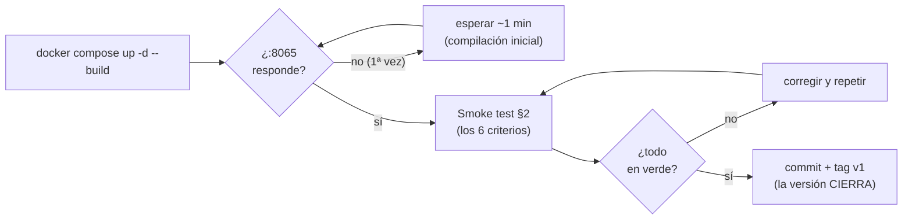

# Quickstart — Versión 1: arranque y smoke test

> **Versión 1** · Validación rápida de la versión ya construida. Si aún no
> hay nada construido, empiece por [8_tasks.md](8_tasks.md).

---

## 1. Arranque (un solo comando)

```powershell
docker compose up -d --build
```

La primera vez tarda: descarga imágenes, restaura paquetes y PostgreSQL
se siembra solo (el script montado corre al nacer el volumen). Al final:
`postgres` (healthy) y `api-facturas` arriba. La primera compilación de
`dotnet watch` toma ~30-60 segundos más.

**El ciclo de validación de la versión** (la regla: no hay tag en rojo):



## 2. Smoke test (equivale a los 6 criterios de 2_spec.md)

```powershell
# 1. Diagnóstico (y de paso: edite un .cs, guarde — recompila solo)
curl.exe http://localhost:8065/
# … y la documentación interactiva en el navegador: http://localhost:8065/swagger

# 2. Listar: 8 productos; con limite=3, exactamente 3
curl.exe http://localhost:8065/api/producto
curl.exe "http://localhost:8065/api/producto?limite=3"

# 3. Obtener: 200 con la Laptop; 404 con PR999
curl.exe http://localhost:8065/api/producto/PR001
curl.exe -i http://localhost:8065/api/producto/PR999

# 4. El ciclo de los 5 verbos
curl.exe -X POST http://localhost:8065/api/producto -H "Content-Type: application/json" -d "{\"codigo\":\"PR009\",\"nombre\":\"Webcam\",\"stock\":10,\"valorunitario\":350000}"
curl.exe -X PUT http://localhost:8065/api/producto/PR009 -H "Content-Type: application/json" -d "{\"nombre\":\"Webcam HD\",\"stock\":12,\"valorunitario\":380000}"
curl.exe -X PATCH http://localhost:8065/api/producto/PR009 -H "Content-Type: application/json" -d "{\"stock\":99}"
curl.exe http://localhost:8065/api/producto/PR009
curl.exe -X DELETE http://localhost:8065/api/producto/PR009
curl.exe -i -X DELETE http://localhost:8065/api/producto/PR009        # → 404

# 4b. El contraste didáctico: MISMO body, dos verbos
curl.exe -i -X PUT http://localhost:8065/api/producto/PR001 -H "Content-Type: application/json" -d "{\"stock\":99}"     # → 422
curl.exe -i -X PATCH http://localhost:8065/api/producto/PR001 -H "Content-Type: application/json" -d "{\"stock\":17}"   # → 200

# 5. La frontera de la petición — nunca llega a la BD
curl.exe -X POST http://localhost:8065/api/producto -H "Content-Type: application/json" -d "{\"codigo\":\"PRX\",\"nombre\":\"X\",\"stock\":-5,\"valorunitario\":10}"      # → 422 con errores[]
curl.exe -i -X POST http://localhost:8065/api/producto -H "Content-Type: application/json" -d "{\"codigo\":\"PRY\",\"nombre\":\"Y\",\"stock\":7.5,\"valorunitario\":10}"  # → 422 (el tipo es regla)

# 6. La prueba de capas (sin PostgreSQL)
docker compose exec api-facturas dotnet run --project pruebas
# → CRITERIO 6 OK: el servicio funciona con el repositorio falso, sin PostgreSQL
```

## 3. Si algo falla

| Síntoma | Causa probable |
|---|---|
| `curl` no conecta al 8065 | La primera compilación de dotnet watch aún no termina — espere ~1 min y reintente (`docker compose logs api-facturas`) |
| La API responde 500 en todo | La BD no se sembró (¿el volumen ya existía?) o la cadena no apunta a `postgres:5432` — reset: `docker compose down -v && up -d` |
| PostgreSQL nunca queda healthy | El puerto 15459 está ocupado o el disco de Docker está lleno |
| Guardo un .cs y no pasa nada | Espere la recompilación (segundos); si no, `docker compose restart api-facturas` |
| Reset total de la BD | `docker compose down -v && docker compose up -d` (borra el volumen; el script se auto-ejecuta de nuevo) |
