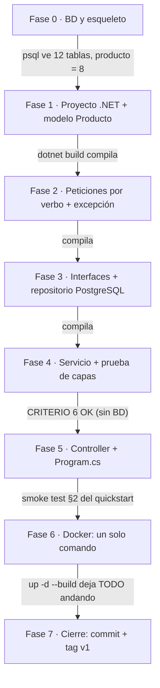

# Tareas — Versión 1: api_facturas con producto + PostgreSQL (C#/ASP.NET Core)

> **Versión 1** · El orden de construcción, partiendo de CERO. Cada fase
> termina en algo **verificable**. Requisitos: [2_spec.md](2_spec.md) ·
> técnica: [3_plan.md](3_plan.md) · contratos: [6_contracts.md](6_contracts.md) ·
> validación final: [7_quickstart.md](7_quickstart.md).

---

**El orden de construcción, dibujado** — cada flecha lleva su compuerta
de verificación (no se cruza en rojo). Note la dirección: de los datos
hacia el HTTP, y el servicio se prueba ANTES de tener controller:

## Fase 0 — Base de datos y esqueleto
- [ ] Copiar a `db/` el archivo **provisto** con esta versión:
      `bdfacturas_postgres.sql` (la BD completa en dialecto PostgreSQL —
      no se escribe ni se genera con IA; ver [3_plan.md](3_plan.md) §4.6).
- [ ] Crear el `docker-compose.yml` con el servicio `postgres` (imagen
      16-alpine, volumen `pgdata`, puerto 15459, healthcheck con
      pg_isready, y el script montado en `/docker-entrypoint-initdb.d/`)
      — ver [3_plan.md](3_plan.md) §5. Levantar: `docker compose up -d`.
- [ ] Crear `api_facturas/` con subcarpetas `Modelos/`, `Peticiones/`, `Controllers/`,
      `Servicios/`, `Repositorios/`, `Excepciones/` y `pruebas/`.

**Verificar:** `docker compose ps` muestra `postgres (healthy)`; un
cliente SQL a `localhost:15459` (usuario `postgres`) ve las **12 tablas**
y `SELECT count(*) FROM producto` da **8**.

## Fase 1 — El proyecto .NET y el modelo Producto (la clase entidad)
- [ ] `ApiFacturas.csproj`: proyecto Web de .NET 10, paquete
      `Npgsql`, y la exclusión de `pruebas/**`.
- [ ] `appsettings.json` con la cadena de conexión (default
      `localhost:15459` para correr sin Docker).
- [ ] `Modelos/Producto.cs`: la clase entidad con las 4 propiedades
      tipadas `{ get; set; }` (`Codigo` string, `Nombre` string, `Stock`
      int, `Valorunitario` decimal). En C#, las propiedades SON los
      getters/setters del lenguaje.

**Verificar:** `dotnet build` compila sin errores.

## Fase 2 — Las peticiones por verbo (la frontera de entrada) y la excepción
- [ ] `Peticiones/ProductoCrear.cs` (POST: todo obligatorio, con código),
      `Peticiones/ProductoReemplazo.cs` (PUT: todo obligatorio, sin código) y
      `Peticiones/ProductoActualizar.cs` (PATCH: todo opcional) — con las
      anotaciones y mensajes de [3_plan.md](3_plan.md) §4.2.
- [ ] `Excepciones/NoEncontradoExcepcion.cs`: la excepción que el
      controller traducirá a 404.

**Verificar:** `dotnet build` compila sin errores.

## Fase 3 — Contratos (interfaces) y repositorio PostgreSQL
- [ ] `Repositorios/IRepositorioProducto.cs`: interface con los 5 métodos
      async ([3_plan.md](3_plan.md) §4.1).
- [ ] `Servicios/IServicioProducto.cs`: interface del servicio.
- [ ] `Repositorios/RepositorioProductoPostgres.cs`: Dapper con los SQL
      de [3_plan.md](3_plan.md) §4.4 — `QueryAsync<Producto>` para
      lecturas y `ExecuteAsync` para escrituras, `LIMIT @limite`,
      parámetros `@`, y el UPDATE con SET dinámico de lista blanca
      (`DynamicParameters` sobre el diccionario).

**Verificar:** `dotnet build` compila sin errores.

## Fase 4 — Servicio (y la prueba de capas)
- [ ] `Servicios/ServicioProducto.cs`: recibe `IRepositorioProducto` por
      constructor; valida reglas de negocio (`limite > 0`, código no
      vacío, PATCH sin campos → `ArgumentException`); traduce "no existe"
      a `NoEncontradoExcepcion`.
- [ ] `pruebas/PruebaCapas.csproj` (consola, con ProjectReference a la
      API) y `pruebas/Programa.cs`: el servicio con un **repositorio falso
      en memoria** (una clase `: IRepositorioProducto` sobre un
      diccionario) — crear/listar/obtener/actualizar/eliminar y las
      excepciones, SIN PostgreSQL.

**Verificar (criterio 6):** `dotnet run --project pruebas` termina con
`CRITERIO 6 OK…`.

## Fase 5 — Controller y Program.cs
- [ ] `Controllers/ProductoController.cs`: `[Route("api/producto")]`, los 6
      métodos con sus atributos de verbo, cada uno con su try/catch
      ([3_plan.md](3_plan.md) §4.5) y el 204 para lista vacía.
- [ ] `Program.cs`: el ENSAMBLADOR (los dos AddScoped), la respuesta 422
      personalizada (`InvalidModelStateResponseFactory` → `{estado,
      mensaje, errores}`), **Swagger** (`AddSwaggerGen` + `UseSwagger` +
      `UseSwaggerUI`), el `GET /` de diagnóstico y `MapControllers`.

**Verificar:** con la BD arriba y `dotnet run`, probar: listar (200 con 8 y
`?limite=3` con 3), obtener PR001 (200), PR999 (404), POST inválido (422
con `errores[]`), y el contraste PUT vs PATCH con `{"stock": 99}` (422 vs
200).

## Fase 6 — Docker: un solo comando
- [ ] `api_facturas/Dockerfile`: imagen `dotnet/sdk:10.0`, `dotnet watch`,
      `ASPNETCORE_URLS` en 8065, `DOTNET_USE_POLLING_FILE_WATCHER`.
- [ ] Agregar al `docker-compose.yml` el servicio `api-facturas`: `build:`,
      código montado + `bin/` y `obj/` en volúmenes anónimos, puerto 8065,
      variable `ConnectionStrings__Postgres` con el host interno
      `postgres:5432`, y `depends_on` de `postgres` con
      `condition: service_healthy`.

**Verificar:** `docker compose down` y luego `docker compose up -d --build`
— UN comando deja BD y API funcionando (criterio 1); editar un `.cs`,
guardar, y verificar que recompila y reinicia solo.

## Fase 7 — Cierre de la versión
- [ ] Correr el smoke test completo de [7_quickstart.md](7_quickstart.md)
      §2 — equivale a los 6 criterios de aceptación de
      [2_spec.md](2_spec.md) §5.
- [ ] `.gitignore` (`bin/`, `obj/`, `*.session.sql`) y `.gitattributes`
      (`*.sh` con LF).
- [ ] Commit y tag `v1`.

**La v1 está TERMINADA.** Solo ahora se escribe la spec de la v2
([mapa de versiones](../0_mapa_versiones.md)).
