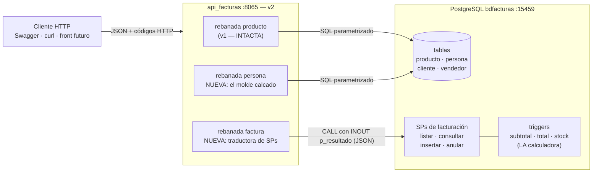

# Especificación — Versión 2: persona y factura maestro-detalle (SPs y triggers)

> **Versión 2** del desarrollo incremental ([mapa de versiones](../0_mapa_versiones.md)).
> Rige la constitución del proyecto: [../../1_constitution.md](../../1_constitution.md).
> **Las versiones son acumulativas:** la v2 contiene TODO lo de la v1
> ([spec de la v1](../v1_producto_postgres/2_spec.md)) — el CRUD de
> `producto` no se toca y sus contratos siguen vigentes tal cual.
>
> | Documento de esta versión | Contenido |
> |---|---|
> | **2_spec.md** (este) | QUÉ agrega la v2 y sus criterios de aceptación |
> | [3_plan.md](3_plan.md) | CÓMO: los archivos nuevos y el diseño de las dos rebanadas |
> | [4_research.md](4_research.md) | Decisiones y alternativas *(lectura opcional)* |
> | [5_data_model.md](5_data_model.md) | Las tablas que la v2 empieza a usar + los SPs y triggers |
> | [6_contracts.md](6_contracts.md) | Los 10 endpoints nuevos con formatos exactos |
> | [7_quickstart.md](7_quickstart.md) | Arranque, regresión de la v1 y smoke test de la v2 |
> | [8_tasks.md](8_tasks.md) | Orden de construcción por fases verificables |

---

## 1. Propósito de la v2

Dos lecciones nuevas, una por rebanada:

1. **Replicar el molde** — `persona` recibe exactamente el mismo corte
   vertical que `producto` (modelo + peticiones por verbo + interfaces +
   servicio + repositorio + controller). Si la v1 dejó bien el esqueleto,
   esta rebanada debe "caer en surcos ya hechos": mismos patrones, cero
   decisiones nuevas. Es el examen de la arquitectura de la v1.

2. **La lógica que vive en la base de datos** — `factura` es
   **maestro-detalle** (encabezado + renglones en `productosporfactura`) y
   sus reglas pesadas NO se programan en C#: los **procedimientos
   almacenados** insertan/consultan/anulan la factura completa y los
   **triggers** calculan subtotales, recalculan el total y mueven el stock.
   La API se vuelve un traductor: petición → SP → JSON del SP → respuesta.

```
┌─────────────────────────── el sistema completo ───────────────────────────┐
│  CONTROLLER  │ producto █ │ persona █ │ factura █ │ ...las demás (v5)     │
│  SERVICIO    │ producto █ │ persona █ │ factura █ │ ...                   │
│  REPOSITORIO │ producto █ │ persona █ │ factura █ │ ...                   │
│  BD          │ producto █ │ persona █ │ factura █ + SPs + triggers        │
└──────────────┴────────────┴─────▲─────┴─────▲─────┴───────────────────────┘
                    v1 (intacta)  └── las DOS rebanadas nuevas de la v2
```

**El contexto de la v2, dibujado** (Mermaid: GitHub lo renderiza y la IA
lo lee como parte de la spec):



**Guía de lectura:** a la izquierda viajan contratos HTTP; a la derecha,
contratos de datos. Fíjese en que la rebanada factura NO toca tablas:
habla únicamente con los SPs, y quien calcula subtotales, total y stock
son los triggers — ese es el RNF2 hecho dibujo: la API jamás multiplica.

## 2. Alcance

**Incluye:**
- CRUD completo de `persona` (los 5 verbos, patrón idéntico a producto).
- `factura` de solo-SPs: listar, consultar una (maestro + detalle con
  nombres de cliente y vendedor), **crear** (encabezado + renglones en una
  transacción del SP; el trigger calcula subtotal/total y descuenta stock)
  y **anular** (borrado lógico: estado='anulada' + restaurar stock).
- Una excepción de negocio nueva: `ConflictoExcepcion` → **409** (anular
  una factura ya anulada).
- La prueba de capas crece: persona también se verifica con repositorio
  falso en memoria.
- El endpoint `/` de diagnóstico pasa a reportar `"version": "v2"`.

**No incluye (deliberado — [mapa](../0_mapa_versiones.md)):**
- CRUD de `cliente`, `vendedor` ni las demás tablas: la factura los
  referencia **por id** usando los datos semilla (clientes 1–3, vendedores
  1–3). Su gestión llega en la v3 (el resto de las entidades).
- Editar (PUT/PATCH) o borrar físicamente facturas: `sp_actualizar_…` y
  `sp_borrar_…` existen en la BD pero la v2 no los expone — anular ES la
  operación de negocio; el borrado físico queda para el administrador.
- Usuarios y roles (v3) · otros motores (v4/v5) · JWT y frontend (v6).

## 3. Requisitos funcionales

### RF1 — CRUD de persona (el molde replicado)
Los 6 endpoints de `producto` calcados sobre `/api/persona`
(PK `codigo`; campos `nombre`, `email`, `telefono` — todos obligatorios,
solo texto): listar con `?limite`, obtener, POST (petición `PersonaCrear`),
PUT (`PersonaReemplazo`, todo obligatorio), PATCH (`PersonaActualizar`,
todo opcional, body vacío → 400), DELETE. Misma envoltura, mismos códigos,
misma pareja PUT=422/PATCH=200. Detalle didáctico: `DELETE` de una persona
que es cliente o vendedor → **500 con el error de llave foránea** del motor
(integridad referencial en acción).

### RF2 — Listar facturas (SP)
`GET /api/factura` → 200 `{tabla:"factura", total, datos:[…]}` donde cada
elemento trae el maestro (número, fecha, total, estado, ids Y NOMBRES de
cliente/vendedor) con su detalle anidado — todo lo arma
`sp_listar_facturas_y_productosporfactura`; la API no hace JOINs.

### RF3 — Consultar una factura (SP)
`GET /api/factura/{numero}` → 200 `{factura:{…}, productos:[…]}` vía
`sp_consultar_factura_y_productosporfactura`; inexistente → **404** (el
`RAISE EXCEPTION` del SP traducido).

### RF4 — Crear factura maestro-detalle (SP + trigger)
`POST /api/factura` con la petición `FacturaCrear`:
`fkidcliente` y `fkidvendedor` (enteros, obligatorios) y `productos`
(lista de `{codigo, cantidad ≥ 1}`, **mínimo 1 elemento**).
El repositorio llama `sp_insertar_factura_y_productosporfactura`; el
trigger valida stock, calcula cada subtotal, descuenta stock y fija el
total. Respuesta 200 con el JSON del SP (la factura creada + sus renglones
ya calculados). Lista vacía → **422** (la petición); stock insuficiente o
FK inexistente → **500** con el mensaje del motor/trigger en `detalle`.

### RF5 — Anular factura (SP, borrado lógico)
`POST /api/factura/{numero}/anular` → 200 con el JSON del SP
(`sp_anular_factura`: restaura stock y pone estado='anulada').
Inexistente → **404**; ya anulada → **409** (`ConflictoExcepcion`).

### RF6 — La v1 queda intacta
Los 7 contratos de la v1 (producto + diagnóstico) siguen cumpliéndose al
pie de la letra; solo cambia `"version": "v2"` en el diagnóstico.

## 4. Requisitos no funcionales

- **RNF1 — Los de la v1 siguen todos** (capas estrictas, sin ORM, SQL
  parametrizado, async, errores uniformes).
- **RNF2 — La lógica de facturación NO se duplica en C#:** ni subtotales,
  ni total, ni stock se calculan en la API — si un número sale mal, el bug
  se busca en la BD, no en el servicio.
- **RNF3 — Los errores de la BD también son contrato:** el repositorio de
  factura traduce los `RAISE EXCEPTION` de los SPs (SQLSTATE `P0001`:
  "no existe" → 404 · "ya está anulada" → 409, por patrón del mensaje) —
  las señales de error del motor son parte de la interfaz con la BD.
- **RNF4 — Sin anticipación:** nada de fábricas ni motores nuevos (v3).

## 5. Criterios de aceptación

1. **Regresión:** `docker compose up -d --build` — un comando — y el smoke
   test **de la v1** ([7_quickstart de v1](../v1_producto_postgres/7_quickstart.md) §2)
   pasa completo sin cambios (salvo `"version":"v2"` en `/`).
2. **El molde replicado:** ciclo completo de persona con los 5 verbos
   (crear P007 → reemplazar → parchar → confirmar → eliminar → segundo
   DELETE 404), incluida la pareja `{"telefono":"3009999999"}`: 422 en PUT,
   200 en PATCH. Y `DELETE /api/persona/P001` (es cliente) → 500 con el
   error de FK en `detalle`.
3. **Lectura maestro-detalle:** `GET /api/factura` trae las 6 facturas de
   ejemplo con nombres de cliente/vendedor y renglones anidados;
   `GET /api/factura/1` trae el detalle de la 1; `GET /api/factura/999` → 404.
4. **El trigger trabaja:** anotar el stock de PR001 y PR003 → `POST
   /api/factura` con esos 2 productos → la respuesta trae subtotales y
   total calculados (total = Σ subtotales) y `GET /api/producto/PR001` y
   `PR003` muestran el stock descontado. La API nunca multiplicó nada.
5. **Errores de negocio de la BD:** POST con `productos: []` → 422 de la
   petición; POST con `cantidad` mayor que el stock → 500 con el mensaje
   del trigger («Stock insuficiente…») en `detalle`; anular la factura
   creada → 200 (stock restaurado, verificable), anularla de nuevo → 409;
   anular la 999 → 404.
6. **Prueba de capas ampliada:** `dotnet run --project pruebas` ejercita
   producto Y persona con repositorios falsos en memoria — sin PostgreSQL —
   y termina en `CRITERIO 6 OK…`.

## 6. Definición de TERMINADA

Los 6 criterios pasan → commit + tag `v2` → recién entonces se escribe la
spec de la v3 ([mapa](../0_mapa_versiones.md)).

## 7. Clarificaciones

> **Qué es esta sección:** el registro de las ambigüedades detectadas ANTES
> de planear, con la respuesta que se acordó y su razón. Es **la compuerta
> 1** del método (ver [SDD_SPECKIT](../../../SDD_SPECKIT.md)): mientras
> quede un `[NECESITA ACLARACIÓN: …]` en los requisitos de arriba, esta
> versión no pasa a la planeación.
>
> Las entradas de abajo se reconstruyeron **al cerrar la versión**, a
> partir de las decisiones que sus propios contratos ya dejaban fijadas.
> De aquí en adelante esta sección se llena **en vivo**, antes del
> `3_plan.md` — que es como debe ser.

| # | La pregunta | La respuesta acordada, con su razón | Dónde quedó |
|---|---|---|---|
| C1 | El listado sin filas, ¿es un error o un resultado? | Un resultado: **204 sin cuerpo**. Vacío no es error. | RF de listar · contrato del `GET` |
| C2 | `?limite=0` o negativo, ¿422 o 400? | **400**: la FORMA del dato es correcta (sí es un entero); lo que se rompe es una regla de negocio. El 422 se reserva para el body mal formado. | Contrato del `GET` · convenciones |
| C3 | `PATCH` con el body vacío, ¿200 sin hacer nada, o error? | **400**: pedir una actualización sin decir qué actualizar es una regla de negocio rota. | Contrato del `PATCH` |
| C4 | Una factura equivocada, ¿se borra o se anula? | Se **anula**: borrado lógico que restaura el stock. La factura es un hecho contable; borrarla perdería la trazabilidad. | RF de anulación · contrato de anular |
| C5 | Anular dos veces la misma factura, ¿qué responde? | **409**: el conflicto es de estado, no de forma ni de existencia. La factura existe (no es 404) y el body está bien (no es 422). | Contrato de anular |

**Cómo se escribe una entrada nueva:** la pregunta tal como se hizo (no
"revisar el borrado", sino "¿físico o lógico?"), la respuesta **con su
razón**, y el documento donde quedó plasmada. Si la respuesta cambia un
requisito, se corrige el requisito allá arriba: esta sección lo registra,
no lo reemplaza.
