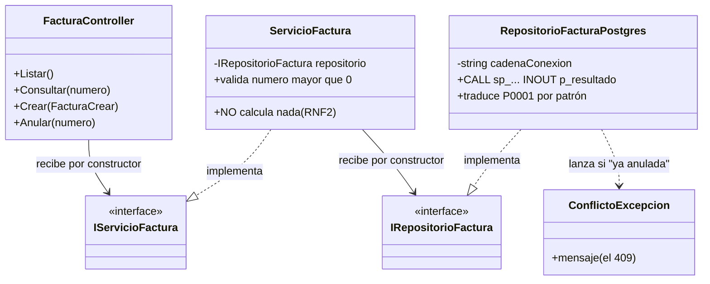
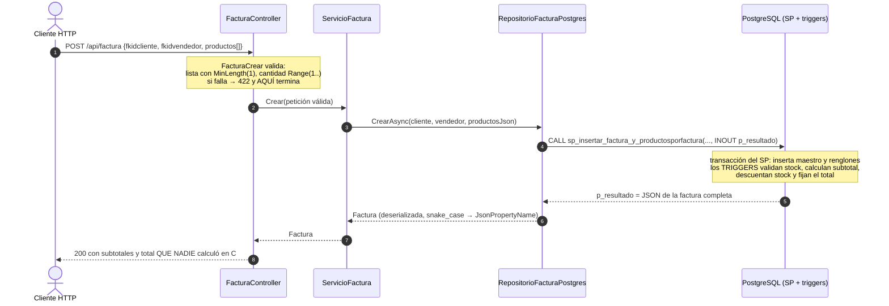

# Plan técnico — Versión 2: persona y factura (C#/ASP.NET Core + PostgreSQL)

> **Nota (agosto de 2026):** el curso adoptó **Dapper** como
> micro-ejecutor en TODOS los repositorios: el SQL sigue escrito a mano
> y parametrizado; cambió el mapeo (`QueryAsync`/`ExecuteAsync` en vez
> del ciclo DataReader) y los SPs se llaman con `DynamicParameters`.
> Las tablas de "calco" entre dialectos siguen valiendo para los
> PROVEEDORES (Npgsql/SqlClient/MySqlConnector) que Dapper usa por debajo.


> **Versión 2** · CÓMO construir lo especificado en [2_spec.md](2_spec.md).
> El porqué de cada decisión: [4_research.md](4_research.md) · contratos
> exactos: [6_contracts.md](6_contracts.md) · orden: [8_tasks.md](8_tasks.md).
> El stack NO cambia (es el de la [v1](../v1_producto_postgres/3_plan.md) §1:
> .NET 10 + ADO.NET + PostgreSQL, sin ORM).

---

## 1. Qué archivos se AGREGAN (la v1 no se toca, salvo Program.cs)

```
api_facturas/
├── Program.cs                        ★ CRECE: 4 AddScoped nuevos + version "v2"
├── Modelos/
│   ├── Persona.cs                    NUEVO: la entidad (4 propiedades string)
│   ├── Factura.cs                    NUEVO: el maestro que devuelven los SPs
│   └── ProductoDeFactura.cs          NUEVO: un renglón del detalle
├── Peticiones/
│   ├── PersonaCrear.cs               NUEVO: POST persona (todo obligatorio)
│   ├── PersonaReemplazo.cs           NUEVO: PUT persona (todo obligatorio, sin código)
│   ├── PersonaActualizar.cs          NUEVO: PATCH persona (todo opcional)
│   └── FacturaCrear.cs               NUEVO: POST factura (+ ProductoDeFacturaCrear anidada)
├── Controllers/
│   ├── PersonaController.cs          NUEVO: calcado de ProductoController
│   └── FacturaController.cs          NUEVO: 4 endpoints (2 GET, POST, POST anular)
├── Servicios/
│   ├── IServicioPersona.cs · ServicioPersona.cs        NUEVOS (calcados)
│   └── IServicioFactura.cs · ServicioFactura.cs        NUEVOS
├── Repositorios/
│   ├── IRepositorioPersona.cs · RepositorioPersonaPostgres.cs   NUEVOS (calcados)
│   └── IRepositorioFactura.cs · RepositorioFacturaPostgres.cs   NUEVOS (solo SPs)
├── Excepciones/
│   └── ConflictoExcepcion.cs         NUEVO: el 409 (ya está anulada)
└── pruebas/
    └── Programa.cs                   ★ CRECE: repo falso de persona + sus verificaciones
```

Todo lo demás (docker-compose, Dockerfile, db/, la rebanada de producto)
queda **idéntico a la v1**.

## 2. Rebanada 1: persona — calcar, no diseñar

Regla de oro: **abrir el archivo gemelo de producto y replicarlo** cambiando
entidad, campos y textos. Nada más.

| Pieza | Se calca de | Cambios |
|---|---|---|
| `Persona.cs` | `Producto.cs` | 4 propiedades: `Codigo`, `Nombre`, `Email`, `Telefono` (todas `string`) |
| `PersonaCrear/Reemplazo/Actualizar` | las 3 de producto | `[Required]` + `[StringLength]`: codigo 1–10 · nombre ≤100 · email ≤100 · telefono ≤20 (sin `[Range]`: no hay números) |
| `IRepositorioPersona` / `RepositorioPersonaPostgres` | los de producto | tabla `persona`, mismos 5 métodos, mismos SQL con `@parametros` |
| `IServicioPersona` / `ServicioPersona` | los de producto | mismas reglas (límite > 0, código no vacío, PATCH vacío → `ArgumentException`) |
| `PersonaController` | `ProductoController` | `[Route("api/persona")]`, mismos 6 métodos y try/catch |

## 3. Rebanada 2: factura — la API como traductora de SPs

### 3.1 Los modelos de lectura (lo que los SPs devuelven)

Los SPs retornan **JSON por el parámetro `INOUT p_resultado`**. El
repositorio lo deserializa con `System.Text.Json` a modelos tipados
(claves del JSON en snake_case → `[JsonPropertyName]`):

```csharp
public class Factura {
    public int Numero; public string Fecha; public decimal Total;
    public string Estado; public int Fkidcliente;
    [JsonPropertyName("nombre_cliente")] public string NombreCliente;
    public int Fkidvendedor;
    [JsonPropertyName("nombre_vendedor")] public string NombreVendedor;
    public List<ProductoDeFactura> Productos;   // el detalle anidado
}
public class ProductoDeFactura {
    [JsonPropertyName("codigo_producto")] public string CodigoProducto;
    [JsonPropertyName("nombre_producto")] public string NombreProducto;
    public int Cantidad; public decimal Valorunitario; public decimal Subtotal;
}
```
(Como propiedades `{ get; set; }` — abreviadas aquí. `PropertyNameCaseInsensitive`
cubre las claves simples.)

### 3.2 La petición del POST (validación anidada)

```csharp
public class FacturaCrear {
    [Required] public int? Fkidcliente { get; set; }
    [Required] public int? Fkidvendedor { get; set; }
    [Required, MinLength(1, ErrorMessage = "La factura requiere mínimo 1 producto.")]
    public List<ProductoDeFacturaCrear>? Productos { get; set; }
}
public class ProductoDeFacturaCrear {
    [Required, StringLength(10, MinimumLength = 1)] public string? Codigo { get; set; }
    [Required, Range(1, int.MaxValue)] public int? Cantidad { get; set; }
}
```
ASP.NET valida la lista Y cada elemento → lista vacía o cantidad 0 mueren
en **422** antes del controlador. (El SP tiene su propio mínimo con
`RAISE EXCEPTION` — queda como respaldo, no como el camino normal.)

### 3.3 El repositorio de factura: un CALL de texto

`IRepositorioFactura` — 4 métodos, nada de SQL de tablas:

```csharp
Task<List<Factura>> ListarAsync();            // sp_listar_facturas_y_productosporfactura
Task<Factura> ConsultarAsync(int numero);     // sp_consultar (el sobre {factura, productos} se APLANA a una Factura)
Task<Factura> CrearAsync(int fkidcliente, int fkidvendedor, string productosJson);
Task<string> AnularAsync(int numero);         // sp_anular_factura — su JSON se re-emite tal cual
```

Patrón de llamada (igual en los 4):
```csharp
await using var conexion = new NpgsqlConnection(_cadena);
await using var comando = new NpgsqlCommand("sp_consultar_factura_y_productosporfactura", conexion)
    { CommandType = un CALL de texto };
comando.Parameters.AddWithValue("@p_numero", numero);
var salida = new NpgsqlParameter("@p_resultado", SqlDbType.NVarChar, -1)
    { Direction = ParameterDirection.Output };          // -1 = NVARCHAR(MAX)
comando.Parameters.Add(salida);
await conexion.OpenAsync();
await comando.ExecuteNonQueryAsync();
return JsonSerializer.Deserialize<…>((string)salida.Value, _opcionesJson)!;
```
Para `CrearAsync`, `@p_productos` recibe el JSON de los renglones
(`[{"codigo":"PR001","cantidad":2}]`) — el servicio lo serializa desde la
petición ya validada.

### 3.4 Los RAISE EXCEPTION del SP se traducen a excepciones de negocio

PostgreSQL no numera sus errores de negocio (no hay THROW 50003 como en
otros motores): todo `RAISE EXCEPTION` sale con SQLSTATE **`P0001`**. La
traducción filtra por P0001 + el PATRÓN del mensaje — los textos reales
de `db/bdfacturas_postgres.sql` ("Factura N no existe", "Factura N ya
está anulada"):

```csharp
catch (PostgresException ex) when (ex.SqlState == "P0001"
                                   && ex.MessageText.Contains("no existe"))
    { throw new NoEncontradoExcepcion(ex.MessageText); }     // → 404
catch (PostgresException ex) when (ex.SqlState == "P0001"
                                   && ex.MessageText.Contains("anulada"))
    { throw new ConflictoExcepcion(ex.MessageText); }        // → 409
// Cualquier otro error del motor (stock insuficiente del trigger, FK)
// sube tal cual y el controller lo vuelve 500 con el mensaje en `detalle`.
```
La traducción vive en el REPOSITORIO: las señales de error del motor son un
detalle de datos, no de negocio ni de HTTP.

### 3.5 Servicio y controller de factura

`ServicioFactura`: valida `numero > 0` y **no calcula nada** (RNF2). El
JSON de renglones para el SP lo arma el **controller** desde la petición ya
validada (lista blanca `codigo`/`cantidad`) — así el servicio no conoce las
clases de `Peticiones/`, igual que en el molde de la v1.
`FacturaController` (`[Route("api/factura")]`): 4 métodos con el try/catch
de siempre + una fila nueva en la tabla de traducción:
`ConflictoExcepcion → 409`.

### 3.6 Los planos de la rebanada factura (Mermaid)

**Diagrama de clases** — persona calca el molde de la v1 (su diagrama es
el de [3_plan de v1](../v1_producto_postgres/3_plan.md) §3.1 cambiando la
entidad); lo que merece plano propio es factura, porque su repositorio no
habla SQL de tablas sino SPs:



**Secuencia del camino feliz** — `POST /api/factura` de punta a punta;
observe QUIÉN calcula (nadie en C#):



**Guía de lectura:** la nota del controller marca la frontera de entrada
(el 422 corta ANTES de tocar servicio); la nota de la BD marca dónde vive
la lógica pesada. Si en su código un subtotal se calcula en C#, el
diagrama lo delata: no hay flecha para eso.

## 4. Program.cs: el ensamblador crece (y nada más)

```csharp
builder.Services.AddScoped<IRepositorioPersona>(_ => new RepositorioPersonaPostgres(cadena));
builder.Services.AddScoped<IServicioPersona, ServicioPersona>();
builder.Services.AddScoped<IRepositorioFactura>(_ => new RepositorioFacturaPostgres(cadena));
builder.Services.AddScoped<IServicioFactura, ServicioFactura>();
```
Y el diagnóstico pasa a `"version": "v2"`. El 422 personalizado, Swagger y
`MapControllers` quedan como están — los controllers nuevos se registran
solos por sus atributos.

## 5. Docker

Sin cambios: mismos 3 servicios, mismos puertos (API 8065 · PostgreSQL
15459 al host). `dotnet watch` recompila al agregar los archivos nuevos.

## 6. Chequeo de constitución

> **La compuerta 2** del método (ver [SDD_SPECKIT](../../../SDD_SPECKIT.md)):
> antes de pasar a `8_tasks.md` se revisa la
> [constitución](../../1_constitution.md) **artículo por artículo**. Si algo
> no cumple, o se corrige el plan, o se enmienda la constitución. Nunca se
> deja pasar "por esta vez".

| Artículo | Cómo lo cumple esta versión |
|---|---|
| **1** — El curso es POR VERSIONES y la especificación manda | El alcance de esta versión es el que declara [2_spec.md](2_spec.md) §2, y **no anticipa** nada de las siguientes. Cierra con commit y tag. |
| **2** — Stack: C# y ASP.NET Core, con el SQL a la vista | C# sobre ASP.NET Core, SQL escrito a mano y **siempre parametrizado**, sin ORM de entidades. Los paquetes son los que el artículo permite (§1 de este plan). |
| **3** — Arquitectura en capas con interfaces, desde el día 1 | Controlador → interfaz de servicio → interfaz de repositorio → repositorio (§3 de este plan). Solo el ensamblador conoce clases concretas. |
| **4** — Un solo comando | `docker compose up -d --build` deja la versión funcionando (§5 de este plan). |
| **5** — La base de datos viene DADA | La BD `bdfacturas` viene dada por los scripts de `db/`; esta versión solo nombra las tablas que su alcance le permite ([5_data_model.md](5_data_model.md)). |
| **6** — Todo en español, comentado para principiantes | Nombres, rutas y mensajes en español, con comentarios línea a línea en el código. |
| **7** — Contratos exactos | [6_contracts.md](6_contracts.md) fija verbos, rutas, códigos y formatos exactos, incluidos los desenlaces de error. |
| **8** — Convenciones fijas | Puertos, rutas, sobre de respuesta y catálogo de errores, tal como los fija el artículo. |

**Complejidad justificada:** si esta versión se desvía de algún artículo,
la desviación va aquí, con la alternativa más simple que se descartó y por
qué no sirvió. Sin desviaciones anotadas, se entiende que no las hay.
