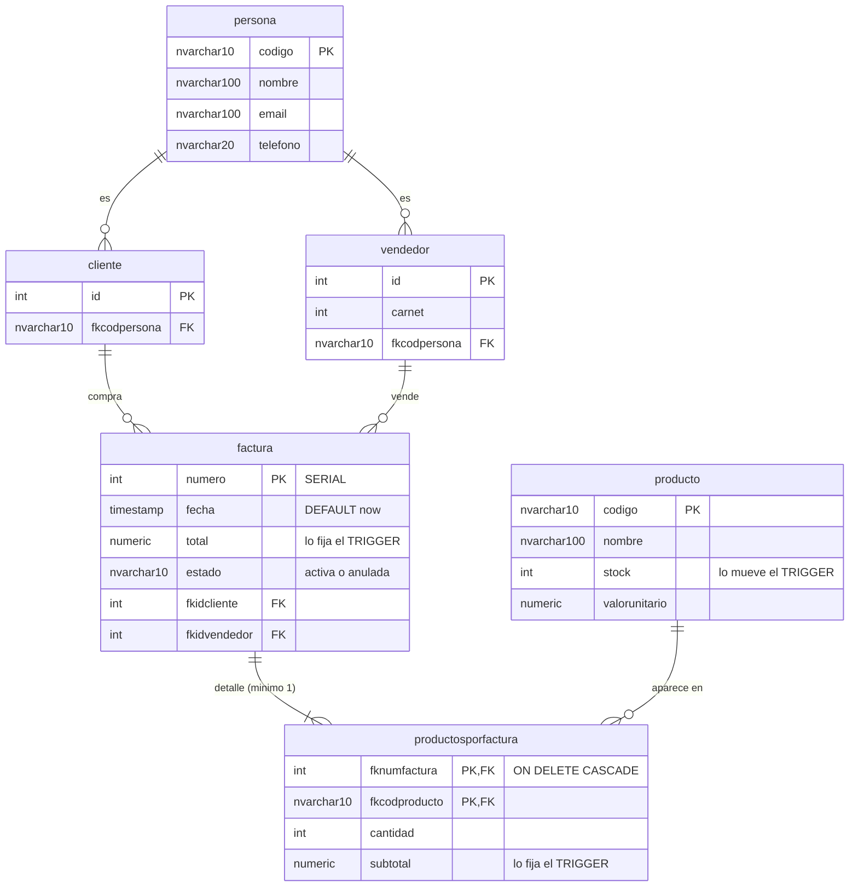

# Modelo de datos — Versión 2: lo que la API empieza a usar

> **Versión 2** · La BD `bdfacturas` está COMPLETA desde la v1 (artefacto
> provisto `db/bdfacturas_postgres.sql` + `db/init.sh` — no se genera ni se
> modifica). Lo que cambia en v2 es **cuánta BD usa la API**: de 1 tabla
> (producto) pasa a 5, y estrena los SPs y triggers de facturación.

---

## 1. Las tablas de la v2

### `persona` — la rebanada que replica el molde

| Columna | Tipo | Regla |
|---|---|---|
| `codigo` | NVARCHAR(10) | **PK** |
| `nombre` | NVARCHAR(100) | NOT NULL |
| `email` | NVARCHAR(100) | NOT NULL |
| `telefono` | NVARCHAR(20) | NOT NULL |

Semilla: 6 personas (`P001` Ana Torres … `P006` Pedro Castillo).
**Ojo didáctico:** varias personas son a la vez cliente y/o vendedor
(P001, P003, P005, P006 son clientes; P002, P004, P006 son vendedores) —
eliminarlas dispara el error de **llave foránea** (criterio 2).

### El grafo de la facturación (v2 lo LEE; solo escribe factura y su detalle)

```
persona ──< cliente ──┐
persona ──< vendedor ─┼──< factura ──< productosporfactura >── producto
        (por id)      │      │              (el detalle)        (v1)
                      │      └ numero SERIAL · fecha · total · estado
                      └ semilla: clientes 1,2,3,5 · vendedores 1,2,3
```

**El mismo grafo en entidad-relación** (Mermaid — PK/FK y cardinalidades;
sombreado mental: la v2 solo ESCRIBE `factura` y `productosporfactura`):



**Guía de lectura:** las tres columnas anotadas con "TRIGGER" son las que
la API tiene PROHIBIDO enviar — las escribe la BD. La cardinalidad
`||--|{` de factura a su detalle dice "mínimo 1 renglón": es la misma
regla del `MinLength(1)` de la petición y del `RAISE` del SP, contada
tres veces en tres capas.

| Tabla | Lo que la v2 usa |
|---|---|
| `cliente` | Solo el **id** como FK del POST de factura (ids semilla: 1, 2, 3 y 5) — sin CRUD |
| `vendedor` | Solo el **id** (semilla: 1, 2, 3) — sin CRUD |
| `factura` | `numero` (SERIAL), `fecha` (default CURRENT_TIMESTAMP), `total` (lo fija el trigger), `estado` ('activa'/'anulada'), `fkidcliente`, `fkidvendedor`. Semilla: facturas 1–6 |
| `productosporfactura` | PK compuesta (`fknumfactura`, `fkcodproducto`) + `cantidad` + `subtotal` (lo fija el trigger). FK a factura con ON DELETE CASCADE |

## 2. Los triggers (la calculadora vive en la BD)

Tres triggers sobre `productosporfactura` (`trg_prodfact_insert`,
`_update`, `_delete`) hacen, en cada cambio de un renglón:

1. **Validar stock**: si `cantidad > stock` → `RAISE EXCEPTION` con el mensaje
   «Stock insuficiente…» (la API lo muestra como 500 con `detalle`).
2. **Calcular** `subtotal = cantidad × valorunitario` (nadie se lo pasa).
3. **Mover stock** del producto (descuenta al insertar, restaura al borrar,
   ajusta la diferencia al actualizar).
4. **Recalcular** `factura.total` = Σ subtotales.

Consecuencia para la API: el POST de factura envía cantidades y códigos —
**jamás** subtotales ni totales (RNF2).

## 3. Los procedimientos almacenados que la v2 expone

Los 4 SPs retornan su resultado como **JSON** en el parámetro
`INOUT p_resultado JSON`:

| SP | Parámetros | Qué hace | Errores (`RAISE EXCEPTION`, SQLSTATE P0001) |
|---|---|---|---|
| `sp_listar_facturas_y_productosporfactura` | `@p_resultado OUT` | Array de facturas, cada una con nombres de cliente/vendedor y su detalle anidado | — |
| `sp_consultar_factura_y_productosporfactura` | `@p_numero`, `@p_resultado OUT` | `{factura:{…}, productos:[…]}` de UNA factura (la API lo aplana: UNA factura con `productos` adentro) | «Factura N no existe» |
| `sp_insertar_factura_y_productosporfactura` | `@p_fkidcliente`, `@p_fkidvendedor`, `@p_productos` (JSON), `@p_minimo_detalle=1`, `@p_resultado OUT` | Transacción completa: inserta el encabezado, abre el JSON con json_array_elements e inserta cada renglón (el trigger calcula todo) | «requiere mínimo N producto(s)»; los del trigger (stock); FK del motor |
| `sp_anular_factura` | `@p_numero`, `@p_resultado OUT` | Borrado lógico: restaura stock y pone `estado='anulada'` | «no existe» · «ya está anulada» |

Formato del JSON de lectura (claves en snake_case — de ahí los
`[JsonPropertyName]` del [plan](3_plan.md) §3.1):

```json
{ "factura":   { "numero": 1, "fecha": "…", "total": 5000000.00, "estado": "activa",
                 "fkidcliente": 1, "nombre_cliente": "Ana Torres",
                 "fkidvendedor": 1, "nombre_vendedor": "Carlos Pérez" },
  "productos": [ { "codigo_producto": "PR001", "nombre_producto": "Laptop Lenovo IdeaPad",
                   "cantidad": 2, "valorunitario": 2500000.00, "subtotal": 5000000.00 } ] }
```

El JSON de entrada de `@p_productos` (lo arma el servicio desde la petición):

```json
[ { "codigo": "PR001", "cantidad": 2 }, { "codigo": "PR003", "cantidad": 3 } ]
```

## 4. Lo que la v2 NO usa todavía

`empresa` · `usuario`/`rol`/`rol_usuario` y los SPs de usuarios ·
`ruta`/`rutarol` y los SPs de RBAC · `sp_actualizar_…` y `sp_borrar_…` de
factura. Todo existe en la BD desde la v1 y espera su versión
([mapa](../0_mapa_versiones.md): v5 los aprovechará).
