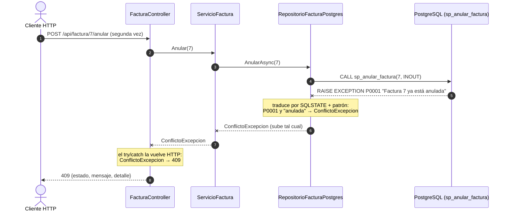
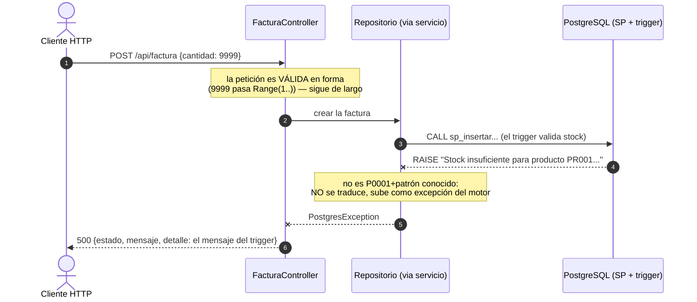

# Contratos HTTP — Versión 2: los 10 endpoints nuevos

> **Versión 2** · Base: `http://localhost:8065` · Swagger: `/swagger`.
> **Los 7 contratos de la v1 siguen vigentes sin cambios**
> ([6_contracts de v1](../v1_producto_postgres/6_contracts.md)) — aquí
> solo lo NUEVO. Convenciones idénticas: envoltura en listados, errores
> `{estado, mensaje, detalle}`, 422 con `errores:[…]`.

---

## A. Persona — el molde de producto, calcado (6 endpoints)

Mismos verbos, mismas reglas y mismos códigos que producto; solo cambian
la entidad y sus campos (`codigo`, `nombre`, `email`, `telefono` — todos
texto, todos obligatorios al crear).

```
GET    /api/persona[?limite=N]   → 200 {tabla:"persona", limite, total, datos:[…]}
                                   · 204 vacía · 400 si limite ≤ 0
GET    /api/persona/P001         → 200 {"codigo":"P001","nombre":"Ana Torres",
                                        "email":"ana.torres@correo.com","telefono":"3011111111"}
                                   · 404 si no existe
POST   /api/persona              body {codigo, nombre, email, telefono}  (PersonaCrear: todo obligatorio)
                                 → 200 {estado, mensaje} · 422 con errores[] · 500 código duplicado
PUT    /api/persona/{codigo}     body {nombre, email, telefono}  (PersonaReemplazo: TODO obligatorio)
                                 → 200 {…, filasAfectadas:1} · 422 si falta CUALQUIER campo · 404
PATCH  /api/persona/{codigo}     body parcial  (PersonaActualizar: todo opcional)
                                 → 200 {…, filasAfectadas:1} · 400 body vacío · 404
DELETE /api/persona/{codigo}     → 200 {…, filasEliminadas:1} · 404
```

**La pareja didáctica, ahora en persona:** `{"telefono":"3009999999"}` →
**422** en PUT (faltan nombre y email) y **200** en PATCH.

**El endpoint-lección de integridad referencial:**

```
DELETE /api/persona/P001        ← P001 es cliente (FK desde cliente.fkcodpersona)
→ 500 {estado:500, mensaje:"…", detalle:"The DELETE statement conflicted with
       the REFERENCE constraint \"fk_cliente_persona\"…"}
```
La BD protege sus relaciones; el error del motor viaja completo en `detalle`.

## B. Factura — maestro-detalle vía SPs (4 endpoints)

### B1. `GET /api/factura` — Listar (SP listar)

```
→ 200 { "tabla":"factura", "total":6, "datos":[
        { "numero":1, "fecha":"…", "total":5000000.00, "estado":"activa",
          "fkidcliente":1,  "nombre_cliente":"Ana Torres",
          "fkidvendedor":1, "nombre_vendedor":"Carlos Pérez",
          "productos":[ { "codigo_producto":"PR001", "nombre_producto":"Laptop Lenovo IdeaPad",
                          "cantidad":2, "valorunitario":2500000.00, "subtotal":5000000.00 } ] }, … ] }
```
Cada factura llega con su detalle anidado y los NOMBRES ya resueltos —
los JOINs los hizo el SP, no la API.

### B2. `GET /api/factura/{numero}` — Consultar una (SP consultar)

La respuesta tiene **la misma forma que cada elemento del listado** (el SP
devuelve el sobre `{factura, productos}` y la API lo aplana — una sola
forma de factura en toda la API):

```
GET /api/factura/1
→ 200 { "numero":1, "fecha":"…", "total":5000000.00, "estado":"activa",
        "fkidcliente":1, "nombre_cliente":"Ana Torres",
        "fkidvendedor":1, "nombre_vendedor":"Carlos Pérez",
        "productos":[ … ] }

GET /api/factura/999
→ 404 {estado:404, mensaje:"Factura no encontrada.", detalle:"Factura 999 no existe"}
```

### B3. `POST /api/factura` — Crear maestro-detalle (SP insertar + trigger)

Body (petición `FacturaCrear`):

```json
{ "fkidcliente": 1, "fkidvendedor": 1,
  "productos": [ { "codigo": "PR001", "cantidad": 2 },
                 { "codigo": "PR003", "cantidad": 3 } ] }
```

```
→ 200  la factura creada, con la MISMA forma del B2: fecha, estado
       "activa", subtotales POR RENGLÓN y total — todo calculado por el
       trigger. La API nunca recibió ni calculó un solo valor monetario.

→ 422  productos:[] o ausente · cantidad 0 o negativa · codigo vacío
       (la petición: [MinLength(1)], [Range(1,…)], [Required])
→ 500  cantidad > stock  → detalle: "Stock insuficiente para producto PR001…"  (el trigger)
→ 500  fkidcliente/fkidvendedor inexistente → detalle: error de FK del motor
```

### B4. `POST /api/factura/{numero}/anular` — Borrado lógico (SP anular)

```
POST /api/factura/7/anular
→ 200 { "mensaje":"Factura anulada exitosamente", "numero_anulado":7,
        "total_anulado":…, "productos_afectados":2, "estado":"anulada" }
      (y el stock de sus productos quedó RESTAURADO — verifíquelo con GET /api/producto/{codigo})

POST /api/factura/7/anular      ← segunda vez
→ 409 {estado:409, mensaje:"La factura ya está anulada.", detalle:"Factura 7 ya está anulada"}

POST /api/factura/999/anular
→ 404 {estado:404, mensaje:"Factura no encontrada.", detalle:"Factura 999 no existe"}
```

**Por qué 409 y no 400/404:** la petición está bien formada y la factura
existe — el conflicto es con el ESTADO actual del recurso. Esa es la
semántica exacta de `409 Conflict`.

### B5. Las dos secuencias de ERROR nuevas, dibujadas

**El 409** — quién decide "ya está anulada" y quién le pone el número HTTP:



**El 500 del trigger** — el error de negocio que NO se traduce (es la
última defensa, no un contrato fino):



**Guía de lectura:** ambos errores NACEN en la BD; la diferencia es el
tratamiento. El del SP es un contrato de negocio conocido (por eso se
traduce a 409/404); el del trigger es la defensa profunda (por eso viaja
como 500 con el mensaje completo en `detalle`). Cada capa aporta lo suyo:
la BD decide, el repositorio traduce, el controller pone el número HTTP.

## C. Diagnóstico (cambia UNA clave)

```
GET /  → 200 {"mensaje":"API Facturas funcionando","version":"v2","contratos":"docs/spec_kit/versiones/v2_persona_factura/6_contracts.md"}
```

## D. Tabla resumen de traducción de errores (acumulada)

| Situación | Excepción interna | HTTP |
|---|---|---|
| Body inválido según la petición del verbo | (la responde el framework) | **422** + `errores[]` |
| Regla de negocio (límite ≤ 0, PATCH vacío, número ≤ 0) | `ArgumentException` | **400** |
| No existe (producto, persona, factura) | `NoEncontradoExcepcion` | **404** |
| Ya está anulada | `ConflictoExcepcion` *(nueva en v2)* | **409** |
| Stock insuficiente, FK violada, BD caída… | `PostgresException` y demás | **500** + mensaje en `detalle` |

## E. Estabilidad

Estos contratos se congelan al cerrar la v2 (tag `v2`): las versiones de motor (v4/v5)
cambian el MOTOR por configuración — si estos endpoints respondieran
distinto contra PostgreSQL, esas versiones están mal.
