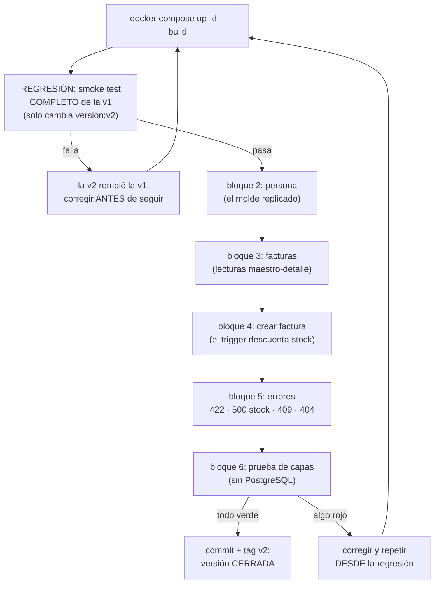

# Quickstart — Versión 2: arranque, regresión y smoke test

> **Versión 2** · Validación rápida de la versión ya construida. Si aún no
> hay nada construido, empiece por [8_tasks.md](8_tasks.md).

---

## 1. Arranque (un solo comando — igual que en v1)

```powershell
docker compose up -d --build
```

Mismos 3 servicios: `postgres` (healthy), `postgres-init` (Exited 0) y
`api-facturas`. La primera compilación de `dotnet watch` toma ~30-60 s.

## 2. Regresión: la v1 sigue intacta (criterio 1)

Correr el smoke test COMPLETO de la v1
([7_quickstart de v1](../v1_producto_postgres/7_quickstart.md) §2).
Única diferencia esperada: el diagnóstico dice `"version":"v2"`.
Si algo de producto cambió, la v2 está mal — las versiones son acumulativas.

## 3. Smoke test de lo nuevo (criterios 2 a 6)

```powershell
# ── 2. PERSONA: el molde replicado ────────────────────────────────────
curl.exe http://localhost:8065/api/persona                    # 6 personas
curl.exe "http://localhost:8065/api/persona?limite=2"         # exactamente 2
curl.exe http://localhost:8065/api/persona/P001               # Ana Torres
curl.exe -X POST http://localhost:8065/api/persona -H "Content-Type: application/json" -d "{\"codigo\":\"P007\",\"nombre\":\"Prueba V2\",\"email\":\"p7@correo.com\",\"telefono\":\"3007777777\"}"
curl.exe -X PUT http://localhost:8065/api/persona/P007 -H "Content-Type: application/json" -d "{\"nombre\":\"Prueba V2 Editada\",\"email\":\"p7b@correo.com\",\"telefono\":\"3008888888\"}"
curl.exe -X PATCH http://localhost:8065/api/persona/P007 -H "Content-Type: application/json" -d "{\"telefono\":\"3009999999\"}"
curl.exe http://localhost:8065/api/persona/P007
curl.exe -X DELETE http://localhost:8065/api/persona/P007
curl.exe -i -X DELETE http://localhost:8065/api/persona/P007          # → 404

# 2b. La pareja didáctica, ahora en persona (MISMO body)
curl.exe -i -X PUT http://localhost:8065/api/persona/P001 -H "Content-Type: application/json" -d "{\"telefono\":\"3009999999\"}"    # → 422
curl.exe -i -X PATCH http://localhost:8065/api/persona/P001 -H "Content-Type: application/json" -d "{\"telefono\":\"3011111111\"}"  # → 200

# 2c. Integridad referencial: P001 es cliente
curl.exe -i -X DELETE http://localhost:8065/api/persona/P001          # → 500 con el error de FK

# ── 3. FACTURA: lecturas maestro-detalle (SPs) ────────────────────────
curl.exe http://localhost:8065/api/factura                    # 6 facturas con nombres y detalle
curl.exe http://localhost:8065/api/factura/1                  # la factura con nombres y productos:[...] adentro
curl.exe -i http://localhost:8065/api/factura/999             # → 404

# ── 4. CREAR FACTURA: el trigger trabaja ──────────────────────────────
# Anote el stock ANTES:
curl.exe http://localhost:8065/api/producto/PR001             # stock: 17
curl.exe http://localhost:8065/api/producto/PR003             # stock: 42
# Cree la factura (2 renglones — nadie envía subtotales):
curl.exe -X POST http://localhost:8065/api/factura -H "Content-Type: application/json" -d "{\"fkidcliente\":1,\"fkidvendedor\":1,\"productos\":[{\"codigo\":\"PR001\",\"cantidad\":2},{\"codigo\":\"PR003\",\"cantidad\":3}]}"
# ← la respuesta trae subtotales y total CALCULADOS; anote el "numero" (será 7)
# El stock DESPUÉS bajó (15 y 39):
curl.exe http://localhost:8065/api/producto/PR001
curl.exe http://localhost:8065/api/producto/PR003

# ── 5. ERRORES DE NEGOCIO DE LA BD ────────────────────────────────────
curl.exe -i -X POST http://localhost:8065/api/factura -H "Content-Type: application/json" -d "{\"fkidcliente\":1,\"fkidvendedor\":1,\"productos\":[]}"                                    # → 422 (la petición)
curl.exe -i -X POST http://localhost:8065/api/factura -H "Content-Type: application/json" -d "{\"fkidcliente\":1,\"fkidvendedor\":1,\"productos\":[{\"codigo\":\"PR001\",\"cantidad\":9999}]}"  # → 500 "Stock insuficiente…"
# Anular la factura creada (el 7): restaura stock y estado='anulada'
curl.exe -X POST http://localhost:8065/api/factura/7/anular            # → 200
curl.exe http://localhost:8065/api/producto/PR001                      # stock volvió a 17
curl.exe -i -X POST http://localhost:8065/api/factura/7/anular         # → 409 ya está anulada
curl.exe -i -X POST http://localhost:8065/api/factura/999/anular       # → 404

# ── 6. LA PRUEBA DE CAPAS (sin PostgreSQL) ────────────────────────────
docker compose exec api-facturas dotnet run --project pruebas
# → CRITERIO 6 OK: … (ahora ejercita producto Y persona con repos falsos)
```

También todo con clics en **http://localhost:8065/swagger** (los endpoints
nuevos aparecen bajo Persona y Factura).

> **Nota para dejar la BD como al inicio:** la factura 7 queda anulada (no
> borrada) — es el comportamiento de negocio correcto. Si quiere el estado
> semilla exacto: `docker compose down -v && docker compose up -d`.

## 3b. El ciclo de validación, dibujado



**Guía de lectura:** la regresión va PRIMERO — si la v1 se rompió, nada
de lo nuevo cuenta. Y el camino rojo siempre regresa al inicio: después
de corregir se repite todo, no solo el bloque que falló.

## 4. Si algo falla

| Síntoma | Causa probable |
|---|---|
| Los de la v1 ([7_quickstart v1](../v1_producto_postgres/7_quickstart.md) §3) | Aplican todos igual |
| POST de factura da 500 con error de FK | `fkidcliente`/`fkidvendedor` no existen — use los semilla (clientes 1, 2, 3, 5 · vendedores 1, 2, 3) |
| GET /api/factura devuelve 500 "Could not find stored procedure" | La BD es vieja (¿de antes de la v1?) — `docker compose down -v && up -d` para re-crear con los SPs |
| El total de la factura no cuadra | No es la API (no calcula nada): revise los triggers en la BD |
| Anular responde 500 en vez de 409 | El repositorio no está traduciendo P0001 + patrón — ver [3_plan.md](3_plan.md) §3.4 |
