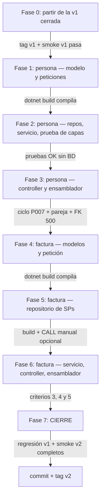

# Tareas — Versión 2: persona y factura (C#/ASP.NET Core + PostgreSQL)

> **Versión 2** · El orden de construcción, PARTIENDO DE LA v1 TERMINADA
> (tag `v1`: producto funcionando de punta a punta). Cada fase termina en
> algo **verificable**. Requisitos: [2_spec.md](2_spec.md) · técnica:
> [3_plan.md](3_plan.md) · contratos: [6_contracts.md](6_contracts.md) ·
> validación final: [7_quickstart.md](7_quickstart.md).
>
> Estrategia: primero la rebanada FÁCIL (persona: calcar el molde) y su
> verificación; después la rebanada NUEVA (factura por SPs). No se toca
> NADA de producto.

---

**El orden de fases con sus compuertas** (cada flecha solo se cruza si el
"Verificar:" de la fase pasó):

**Guía de lectura:** las dos rebanadas van en serie, la fácil primero
(persona, fases 1–3) — así los errores de arquitectura aparecen en
terreno conocido antes de entrar a la rebanada nueva (factura, 4–6).

## Fase 0 — Punto de partida verificado
- [ ] Estar parado sobre la v1 cerrada: `git tag` muestra `v1` y el smoke
      test de la v1 pasa ([7_quickstart de v1](../v1_producto_postgres/7_quickstart.md) §2).
- [ ] `docker compose up -d` (la BD ya tiene TODO lo que la v2 necesita:
      tablas, SPs y triggers están en `db/bdfacturas_postgres.sql` desde la v1).

**Verificar:** un cliente SQL a `localhost:15459` ve los SPs
(`SELECT name FROM sys.procedures` incluye los 4 de factura) y
`SELECT count(*) FROM persona` da **6**.

## Fase 1 — Persona: modelo y peticiones (calcar de producto)
- [ ] `Modelos/Persona.cs`: 4 propiedades `string` (`Codigo`, `Nombre`,
      `Email`, `Telefono`) — copiar `Producto.cs` y ajustar.
- [ ] `Peticiones/PersonaCrear.cs`, `PersonaReemplazo.cs`,
      `PersonaActualizar.cs` — copiar las de producto; reglas:
      codigo 1–10 · nombre ≤100 · email ≤100 · telefono ≤20
      ([3_plan.md](3_plan.md) §2).

**Verificar:** `dotnet build` compila sin errores.

## Fase 2 — Persona: repositorio, servicio y sus interfaces
- [ ] `Repositorios/IRepositorioPersona.cs` y
      `RepositorioPersonaPostgres.cs` (tabla `persona`, mismos 5 SQL
      parametrizados del molde).
- [ ] `Servicios/IServicioPersona.cs` y `ServicioPersona.cs` (mismas
      reglas: límite > 0, código no vacío, PATCH vacío →
      `ArgumentException`, no existe → `NoEncontradoExcepcion`).
- [ ] Ampliar `pruebas/Programa.cs`: repositorio falso de persona
      (diccionario) + el mismo ciclo de verificaciones que producto.

**Verificar (parte del criterio 6):** `dotnet run --project pruebas`
termina en `CRITERIO 6 OK…` ejercitando producto Y persona — sin BD.

## Fase 3 — Persona: controller y ensamblador
- [ ] `Controllers/PersonaController.cs`: `[Route("api/persona")]`, los 6
      métodos calcados con su try/catch.
- [ ] `Program.cs`: los 2 `AddScoped` de persona.

**Verificar (criterio 2):** con la BD arriba — ciclo completo de P007 con
los 5 verbos, la pareja PUT/PATCH con `{"telefono":"…"}` (422 vs 200), y
`DELETE /api/persona/P001` → 500 con el error de FK en `detalle`
(comandos exactos en [7_quickstart.md](7_quickstart.md) §3, bloque 2).

## Fase 4 — Factura: modelos de lectura y petición de creación
- [ ] `Modelos/Factura.cs` y `Modelos/ProductoDeFactura.cs` con los
      `[JsonPropertyName]` del snake_case ([3_plan.md](3_plan.md) §3.1).
- [ ] `Peticiones/FacturaCrear.cs` (+ `ProductoDeFacturaCrear` anidada):
      `[Required]`, `[MinLength(1)]` en la lista, `[Range(1,…)]` en
      cantidad ([3_plan.md](3_plan.md) §3.2).
- [ ] `Excepciones/ConflictoExcepcion.cs` (el futuro 409).

**Verificar:** `dotnet build` compila sin errores.

## Fase 5 — Factura: repositorio de SPs
- [ ] `Repositorios/IRepositorioFactura.cs` (4 métodos) y
      `RepositorioFacturaPostgres.cs`: un CALL de texto por SP,
      lectura del `INOUT p_resultado` con `ExecuteScalarAsync()`,
      deserialización con `System.Text.Json`, y la traducción de los
      `RAISE EXCEPTION` (SQLSTATE `P0001` + patrón del mensaje →
      `NoEncontradoExcepcion` / `ConflictoExcepcion`)
      ([3_plan.md](3_plan.md) §3.3–3.4).

**Verificar:** `dotnet build`; opcional: un `psql` manual
(`EXEC sp_consultar_factura_y_productosporfactura @p_numero=1, …`)
para ver el JSON que el repositorio va a recibir.

## Fase 6 — Factura: servicio, controller y ensamblador
- [ ] `Servicios/IServicioFactura.cs` y `ServicioFactura.cs`: valida
      `numero > 0`, serializa los renglones de la petición al JSON del SP
      — y NO calcula nada (RNF2).
- [ ] `Controllers/FacturaController.cs`: los 4 endpoints
      ([6_contracts.md](6_contracts.md) §B) con la fila nueva
      `ConflictoExcepcion → 409` en el try/catch.
- [ ] `Program.cs`: los 2 `AddScoped` de factura + `"version": "v2"` en
      el diagnóstico.

**Verificar (criterios 3, 4 y 5):** los bloques 3, 4 y 5 de
[7_quickstart.md](7_quickstart.md) §3 — lecturas con nombres, creación con
stock descontado por el trigger, 422/500/409/404 según el caso.

## Fase 7 — Cierre de la versión
- [ ] **Regresión v1** (criterio 1): el smoke test de la v1 completo, sin
      cambios (salvo `"version":"v2"`).
- [ ] Smoke test v2 completo ([7_quickstart.md](7_quickstart.md) §3).
- [ ] Commit y tag `v2`.

**La v2 está TERMINADA.** Solo ahora se escribe la spec de la v3
([mapa de versiones](../0_mapa_versiones.md)).
