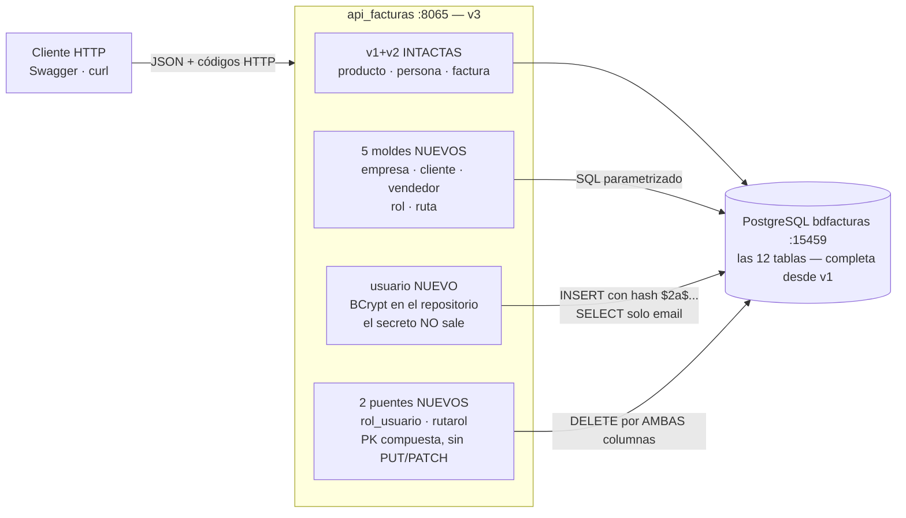

# Especificación — Versión 3: el resto de las entidades (toda la BD con UN motor)

> **Versión 3** del desarrollo incremental ([mapa de versiones](../0_mapa_versiones.md)).
> Rige la constitución: [../../1_constitution.md](../../1_constitution.md).
> **Acumulativa:** contiene TODO lo de v1 y v2 — producto, persona y
> factura no se tocan y sus contratos siguen vigentes tal cual.
>
> | Documento de esta versión | Contenido |
> |---|---|
> | **2_spec.md** (este) | QUÉ agrega la v3 y sus criterios de aceptación |
> | [3_plan.md](3_plan.md) | CÓMO: las 8 rebanadas nuevas y sus patrones |
> | [4_research.md](4_research.md) | Decisiones y alternativas *(lectura opcional)* |
> | [5_data_model.md](5_data_model.md) | Las 8 tablas que faltaban |
> | [6_contracts.md](6_contracts.md) | Los 36 endpoints nuevos con formatos exactos |
> | [7_quickstart.md](7_quickstart.md) | Regresión v1-v2 y smoke test de la v3 |
> | [8_tasks.md](8_tasks.md) | Orden de construcción por fases verificables |
> | [GUIA_IA3.md](GUIA_IA3.md) | Construirla con IA, sobre su proyecto v2 |

---

## 1. Propósito de la v3

**Completar la cobertura: al cerrar esta versión, las 12 tablas de
`bdfacturas` son operables por la API.** Esa es la regla que ordena la
ruta del curso: *toda la BD dominada con UN motor (PostgreSQL) ANTES de
cambiar de motor* (el segundo motor llega en la v4 — y encontrará el
terreno listo: 12 rebanadas que solo dependen de interfaces).

La v3 no introduce técnicas nuevas de capas — introduce **tres patrones de
entidad** que faltaban:

1. **El molde replicado en serie** (empresa, cliente, vendedor, rol,
   ruta): la v2 lo replicó una vez; la v3 demuestra que es industrial.
2. **La entidad con secreto** (usuario): la contraseña se guarda como
   hash **BCrypt** y JAMÁS sale de la API; nace `verificar-contrasena`.
3. **Las tablas puente** (rol_usuario, rutarol): PK compuesta, sin
   PUT/PATCH, búsquedas por cada lado, y DELETE por AMBAS columnas.

**El contexto de la v3, dibujado** (Mermaid — al cerrar, las 12 tablas
con API):



**Guía de lectura:** la v3 no agrega técnica de capas — agrega los tres
patrones de entidad que faltaban. Las flechas anotadas son las reglas
duras: el hash entra pero nunca sale, y el puente borra por la pareja
exacta.

## 2. Alcance

**Incluye:** CRUD de empresa, cliente, vendedor, rol y ruta · usuario con
BCrypt y verificación de credenciales · rol_usuario y rutarol (puentes) ·
diagnóstico pasa a `"version": "v3"` · la prueba de capas crece con
empresa (el molde una vez más, sin BD).

**No incluye (deliberado — [mapa](../0_mapa_versiones.md)):**
- **JWT, login con token y control de acceso**: eso llega con el front (v6). En v3, usuario/rol/ruta/rutarol son DATOS con CRUD — la
  infraestructura RBAC se llena, todavía no protege endpoints.
- Otros motores ni fábrica multi-motor (v4).
- CRUD directo de `productosporfactura`: sus renglones se gestionan a
  través de factura (v2) — la tabla ya está cubierta.

## 3. Requisitos funcionales

### RF1 — Cinco moldes más (empresa, cliente, vendedor, rol, ruta)
Los 5 endpoints del patrón (listar `?limite`, obtener, POST, PUT, PATCH,
DELETE) sobre:

| Entidad | PK | Campos |
|---|---|---|
| `empresa` | codigo (string 1-10) | nombre (≤100) |
| `cliente` | id (SERIAL) | credito (decimal ≥ 0, opcional al crear: default 0), fkcodpersona (req), fkcodempresa (opcional — puede ser null) |
| `vendedor` | id (SERIAL) | carnet (int ≥ 0), direccion (≤100), fkcodpersona (req) |
| `rol` | id (SERIAL) | nombre (≤50) |
| `ruta` | id (SERIAL) | ruta (≤100, UNIQUE en BD), descripcion (≤200) |

FK violada (fkcodpersona inexistente) o UNIQUE violado (ruta repetida)
→ 500 con el error del motor en `detalle` (la BD es la última defensa).

### RF2 — Usuario: el secreto nunca viaja
- `POST /api/usuario` (email + contrasena): la contraseña se guarda como
  **hash BCrypt (costo 12)**; jamás en texto plano.
- **Las lecturas NUNCA devuelven la contraseña** (ni siquiera el hash):
  listar/obtener responden solo `{email}`.
- PUT (contrasena obligatoria) y PATCH (opcional) **re-hashean** si llega.
- `POST /api/usuario/verificar-contrasena?valor_usuario=…&valor_contrasena=…`
  → 200 válida · 401 incorrecta · 404 el usuario no existe. Es el
  cimiento del login real que llegará con JWT (v6).

### RF3 — Las tablas puente (rol_usuario y rutarol)
Sin PUT/PATCH (una asignación no se edita: se quita y se pone otra):

```
GET    /api/rol-usuario            · GET /api/rol-usuario/usuario/{email}
GET    /api/rol-usuario/rol/{id}   · POST /api/rol-usuario
DELETE /api/rol-usuario/{email}/{idrol}      ← filtra por AMBAS columnas
GET    /api/rutarol                · GET /api/rutarol/ruta/{idruta}
GET    /api/rutarol/rol/{idrol}    · POST /api/rutarol
DELETE /api/rutarol/{idruta}/{idrol}         ← filtra por AMBAS columnas
```

**Regla dura:** el DELETE de PK compuesta borra UNA pareja exacta (WHERE
por las dos columnas). Borrar "todos los roles del usuario" NO es un
endpoint de la v3.

### RF4 — Diagnóstico
`GET /` → `"version": "v3"` (única alteración a lo existente).

## 4. Requisitos no funcionales

- **RNF1 — Los de v1 y v2 siguen todos** (capas, sin ORM, SQL
  parametrizado, async, errores uniformes, 422 con `errores[]`).
- **RNF2 — El hash es detalle de persistencia:** BCrypt vive en el
  REPOSITORIO de usuario; servicio y controller no saben qué algoritmo es.
- **RNF3 — El secreto no sale:** ningún SELECT de la API proyecta la
  columna `contrasena` hacia el cliente HTTP.
- **RNF4 — Sin anticipación:** nada de JWT/middleware (v6) ni motores (v4).

## 5. Criterios de aceptación

1. **Regresión:** `docker compose up -d --build` y los smoke tests de
   [v1](../v1_producto_postgres/7_quickstart.md) y
   [v2](../v2_persona_factura/7_quickstart.md) pasan completos (solo
   cambia `"version":"v3"`).
2. **Los moldes:** ciclo completo (5 verbos, con la pareja PUT/PATCH donde
   la entidad tiene 2+ campos) para empresa, cliente, vendedor, rol y
   ruta. Cliente con `fkcodempresa` null Y con empresa; `fkcodpersona`
   inexistente → 500 con FK; `ruta` duplicada → 500 con UNIQUE.
3. **La cadena comercial completa:** crear empresa E100 → persona P010 →
   cliente (P010, E100) → vendedor (P010) → **crear una factura con ESE
   cliente y ESE vendedor nuevos** (v2 y v3 trabajando juntas) → anularla.
4. **Usuario:** crear → en la BD hay hash `$2…` de 60 caracteres; listar y
   obtener NO exponen contraseña; verificar-contrasena → 200/401/404;
   PATCH re-hashea (verificar con la clave nueva → 200, con la vieja → 401).
5. **Puentes:** asignar 2 roles a un usuario; listarlos por usuario y por
   rol; DELETE de UNA pareja no toca la otra (la segunda sigue); POST
   duplicado → 500 (PK compuesta); ídem rutarol.
6. **Prueba de capas ampliada:** `dotnet run --project pruebas` ejercita
   producto, persona Y empresa con repositorios falsos — sin PostgreSQL.

## 6. Definición de TERMINADA

Los 6 criterios pasan → commit + tag `v3` → la API cubre las 12 tablas →
recién entonces se especifica la v4 (el segundo motor).

## 7. Clarificaciones

> **Qué es esta sección:** el registro de las ambigüedades detectadas ANTES
> de planear, con la respuesta que se acordó y su razón. Es **la compuerta
> 1** del método (ver [SDD_SPECKIT](../../../SDD_SPECKIT.md)): mientras
> quede un `[NECESITA ACLARACIÓN: …]` en los requisitos de arriba, esta
> versión no pasa a la planeación.
>
> Las entradas de abajo se reconstruyeron **al cerrar la versión**, a
> partir de las decisiones que sus propios contratos ya dejaban fijadas.
> De aquí en adelante esta sección se llena **en vivo**, antes del
> `3_plan.md` — que es como debe ser.

| # | La pregunta | La respuesta acordada, con su razón | Dónde quedó |
|---|---|---|---|
| C1 | El listado sin filas, ¿es un error o un resultado? | Un resultado: **204 sin cuerpo**. Vacío no es error. | RF de listar · contrato del `GET` |
| C2 | Una factura equivocada, ¿se borra o se anula? | Se **anula**: borrado lógico que restaura el stock. La factura es un hecho contable; borrarla perdería la trazabilidad. | RF de anulación · contrato de anular |
| C3 | La contraseña, ¿viaja y se guarda en claro? | Nunca: se guarda **hasheada con BCrypt** y la comparación se hace con un endpoint de verificación. La API jamás devuelve el hash. | RF de usuario · modelo de datos |

**Cómo se escribe una entrada nueva:** la pregunta tal como se hizo (no
"revisar el borrado", sino "¿físico o lógico?"), la respuesta **con su
razón**, y el documento donde quedó plasmada. Si la respuesta cambia un
requisito, se corrige el requisito allá arriba: esta sección lo registra,
no lo reemplaza.
