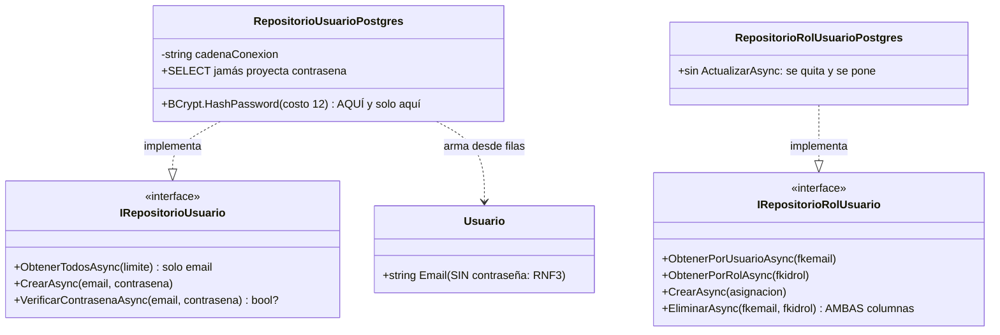
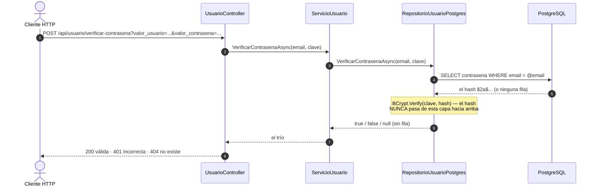

# Plan técnico — Versión 3: el resto de las entidades

> **Nota (agosto de 2026):** el curso adoptó **Dapper** como
> micro-ejecutor en TODOS los repositorios: el SQL sigue escrito a mano
> y parametrizado; cambió el mapeo (`QueryAsync`/`ExecuteAsync` en vez
> del ciclo DataReader) y los SPs se llaman con `DynamicParameters`.
> Las tablas de "calco" entre dialectos siguen valiendo para los
> PROVEEDORES (Npgsql/SqlClient/MySqlConnector) que Dapper usa por debajo.


> **Versión 3** · CÓMO construir lo especificado en [2_spec.md](2_spec.md).
> El porqué de cada decisión: [4_research.md](4_research.md) · contratos:
> [6_contracts.md](6_contracts.md) · orden: [8_tasks.md](8_tasks.md).
> El stack solo suma UN paquete: **BCrypt.Net-Next** (el hash de usuario).

---

## 1. Qué archivos se AGREGAN (v1 y v2 no se tocan, salvo los de siempre)

```
api_facturas/
├── ApiFacturas.csproj                ★ CRECE: paquete BCrypt.Net-Next
├── Program.cs                        ★ CRECE: 16 AddScoped nuevos + version "v3"
├── Modelos/          Empresa, Cliente, Vendedor, Usuario, Rol, Ruta,
│                     RolUsuario, RutaRol                       (8 nuevos)
├── Peticiones/       {Empresa|Cliente|Vendedor|Usuario|Rol|Ruta}Crear/
│                     Reemplazo/Actualizar (18) + RolUsuarioCrear +
│                     RutaRolCrear                              (20 nuevas)
├── Controllers/      EmpresaController, ClienteController,
│                     VendedorController, UsuarioController,
│                     RolController, RutaController,
│                     RolUsuarioController, RutaRolController   (8 nuevos)
├── Servicios/        IServicioX + ServicioX por entidad        (16 nuevos)
├── Repositorios/     IRepositorioX + RepositorioXPostgres     (16 nuevos)
└── pruebas/Programa.cs               ★ CRECE: repo falso de empresa
```

Los 5 moldes (empresa, cliente, vendedor, rol, ruta) se **calcan** de
producto/persona cambiando tabla, PK y campos. Lo genuinamente nuevo de la
v3 son usuario (§3) y los puentes (§4).

## 2. Los moldes: qué cambia en cada calco

| Entidad | PK (tipo) | Petición Crear exige | Notas del calco |
|---|---|---|---|
| Empresa | `codigo` string | codigo 1-10, nombre 1-100 | Idéntica a persona con 2 campos |
| Cliente | `id` int SERIAL | fkcodpersona (req); credito ≥ 0 **opcional** (si no llega → 0); fkcodempresa **opcional** | La PK NO viaja al crear (la genera la BD); rutas `{id:int}` |
| Vendedor | `id` int SERIAL | carnet ≥ 0, direccion 1-100, fkcodpersona | ídem cliente |
| Rol | `id` int SERIAL | nombre 1-50 | El molde mínimo |
| Ruta | `id` int SERIAL | ruta 1-100, descripcion 1-200 | `ruta` es UNIQUE: duplicado → 500 del motor |

Detalles de implementación de los calcos:
- INSERT de cliente con opcionales: `credito` se envía siempre (el
  controller pone 0 si no llegó); `fkcodempresa` viaja como
  `DBNull.Value` cuando es null (`AddWithValue("@fkcodempresa",
  (object?)valor ?? DBNull.Value)`).
- Lectura de columnas NULL: `lector.IsDBNull(n) ? null : lector.GetString(n)`.
- PK SERIAL: las rutas usan `{id:int}` y `ObtenerPorIdAsync(int id)` —
  el resto del molde igual.

## 3. Usuario: el hash vive en el repositorio

### 3.1 Modelo y peticiones

```csharp
public class Usuario { public required string Email { get; set; } }
// ¡SIN propiedad de contraseña! Lo que no está en el modelo de lectura
// no puede filtrarse a una respuesta (RNF3).

UsuarioCrear      { Email (req, 1-100), Contrasena (req, 6-200) }
UsuarioReemplazo  { Contrasena (req, 6-200) }        // el email va en la URL
UsuarioActualizar { Contrasena (opcional, 6-200) }   // PATCH: {} → 400
```

### 3.2 El repositorio hashea (nadie más)

```csharp
// ApiFacturas.csproj: <PackageReference Include="BCrypt.Net-Next" Version="4.*" />
using BC = BCrypt.Net.BCrypt;

public Task CrearAsync(string email, string contrasena)
    // INSERT INTO usuario (email, contrasena) VALUES (@email, @hash)
    // con: var hash = BC.HashPassword(contrasena, workFactor: 12);

public Task<bool?> VerificarContrasenaAsync(string email, string contrasena)
    // SELECT contrasena FROM usuario WHERE email = @email
    // sin fila → null (404) · con fila → BC.Verify(contrasena, hash) (true/false)
```

Los SELECT de listar/obtener proyectan **solo `email`**. `ActualizarAsync`
recibe la contraseña en claro y guarda el hash (PUT y PATCH pasan por ahí).

### 3.3 Servicio y controller

`ServicioUsuario.VerificarContrasenaAsync` → devuelve el trío del
contrato: el controller lo traduce a 200 / 401 / 404. El resto es el molde
(con el detalle de que crear recibe email+contrasena y actualizar solo
contrasena).

## 4. Las tablas puente: el patrón nuevo

```csharp
public interface IRepositorioRolUsuario
{
    Task<List<RolUsuario>> ObtenerTodosAsync(int limite);
    Task<List<RolUsuario>> ObtenerPorUsuarioAsync(string fkemail);
    Task<List<RolUsuario>> ObtenerPorRolAsync(int fkidrol);
    Task CrearAsync(RolUsuario asignacion);
    Task<int> EliminarAsync(string fkemail, int fkidrol);   // ¡AMBAS columnas!
}
// DELETE FROM rol_usuario WHERE fkemail = @fkemail AND fkidrol = @fkidrol
```

- Sin `ActualizarAsync`: una asignación se quita y se pone, no se edita.
- `RutaRol` es el gemelo con (fkidruta int, fkidrol int).
- POST duplicado viola la PK compuesta → 500 del motor (comportamiento
  consistente con el resto).
- Prefijos: `/api/rol-usuario` (kebab-case: dos palabras) y `/api/rutarol`.

## 4b. Los planos de los patrones nuevos (Mermaid)

**Diagrama de clases** — usuario y un puente, los dos contratos que NO
son el molde (los 5 moldes usan el diagrama de la
[v1](../v1_producto_postgres/3_plan.md) §3.1 cambiando entidad y campos):



**Secuencia de `verificar-contrasena`** — el cimiento del login (v6),
con el secreto quieto en la BD:



**Guía de lectura:** el hash muere en el repositorio — hacia arriba solo
viaja un booleano (o null). Si su código devuelve el hash al servicio "para
compararlo allá", el diagrama lo declara mal diseñado.

## 5. Program.cs: la última vez que el ensamblador crece "a mano"

16 `AddScoped` nuevos (8 repos + 8 servicios), mismo patrón de siempre, y
`"version": "v3"` en el diagnóstico. Nota consciente: la lista ya es larga
y repetitiva — ESE dolor es el argumento de la fábrica real que la v4
introduce al llegar el segundo motor. Se deja doler a propósito.

## 6. Docker

Sin cambios: mismos 3 servicios y puertos. `dotnet watch` recompila al
agregar archivos; el paquete BCrypt exige `docker compose restart
api-facturas` tras editar el `.csproj` (watch reinicia el restore solo,
pero el reinicio limpio evita sustos).

## 7. Chequeo de constitución

> **La compuerta 2** del método (ver [SDD_SPECKIT](../../../SDD_SPECKIT.md)):
> antes de pasar a `8_tasks.md` se revisa la
> [constitución](../../1_constitution.md) **artículo por artículo**. Si algo
> no cumple, o se corrige el plan, o se enmienda la constitución. Nunca se
> deja pasar "por esta vez".

| Artículo | Cómo lo cumple esta versión |
|---|---|
| **1** — El curso es POR VERSIONES y la especificación manda | El alcance de esta versión es el que declara [2_spec.md](2_spec.md) §2, y **no anticipa** nada de las siguientes. Cierra con commit y tag. |
| **2** — Stack: C# y ASP.NET Core, con el SQL a la vista | C# sobre ASP.NET Core, SQL escrito a mano y **siempre parametrizado**, sin ORM de entidades. Los paquetes son los que el artículo permite (§1 de este plan). |
| **3** — Arquitectura en capas con interfaces, desde el día 1 | Controlador → interfaz de servicio → interfaz de repositorio → repositorio (§3 de este plan). Solo el ensamblador conoce clases concretas. |
| **4** — Un solo comando | `docker compose up -d --build` deja la versión funcionando (§5 de este plan). |
| **5** — La base de datos viene DADA | La BD `bdfacturas` viene dada por los scripts de `db/`; esta versión solo nombra las tablas que su alcance le permite ([5_data_model.md](5_data_model.md)). |
| **6** — Todo en español, comentado para principiantes | Nombres, rutas y mensajes en español, con comentarios línea a línea en el código. |
| **7** — Contratos exactos | [6_contracts.md](6_contracts.md) fija verbos, rutas, códigos y formatos exactos, incluidos los desenlaces de error. |
| **8** — Convenciones fijas | Puertos, rutas, sobre de respuesta y catálogo de errores, tal como los fija el artículo. |

**Complejidad justificada:** si esta versión se desvía de algún artículo,
la desviación va aquí, con la alternativa más simple que se descartó y por
qué no sirvió. Sin desviaciones anotadas, se entiende que no las hay.
