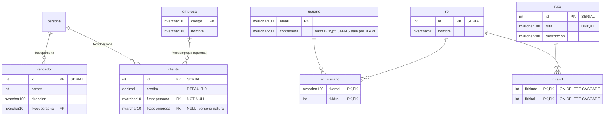

# Modelo de datos — Versión 3: las 8 tablas que faltaban

> **Versión 3** · La BD está completa desde la v1 (`db/bdfacturas_postgres.sql` —
> artefacto provisto). La v3 no cambia NADA en la BD: le da API a las 8
> tablas que aún no la tenían. Con esto, **las 12 quedan cubiertas**.

---

## 1. Los cinco moldes

| Tabla | Columnas | Semilla |
|---|---|---|
| `empresa` | codigo NVARCHAR(10) **PK** · nombre NVARCHAR(100) | 3 (E001, E002, E999) |
| `cliente` | id INT **SERIAL** · credito DECIMAL(18,2) DEFAULT 0 · fkcodpersona → persona **NOT NULL** · fkcodempresa → empresa **NULL** | 4 (ids 1, 2, 3 y 5 — el 4 no existe a propósito) |
| `vendedor` | id INT **SERIAL** · carnet INT · direccion NVARCHAR(100) · fkcodpersona → persona | 3 (ids 1-3) |
| `rol` | id INT **SERIAL** · nombre NVARCHAR(50) | 5 (Administrador, Vendedor, Cajero, Contador, Cliente) |
| `ruta` | id INT **SERIAL** · ruta NVARCHAR(100) **UNIQUE** · descripcion NVARCHAR(200) | 15 (/home, /usuario, /factura…) |

Notas que la API debe respetar:
- `cliente.fkcodempresa` **acepta null** (cliente persona natural sin
  empresa) — la petición lo modela opcional y el repositorio envía
  `DBNull.Value`.
- `ruta.ruta` es UNIQUE: el duplicado lo rechaza la BD (→ 500).
- Las FK a `persona` conectan la v3 con la v2: un cliente/vendedor nuevo
  exige una persona existente.

## 2. Usuario (la entidad con secreto)

| Tabla | Columnas | Semilla |
|---|---|---|
| `usuario` | email NVARCHAR(100) **PK** · contrasena NVARCHAR(200) | 8 usuarios; varios ya con hash BCrypt (`$2a$…`) y DOS con texto plano — a propósito, como material didáctico de "lo que NO se hace" |

- NVARCHAR(200) sobra para el hash BCrypt (60 caracteres).
- Los dos usuarios semilla con contraseña en claro (`jefe@correo.com`,
  `cliente1@correo.com`) permiten mostrar en clase la diferencia — y
  `verificar-contrasena` responderá 401 con ellos (BCrypt.Verify no
  reconoce texto plano), lo cual también es lección.

## 3. Las tablas puente (RBAC en datos)

| Tabla | Columnas | Semilla |
|---|---|---|
| `rol_usuario` | **PK (fkemail, fkidrol)** · FK → usuario.email, rol.id | 21 asignaciones (admin@correo.com tiene el rol 1; hay usuarios con 5 roles) |
| `rutarol` | **PK (fkidruta, fkidrol)** · FK → ruta.id, rol.id, ambas **ON DELETE CASCADE** | 25 permisos (el rol 1 alcanza las 15 rutas) |

- La PK compuesta hace el trabajo de unicidad: asignar dos veces el mismo
  rol al mismo usuario → error de PK (500).
- El CASCADE de rutarol significa: borrar una ruta o un rol arrastra sus
  permisos — la BD limpia sola.

## 3b. Las 8 tablas nuevas, en entidad-relación (Mermaid)

**Guía de lectura:** `persona` (v2) es el ancla de la cadena comercial —
cliente y vendedor la exigen. El rombo RBAC (usuario–rol–ruta con sus dos
puentes) queda LLENO de datos en v3, pero aún no protege nada: eso llega
con JWT en su versión. La cardinalidad `|o--o{` de empresa dice "un
cliente puede no tener empresa" — es el mismo null del `fkcodempresa`.

## 4. El estado final de la cobertura (las 12 tablas)

| Tabla | API desde | Cómo |
|---|---|---|
| producto | v1 | CRUD molde |
| persona | v2 | CRUD molde |
| factura | v2 | SPs (listar/consultar/crear/anular) |
| productosporfactura | v2 | A través de factura (SPs + trigger) |
| empresa, cliente, vendedor, rol, ruta | **v3** | CRUD molde |
| usuario | **v3** | CRUD + BCrypt + verificar-contrasena |
| rol_usuario, rutarol | **v3** | Puente: listar/búsquedas/crear/eliminar |
