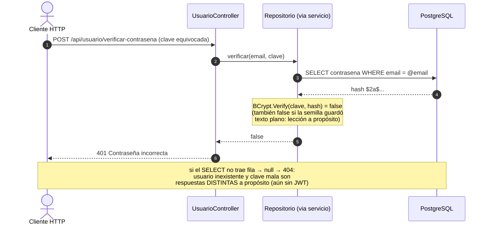
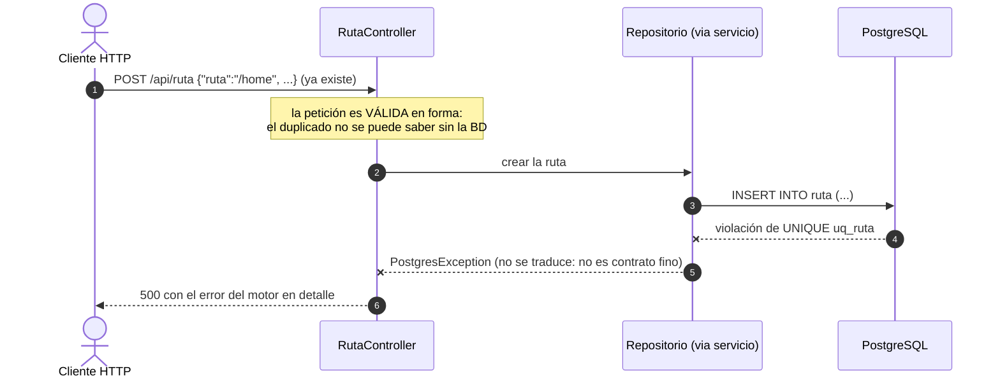

# Contratos HTTP — Versión 3: los 36 endpoints nuevos

> **Versión 3** · Base: `http://localhost:8065` · Swagger: `/swagger`.
> **Los contratos de v1 y v2 siguen vigentes sin cambios.** Convenciones
> idénticas: envoltura `{tabla, limite, total, datos}` en listados · 204
> lista vacía · errores `{estado, mensaje, detalle}` · 422 con `errores[]`
> · ArgumentException→400 · NoEncontrado→404 · resto→500.

---

## A. Los cinco moldes (5 × 6 endpoints = 30)

Mismo patrón de producto/persona. PKs: empresa `{codigo}` string; cliente,
vendedor, rol y ruta `{id}` entero.

```
GET    /api/empresa[?limite]   /api/cliente[?limite]   /api/vendedor[?limite]
       /api/rol[?limite]       /api/ruta[?limite]
GET    /api/<entidad>/{pk}
POST   /api/<entidad>          (petición Crear del verbo → 422 con errores[])
PUT    /api/<entidad>/{pk}     (Reemplazo: TODO obligatorio)
PATCH  /api/<entidad>/{pk}     (Actualizar: parcial; {} → 400)
DELETE /api/<entidad>/{pk}
```

Bodies de creación (los de PUT son iguales sin la PK; los de PATCH, todo
opcional):

```json
POST /api/empresa   {"codigo":"E100","nombre":"Empresa Nueva S.A."}
POST /api/cliente   {"fkcodpersona":"P001","credito":100000,"fkcodempresa":"E100"}
                    // credito y fkcodempresa OPCIONALES: {"fkcodpersona":"P001"} es válido
POST /api/vendedor  {"carnet":1004,"direccion":"Calle 9 #8-70","fkcodpersona":"P002"}
POST /api/rol       {"nombre":"Auditor"}
POST /api/ruta      {"ruta":"/reportes","descripcion":"Módulo de reportes"}
```

Casos de error propios de estos moldes:
```
POST /api/cliente  con fkcodpersona "P999"      → 500 (FK: la persona no existe)
POST /api/ruta     con una ruta ya existente    → 500 (UNIQUE uq_ruta)
Listados semilla: empresa 3 · cliente 4 (ids 1,2,3,5) · vendedor 3 · rol 5 · ruta 15
```

## B. Usuario (6 endpoints — el secreto nunca viaja)

```
GET  /api/usuario            → 200 {tabla:"usuario", limite, total:8,
                                    datos:[{"email":"admin@correo.com"}, …]}
                               ← SOLO emails: ni contrasena ni su hash, NUNCA
GET  /api/usuario/{email}    → 200 {"email":"…"} · 404
POST /api/usuario            body {"email":"…","contrasena":"…"} (6-200 chars)
                             → 200; en la BD queda hash BCrypt $2…$ de 60 chars
PUT  /api/usuario/{email}    body {"contrasena":"…"} → 200 {…, filasAfectadas:1}
                             (re-hashea) · 422 sin contrasena · 404
PATCH /api/usuario/{email}   body {"contrasena":"…"} → 200 (re-hashea)
                             · {} → 400 · 404
DELETE /api/usuario/{email}  → 200 {…, filasEliminadas:1} · 404
                             (si tiene roles asignados → 500 por FK)
```

**Verificación de credenciales** (el cimiento del login de la v6):

```
POST /api/usuario/verificar-contrasena?valor_usuario={email}&valor_contrasena={clave}
→ 200 {estado:200, mensaje:"Contraseña válida.", usuario:"…"}
→ 401 {estado:401, mensaje:"Contraseña incorrecta.", …}   (también si el
       registro semilla guardó texto plano: BCrypt no lo reconoce — a propósito)
→ 404 {estado:404, mensaje:"Usuario no encontrado.", …}
```

### B2. Las secuencias de ERROR propias de la v3, dibujadas

**El 401** — la novedad de esta versión (v1/v2 no lo tenían) y su
diferencia con el 404:



**El 500 del UNIQUE** — la BD como última defensa, ahora con `uq_ruta`:



**Guía de lectura:** el 401 lo decide un booleano del repositorio (el
hash no sube); el 500 lo decide la restricción de la BD. Ninguna de las
dos reglas vive en el servicio — y eso es diseño, no accidente.

## C. Las tablas puente (2 × 5 endpoints)

Sin PUT/PATCH. El DELETE exige **la pareja exacta** (ambas columnas).

```
GET    /api/rol-usuario[?limite]              → 200 {tabla:"rol_usuario", …, total:21, datos:[{"fkemail":"…","fkidrol":1},…]}
GET    /api/rol-usuario/usuario/{email}       → 200 los roles de ESE usuario · 404 si no tiene
GET    /api/rol-usuario/rol/{idrol}           → 200 los usuarios de ESE rol · 404 si no hay
POST   /api/rol-usuario                       body {"fkemail":"…","fkidrol":2}
                                              → 200 · 422 · 500 (duplicado: PK compuesta · usuario/rol inexistente: FK)
DELETE /api/rol-usuario/{email}/{idrol}       → 200 {…, filasEliminadas:1} · 404 si ESA pareja no existe

GET    /api/rutarol[?limite]                  → 200 (semilla: 25)
GET    /api/rutarol/ruta/{idruta}             → 200 los roles con acceso a ESA ruta · 404
GET    /api/rutarol/rol/{idrol}               → 200 las rutas de ESE rol · 404
POST   /api/rutarol                           body {"fkidruta":1,"fkidrol":2}
DELETE /api/rutarol/{idruta}/{idrol}          → 200 · 404
```

## D. Diagnóstico (la única alteración)

```
GET /  → 200 {"mensaje":"API Facturas funcionando","version":"v3","contratos":"docs/spec_kit/versiones/v3_resto_entidades/6_contracts.md"}
```

## E. Estabilidad

Al cerrar la v3 (tag `v3`), la API cubre las 12 tablas y estos contratos
se congelan. La v4 cambia el MOTOR por configuración: **todos** los
contratos de v1+v2+v3 deben responder idéntico contra PostgreSQL — si
algo cambia, la v4 está mal.
