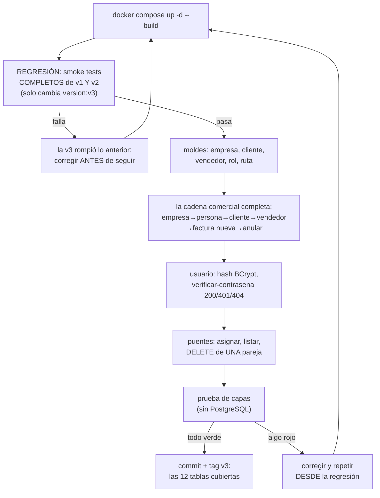

# Quickstart — Versión 3: arranque, regresión y smoke test

> **Versión 3** · Validación rápida de la versión ya construida. Si aún no
> hay nada construido, empiece por [8_tasks.md](8_tasks.md).

---

## 1. Arranque (igual que siempre)

```powershell
docker compose up -d --build
```

## 2. Regresión: v1 y v2 intactas (criterio 1)

Correr COMPLETOS los smoke tests de la
[v1](../v1_producto_postgres/7_quickstart.md) §2 y la
[v2](../v2_persona_factura/7_quickstart.md) §3.
Única diferencia esperada: `"version":"v3"` en el diagnóstico.

## 3. Smoke test de lo nuevo (criterios 2 a 6)

```powershell
# ── 2. LOS MOLDES (aquí solo empresa y cliente; repita el patrón con
#       vendedor, rol y ruta) ────────────────────────────────────────
curl.exe http://localhost:8065/api/empresa                    # 3 empresas
curl.exe -X POST http://localhost:8065/api/empresa -H "Content-Type: application/json" -d "{\"codigo\":\"E100\",\"nombre\":\"Empresa Nueva S.A.\"}"
curl.exe -X PATCH http://localhost:8065/api/empresa/E100 -H "Content-Type: application/json" -d "{\"nombre\":\"Empresa Nueva SAS\"}"

curl.exe http://localhost:8065/api/cliente                    # 4 clientes (ids 1,2,3,5)
# cliente SIN empresa (fkcodempresa null) y SIN credito (default 0):
curl.exe -X POST http://localhost:8065/api/cliente -H "Content-Type: application/json" -d "{\"fkcodpersona\":\"P001\"}"
# la FK como última defensa:
curl.exe -i -X POST http://localhost:8065/api/cliente -H "Content-Type: application/json" -d "{\"fkcodpersona\":\"P999\"}"     # → 500 FK
# la ruta UNIQUE:
curl.exe -i -X POST http://localhost:8065/api/ruta -H "Content-Type: application/json" -d "{\"ruta\":\"/home\",\"descripcion\":\"duplicada\"}"   # → 500 UNIQUE

# ── 3. LA CADENA COMERCIAL COMPLETA (v3 alimentando a la v2) ─────────
curl.exe -X POST http://localhost:8065/api/persona -H "Content-Type: application/json" -d "{\"codigo\":\"P010\",\"nombre\":\"Cliente Nuevo\",\"email\":\"cn@correo.com\",\"telefono\":\"3010101010\"}"
curl.exe -X POST http://localhost:8065/api/cliente -H "Content-Type: application/json" -d "{\"fkcodpersona\":\"P010\",\"fkcodempresa\":\"E100\",\"credito\":500000}"
# ← anote el id del cliente nuevo: GET /api/cliente y busque P010 (será 8 —
#   no 6: los INSERT fallidos del bloque 2 también CONSUMEN identity, aunque
#   la fila nunca exista; PostgreSQL no los devuelve). Cree su vendedor:
curl.exe -X POST http://localhost:8065/api/vendedor -H "Content-Type: application/json" -d "{\"carnet\":1004,\"direccion\":\"Calle 9 #8-70\",\"fkcodpersona\":\"P010\"}"
# ← anote el id (será 4). Ahora una factura CON ELLOS (¡la v2 en acción!):
curl.exe -X POST http://localhost:8065/api/factura -H "Content-Type: application/json" -d "{\"fkidcliente\":8,\"fkidvendedor\":4,\"productos\":[{\"codigo\":\"PR004\",\"cantidad\":1}]}"
# ← anote el numero y anúlela para dejar el stock como estaba (será 9: la
#   factura del intento "stock insuficiente" de la v2 también consumió su id):
curl.exe -X POST http://localhost:8065/api/factura/9/anular

# ── 4. USUARIO: el secreto nunca viaja ───────────────────────────────
curl.exe http://localhost:8065/api/usuario                    # 8 emails — SIN contraseñas
curl.exe -X POST http://localhost:8065/api/usuario -H "Content-Type: application/json" -d "{\"email\":\"qa@test.com\",\"contrasena\":\"secreto1\"}"
curl.exe "http://localhost:8065/api/usuario/qa@test.com"      # {"email":"qa@test.com"} — sin hash
curl.exe -X POST "http://localhost:8065/api/usuario/verificar-contrasena?valor_usuario=qa@test.com&valor_contrasena=secreto1"    # → 200
curl.exe -i -X POST "http://localhost:8065/api/usuario/verificar-contrasena?valor_usuario=qa@test.com&valor_contrasena=mala"    # → 401
curl.exe -i -X POST "http://localhost:8065/api/usuario/verificar-contrasena?valor_usuario=nadie@x.com&valor_contrasena=x"       # → 404
# PATCH re-hashea:
curl.exe -X PATCH "http://localhost:8065/api/usuario/qa@test.com" -H "Content-Type: application/json" -d "{\"contrasena\":\"secreto2\"}"
curl.exe -X POST "http://localhost:8065/api/usuario/verificar-contrasena?valor_usuario=qa@test.com&valor_contrasena=secreto2"   # → 200
curl.exe -i -X POST "http://localhost:8065/api/usuario/verificar-contrasena?valor_usuario=qa@test.com&valor_contrasena=secreto1" # → 401 (la vieja ya no)

# ── 5. LOS PUENTES: parejas exactas ──────────────────────────────────
curl.exe -X POST http://localhost:8065/api/rol-usuario -H "Content-Type: application/json" -d "{\"fkemail\":\"qa@test.com\",\"fkidrol\":2}"
curl.exe -X POST http://localhost:8065/api/rol-usuario -H "Content-Type: application/json" -d "{\"fkemail\":\"qa@test.com\",\"fkidrol\":3}"
curl.exe "http://localhost:8065/api/rol-usuario/usuario/qa@test.com"                 # las 2 asignaciones
curl.exe -i -X POST http://localhost:8065/api/rol-usuario -H "Content-Type: application/json" -d "{\"fkemail\":\"qa@test.com\",\"fkidrol\":2}"   # → 500 PK duplicada
curl.exe -X DELETE "http://localhost:8065/api/rol-usuario/qa@test.com/2"             # borra SOLO esa pareja
curl.exe "http://localhost:8065/api/rol-usuario/usuario/qa@test.com"                 # queda SOLO la del rol 3
# limpiar: la otra pareja y el usuario
curl.exe -X DELETE "http://localhost:8065/api/rol-usuario/qa@test.com/3"
curl.exe -X DELETE "http://localhost:8065/api/usuario/qa@test.com"

# ── 6. LA PRUEBA DE CAPAS (sin PostgreSQL) ───────────────────────────
docker compose exec api-facturas dotnet run --project pruebas
# → CRITERIO 6 OK: … (producto, persona Y empresa con repos falsos)
```

También todo con clics en **http://localhost:8065/swagger** (13 tags).

## 3b. El ciclo de validación, dibujado



**Guía de lectura:** el bloque de la cadena comercial es el corazón de la
validación — demuestra que v2 y v3 trabajan JUNTAS (una factura con
cliente y vendedor recién creados), no como módulos aislados.

## 4. Si algo falla

| Síntoma | Causa probable |
|---|---|
| Los de v1/v2 | Aplican todos igual (sus quickstarts §3/§4) |
| El POST de cliente da 500 sin FK aparente | ¿`credito` negativo? La petición lo valida (422); si pasó, revise el mensaje del motor en `detalle` |
| verificar-contrasena da 401 con los usuarios semilla `jefe@` o `cliente1@` | Correcto: esos guardaron texto plano (material didáctico) — BCrypt no lo reconoce |
| El paquete BCrypt no restaura | `docker compose restart api-facturas` tras editar el `.csproj` |
| DELETE de rol-usuario responde 404 con datos existentes | ¿Está pasando LAS DOS columnas en la URL? La pareja debe ser exacta |
