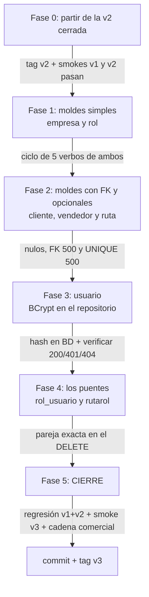

# Tareas — Versión 3: el resto de las entidades

> **Versión 3** · El orden de construcción, PARTIENDO DE LA v2 TERMINADA
> (tag `v2`). Requisitos: [2_spec.md](2_spec.md) · técnica: [3_plan.md](3_plan.md)
> · contratos: [6_contracts.md](6_contracts.md) · validación: [7_quickstart.md](7_quickstart.md).
>
> Estrategia: primero los 5 moldes EN SERIE (de menor a mayor dificultad),
> después la entidad con secreto (usuario), y al final el patrón nuevo
> (los puentes). Nada de v1/v2 se toca salvo Program.cs, el .csproj y
> pruebas/Programa.cs.

---

**El orden de fases con sus compuertas:**

**Guía de lectura:** los moldes van de menor a mayor dificultad (fases
1–2) para que el calco sea mecánico antes de entrar a lo genuinamente
nuevo: el secreto (fase 3) y la PK compuesta (fase 4).

## Fase 0 — Punto de partida verificado
- [ ] `git tag` muestra `v2` y los smoke tests de v1 y v2 pasan.
- [ ] `docker compose up -d` (la BD ya tiene TODO desde la v1).

**Verificar:** `SELECT count(*) FROM empresa` da 3; `usuario` da 8;
`rutarol` da 25 (cliente SQL a `localhost:15459`).

## Fase 1 — Los moldes simples: empresa y rol
- [ ] Empresa: modelo, 3 peticiones, interfaces, repo, servicio,
      controller (calcar de persona; PK string, 2 campos).
- [ ] Rol: ídem con PK `{id:int}` (calcar de cliente-por-venir o adaptar:
      SERIAL → la PK no viaja al crear).
- [ ] `pruebas/Programa.cs`: repo falso de EMPRESA + su guion (parte del
      criterio 6).
- [ ] `Program.cs`: los 4 AddScoped de estas dos.

**Verificar:** `dotnet run --project pruebas` → `CRITERIO 6 OK…` con
empresa incluida; CRUD de empresa y rol en Swagger (semillas: 3 y 5).

## Fase 2 — Los moldes con FK y opcionales: cliente, vendedor y ruta
- [ ] Cliente: `credito` opcional (default 0) y `fkcodempresa` opcional
      (DBNull) — [3_plan.md](3_plan.md) §2.
- [ ] Vendedor: calcado de cliente (sin opcionales).
- [ ] Ruta: molde simple; el UNIQUE lo defiende la BD.
- [ ] `Program.cs`: 6 AddScoped más.

**Verificar (criterios 2 y 3):** bloque 2 del [quickstart](7_quickstart.md) §3
(cliente sin empresa, FK 500, UNIQUE 500) y el bloque 3 completo — la
cadena empresa→persona→cliente→vendedor→FACTURA→anular.

## Fase 3 — Usuario: BCrypt y el secreto que no viaja
- [ ] `ApiFacturas.csproj`: paquete **BCrypt.Net-Next** (+ restart del
      contenedor).
- [ ] Modelo `Usuario` (¡solo Email!), las 3 peticiones (contrasena 6-200).
- [ ] `RepositorioUsuarioPostgres`: hash al crear/actualizar; lecturas
      proyectan solo email; `VerificarContrasenaAsync` → `bool?`
      ([3_plan.md](3_plan.md) §3).
- [ ] Servicio (traduce el trío 200/401/404) y controller (CRUD +
      `POST /verificar-contrasena`).
- [ ] `Program.cs`: 2 AddScoped más.

**Verificar (criterio 4):** bloque 4 del quickstart — hash en BD, lecturas
sin secreto, 200/401/404, PATCH re-hashea.

## Fase 4 — Los puentes: rol_usuario y rutarol
- [ ] Modelos `RolUsuario` y `RutaRol`; peticiones `RolUsuarioCrear` y
      `RutaRolCrear`.
- [ ] Repositorios con los 5 métodos del patrón puente — el DELETE con
      **WHERE por ambas columnas** ([3_plan.md](3_plan.md) §4).
- [ ] Servicios y controllers (prefijos `/api/rol-usuario` y
      `/api/rutarol`; sin PUT/PATCH).
- [ ] `Program.cs`: 4 AddScoped más + `"version": "v3"`.

**Verificar (criterio 5):** bloque 5 del quickstart — parejas exactas,
duplicado 500, DELETE quirúrgico.

## Fase 5 — Cierre de la versión
- [ ] **Regresión total** (criterio 1): smoke tests de v1 y v2 completos.
- [ ] Smoke test v3 completo ([7_quickstart.md](7_quickstart.md) §3).
- [ ] Confirmar el examen de no-invasión: `git diff v2 --stat` solo toca
      archivos NUEVOS + Program.cs + ApiFacturas.csproj +
      pruebas/Programa.cs + docs.
- [ ] Commit y tag `v3`.

**La v3 está TERMINADA: las 12 tablas cubiertas con UN motor.** Solo ahora
se especifica la v4 (el segundo motor — [mapa](../0_mapa_versiones.md)).
