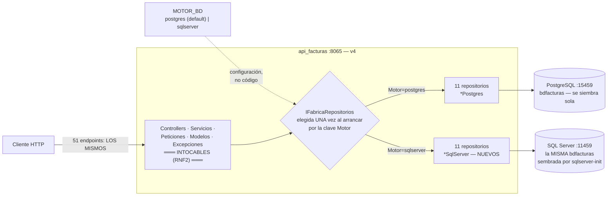

# Especificación — Versión 4: el segundo motor (SQL Server) y la fábrica

> **Versión 4** del desarrollo incremental ([mapa de versiones](../0_mapa_versiones.md)).
> Rige la constitución: [../../1_constitution.md](../../1_constitution.md).
> **Acumulativa:** contiene TODO lo de v1 a v3 — los 51 endpoints
> existentes no se tocan y sus contratos siguen vigentes tal cual.
>
> | Documento de esta versión | Contenido |
> |---|---|
> | **2_spec.md** (este) | QUÉ agrega la v4 y sus criterios de aceptación |
> | [3_plan.md](3_plan.md) | CÓMO: la fábrica, los 11 repositorios SqlServer y el interruptor |
> | [4_research.md](4_research.md) | Decisiones y alternativas *(lectura opcional)* |
> | [5_data_model.md](5_data_model.md) | La MISMA bdfacturas, ahora en dialecto SQL Server |
> | [6_contracts.md](6_contracts.md) | CERO endpoints nuevos — esa es la gracia |
> | [7_quickstart.md](7_quickstart.md) | La regresión DOBLE: todo pasa en ambos motores |
> | [8_tasks.md](8_tasks.md) | Orden de construcción por fases verificables |
> | [GUIA_IA4.md](GUIA_IA4.md) | Construirla con IA, sobre su proyecto v3 |

---

## 1. Propósito de la v4

**Demostrar que las capas eran verdad.** Desde la v1 el proyecto repite
que controlador y servicio "no saben qué motor hay debajo". La v4 lo
somete a la prueba definitiva: aparece un **segundo motor (SQL Server)**
con la MISMA bdfacturas, y la API entera — 51 endpoints, validaciones,
errores de negocio, BCrypt, triggers y SPs — funciona idéntica contra
cualquiera de los dos. **Sin tocar UNA línea por encima de los
repositorios.**

Y de paso cobra la deuda anunciada: la lista de registros del ensamblador
que en la v3 "ya dolía" se cura con la **fábrica de repositorios** (patrón
fábrica abstracta): UN punto del código decide el motor; el resto pide
interfaces. Bono didáctico: también se paga la promesa de la v1 — SQL
Server NO se siembra solo, y por fin se conoce el patrón del **contenedor
inicializador** por contraste con PostgreSQL.

**El contexto de la v4, dibujado** (Mermaid — la prueba definitiva de
las capas):

**Guía de lectura:** la caja de arriba no tiene ni una flecha nueva — ese
es el requisito RNF2 dibujado: el segundo motor entra por DEBAJO de las
interfaces. El rombo es la única decisión, y la toma una variable de
entorno, no el código.

## 2. Alcance

**Incluye:** servicios `sqlserver` + `sqlserver-init` en el compose
(misma BD semilla) · los 11 repositorios en dialecto SqlClient ·
`IFabricaRepositorios` + `FabricaPostgres` + `FabricaSqlServer` · el
**interruptor** `MOTOR_BD` (configuración, no código; default postgres) ·
diagnóstico pasa a `"version": "v4"` y estrena `"motor"` · la prueba de
capas crece con la fábrica.

**No incluye (deliberado — [mapa](../0_mapa_versiones.md)):**
- **MariaDB** (v5): el tercer motor esperará — con la fábrica puesta,
  costará una clase.
- **Selección de motor por petición**: descartada del curso. En v4 el motor se elige UNA vez, al arrancar.
- Cambios de contrato: ningún endpoint nuevo, ningún campo nuevo (salvo
  `motor` en el diagnóstico).

## 3. Requisitos funcionales

### RF1 — La fábrica de repositorios
- `IFabricaRepositorios`: una interfaz con 11 métodos `CrearRepositorioX()`
  (una por rebanada). Quien la implementa decide el motor de TODAS.
- `FabricaPostgres` y `FabricaSqlServer`: cada una entrega los 11
  repositorios de su dialecto, con su cadena de conexión.
- El ensamblador (`Program.cs`) elige la fábrica UNA vez según la
  configuración y registra los 11 repositorios pidiéndoselos a ella.
  **Los servicios no cambian ni una letra.**

### RF2 — El motor por configuración (el interruptor)
- Clave de configuración `Motor`: `postgres` | `sqlserver` (cualquier
  otro valor → la API no arranca, con mensaje claro).
- En Docker la fija la variable de entorno `Motor` del compose, que lee
  `${MOTOR_BD:-postgres}`: **por defecto la API sigue hablando con
  PostgreSQL** (el motor de siempre — continuidad), y
  `MOTOR_BD=sqlserver` estrena el nuevo — sin tocar código, sin
  recompilar.
- Dos cadenas de conexión conviven en la configuración (`Postgres` y
  `SqlServer`); cada fábrica usa la suya.

### RF3 — El segundo motor completo
- Servicio `sqlserver` (SQL Server 2022, ~2 GB de RAM) en el compose,
  puerto publicado **11459**, con healthcheck real (sqlcmd) y
  `start_period` de gracia.
- **`sqlserver-init`**: SQL Server NO ejecuta scripts montados — este
  contenedor corre `db/bdfacturas_sqlserver.sql` UNA vez (idempotente) y
  muere Exited(0). Es la lección de orquestación prometida desde la v1.
- La BD: las MISMAS 12 tablas, las MISMAS semillas (mismos ids, vía
  `IDENTITY_INSERT`), el MISMO trigger de totales/stock y los MISMOS SPs
  de factura — en dialecto T-SQL ([5_data_model](5_data_model.md)).
- Los 11 `RepositorioXSqlServer` (Microsoft.Data.SqlClient): mismos
  contratos de interfaz, mismo SQL parametrizado (dialecto aparte:
  `TOP (@limite)` en vez de `LIMIT`), BCrypt sigue viviendo SOLO en el
  repositorio de usuario.
- El de factura llama los SPs con `CommandType.StoredProcedure` +
  parámetro `@p_resultado OUTPUT` y traduce los `THROW` **numerados**
  (50003/50010) a las MISMAS excepciones de negocio: "no existe" → 404 ·
  "ya está anulada" → 409 · el resto (stock, mínimo) → 500.

### RF4 — Diagnóstico
`GET /` → `{mensaje, version: "v4", motor: "postgres"|"sqlserver",
contratos}`. El campo `motor` es la única adición visible del contrato.

## 4. Requisitos no funcionales

- **RNF1 — Los de v1 a v3 siguen todos** (capas, sin ORM, SQL
  parametrizado, async, errores uniformes, 422 con `errores[]`, el
  secreto nunca viaja).
- **RNF2 — La frontera es el repositorio:** el diff de la v4 NO toca
  Controllers/, Servicios/, Peticiones/, Modelos/ ni Excepciones/. Si
  algo de ahí "necesitara" cambiar, la v4 está mal planteada.
- **RNF3 — Paridad de semillas:** ambos motores arrancan con datos
  idénticos (mismos ids, mismos stocks) — el smoke test es EL MISMO.
- **RNF4 — Sin anticipación:** nada de MariaDB (v5) ni selección
  dinámica de motor por petición (v6).

## 5. Criterios de aceptación

1. **Regresión total contra PostgreSQL (motor por defecto):** `docker
   compose up -d --build` y los smoke tests COMPLETOS de
   [v1](../v1_producto_postgres/7_quickstart.md) §2,
   [v2](../v2_persona_factura/7_quickstart.md) §3 y
   [v3](../v3_resto_entidades/7_quickstart.md) §3 pasan tal cual (solo
   cambia el diagnóstico: `"version":"v4"`, `"motor":"postgres"`).
2. **El interruptor:** `MOTOR_BD=sqlserver` + recrear SOLO la API → el
   diagnóstico dice `"motor":"sqlserver"` y la MISMA regresión total
   pasa contra SQL Server. Ni una recompilación del código fuente.
3. **Los errores de negocio son idénticos en ambos motores:** factura
   999 → 404 · doble anulación → 409 · stock insuficiente → 500 con el
   mensaje del motor · FK/UNIQUE/PK violadas → 500. (El `detalle` puede
   variar en redacción — el `estado` y el `mensaje` no.)
4. **El diff respeta la frontera:** `git diff v3 --stat` solo toca
   `Fabricas/`, `Repositorios/*SqlServer.cs`, `Program.cs`,
   `ApiFacturas.csproj`, `docker-compose.yml`, `appsettings.json`,
   `db/`, `pruebas/`, `postman/` y `docs/`.
5. **Prueba de capas ampliada:** `dotnet run --project pruebas` verifica
   además que cada fábrica entrega los repositorios de SU motor — sin
   abrir una sola conexión (las fábricas construyen, no conectan).

## 6. Definición de TERMINADA

Los 5 criterios pasan → commit + tag `v4` → la API es bi-motor → recién
entonces se especifica la v5 (MariaDB: la fábrica pagará su promesa).

## 7. Clarificaciones

> **Qué es esta sección:** el registro de las ambigüedades detectadas ANTES
> de planear, con la respuesta que se acordó y su razón. Es **la compuerta
> 1** del método (ver [SDD_SPECKIT](../../../SDD_SPECKIT.md)): mientras
> quede un `[NECESITA ACLARACIÓN: …]` en los requisitos de arriba, esta
> versión no pasa a la planeación.
>
> Las entradas de abajo se reconstruyeron **al cerrar la versión**, a
> partir de las decisiones que sus propios contratos ya dejaban fijadas.
> De aquí en adelante esta sección se llena **en vivo**, antes del
> `3_plan.md` — que es como debe ser.

| # | La pregunta | La respuesta acordada, con su razón | Dónde quedó |
|---|---|---|---|
| C1 | El listado sin filas, ¿es un error o un resultado? | Un resultado: **204 sin cuerpo**. Vacío no es error. | RF de listar · contrato del `GET` |
| C2 | Una factura equivocada, ¿se borra o se anula? | Se **anula**: borrado lógico que restaura el stock. La factura es un hecho contable; borrarla perdería la trazabilidad. | RF de anulación · contrato de anular |
| C3 | Anular dos veces la misma factura, ¿qué responde? | **409**: el conflicto es de estado, no de forma ni de existencia. La factura existe (no es 404) y el body está bien (no es 422). | Contrato de anular |
| C4 | La contraseña, ¿viaja y se guarda en claro? | Nunca: se guarda **hasheada con BCrypt** y la comparación se hace con un endpoint de verificación. La API jamás devuelve el hash. | RF de usuario · modelo de datos |

**Cómo se escribe una entrada nueva:** la pregunta tal como se hizo (no
"revisar el borrado", sino "¿físico o lógico?"), la respuesta **con su
razón**, y el documento donde quedó plasmada. Si la respuesta cambia un
requisito, se corrige el requisito allá arriba: esta sección lo registra,
no lo reemplaza.
