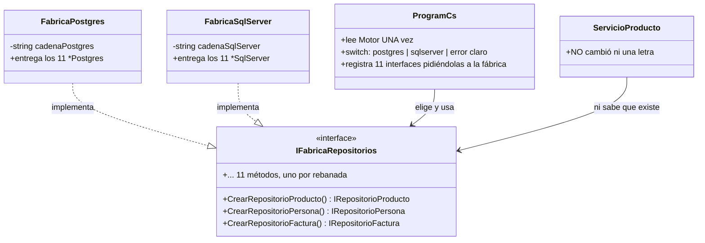
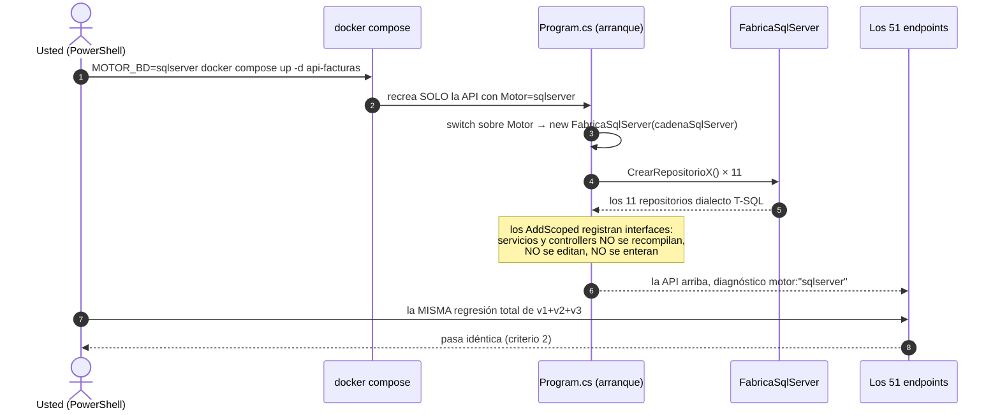
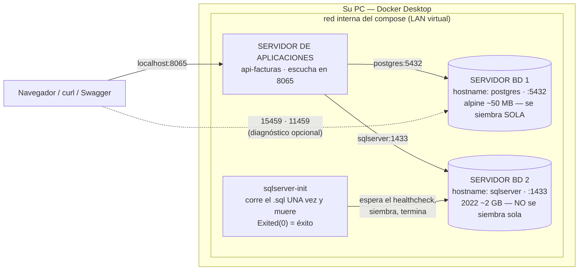

# Plan — Versión 4: el segundo motor (SQL Server) y la fábrica

> **Nota (agosto de 2026):** el curso adoptó **Dapper** como
> micro-ejecutor en TODOS los repositorios: el SQL sigue escrito a mano
> y parametrizado; cambió el mapeo (`QueryAsync`/`ExecuteAsync` en vez
> del ciclo DataReader) y los SPs se llaman con `DynamicParameters`.
> Las tablas de "calco" entre dialectos siguen valiendo para los
> PROVEEDORES (Npgsql/SqlClient/MySqlConnector) que Dapper usa por debajo.


> Cómo se construye lo especificado en [2_spec.md](2_spec.md). El stack es
> el mismo de siempre (C#/ASP.NET Core, ADO.NET, sin ORM); lo nuevo es el
> cliente **Microsoft.Data.SqlClient** y el patrón **fábrica abstracta**.

---

## 1. Inventario de archivos

**Nuevos (14 de código + 2 de BD):**

```
api_facturas/Fabricas/IFabricaRepositorios.cs      ← la interfaz (11 métodos CrearRepositorioX)
api_facturas/Fabricas/FabricaPostgres.cs           ← entrega los 11 *Postgres
api_facturas/Fabricas/FabricaSqlServer.cs          ← entrega los 11 *SqlServer
api_facturas/Repositorios/Repositorio{Producto,Persona,Factura,Empresa,
    Cliente,Vendedor,Usuario,Rol,Ruta,RolUsuario,RutaRol}SqlServer.cs   (11)
db/bdfacturas_sqlserver.sql                        ← la MISMA BD, dialecto T-SQL
db/init_sqlserver.sh                               ← el inicializador (SQL Server no auto-ejecuta)
```

**Crecen (los únicos existentes que se tocan):**

| Archivo | Qué crece |
|---|---|
| `ApiFacturas.csproj` | ★ paquete **Microsoft.Data.SqlClient** |
| `docker-compose.yml` | ★ servicios `sqlserver` (2022, :11459, healthcheck) + `sqlserver-init` + variables `Motor` y `ConnectionStrings__SqlServer` en la API |
| `appsettings.json` | ★ cadena `SqlServer` y clave `Motor` (defaults para correr sin Docker) |
| `Program.cs` | ★ el ensamblador se REESCRIBE alrededor de la fábrica (ver §4) + diagnóstico v4 con `motor` |
| `pruebas/Programa.cs` | ★ criterio 5: las fábricas eligen sin conectarse |

**Intocables (RNF2):** Controllers/, Servicios/, Peticiones/, Modelos/,
Excepciones/. Ese es el punto de la versión.

## 2. Los 10 repositorios "calcados" (todos menos factura)

La traducción Postgres → SqlServer es **mecánica** — la tabla completa:

| PostgreSQL (v1–v3) | SQL Server (v4) |
|---|---|
| `using Npgsql` | `using Microsoft.Data.SqlClient` |
| `NpgsqlConnection` / `NpgsqlCommand` / `NpgsqlDataReader` | `SqlConnection` / `SqlCommand` / `SqlDataReader` |
| `NpgsqlParameterCollection` | `SqlParameterCollection` |
| `SELECT … LIMIT @limite` (al final) | `SELECT TOP (@limite) …` (al PRINCIPIO) |
| Todo lo demás (parámetros `@`, async, `await using`, DBNull del cliente, el SET dinámico del PATCH) | **idéntico** |

BCrypt no se entera del cambio: `RepositorioUsuarioSqlServer` hashea y
verifica EXACTAMENTE igual (el hash es del repositorio, no del motor —
RNF2 de la v3).

## 3. El repositorio de factura SqlServer (el único con diseño propio)

Los SPs de SQL Server devuelven su JSON por un parámetro
`@p_resultado NVARCHAR(MAX) OUTPUT`. Diferencias frente al dialecto
PostgreSQL que el curso ya conoce:

| Aspecto | PostgreSQL (v2) | SQL Server (v4) |
|---|---|---|
| Invocación | texto `CALL sp_x(…, NULL)` | `CommandType.StoredProcedure` |
| El JSON de salida | el CALL devuelve una fila con los INOUT | parámetro OUTPUT (`SqlDbType.NVarChar, -1`) |
| El detalle JSON de entrada | `cast(:productos as json)` | `NVARCHAR` que el SP abre con OPENJSON |
| Errores de negocio | `RAISE EXCEPTION` → SQLSTATE `P0001` + patrón | `THROW` **numerado**: 50003 (consultar no existe) · 50010 (anular: no existe / ya anulada) |

La traducción de errores — fíjese: SQL Server SÍ numera, así que el
filtro es MÁS preciso que el patrón de texto de PostgreSQL (la lección
de dialectos, en la otra dirección):

```csharp
catch (SqlException e) when ((e.Number == 50003 || e.Number == 50010)
                             && e.Message.Contains("no existe"))
{
    throw new NoEncontradoExcepcion(e.Message);      // → 404
}
catch (SqlException e) when (e.Number == 50010 && e.Message.Contains("anulada"))
{
    throw new ConflictoExcepcion(e.Message);         // → 409
}
// Stock insuficiente (trigger), mínimo de renglones, FK → suben → 500.
```

## 4. El ensamblador con fábrica (Program.cs)

La lista de la v3 ("este dolor es el argumento del segundo motor") se
cura así:

```csharp
// UN punto del código decide el motor (default: postgres, el de siempre):
var motor = builder.Configuration["Motor"] ?? "postgres";
IFabricaRepositorios fabrica = motor switch
{
    "postgres"  => new FabricaPostgres(cadenaPostgres),
    "sqlserver" => new FabricaSqlServer(cadenaSqlServer),
    _ => throw new InvalidOperationException(
             $"Motor desconocido: '{motor}' (use postgres o sqlserver)."),
};

// Las 11 rebanadas, ahora CIEGAS al motor:
builder.Services.AddScoped<IRepositorioProducto>(_ => fabrica.CrearRepositorioProducto());
builder.Services.AddScoped<IServicioProducto, ServicioProducto>();
// … (mismo par para las otras 10 rebanadas)
```

La cuenta didáctica: agregar MariaDB en la v5 costará **una clase**
(`FabricaMariaDb`) **y un case** — no 11 registros nuevos. Eso compra la
fábrica.

## 4b. Los planos de la fábrica (Mermaid)

**Diagrama de clases** — el patrón fábrica abstracta con sus dos
implementaciones:



**Secuencia del interruptor** — qué pasa cuando usted escribe
`MOTOR_BD=sqlserver`:



**Guía de lectura:** el motor se decide en el paso 3 y en NINGÚN otro
lugar. Si su diff de la v4 toca un servicio o un controller, violó la
frontera que este diagrama declara (criterio 4: `git diff v3 --stat`).

**Arquitectura de despliegue de la v4** — el sistema de servidores crece
a DOS motores (compare con el de la [v1](../v1_producto_postgres/3_plan.md)
§3.1):



**Guía de lectura:** los DOS motores viven siempre encendidos; el
interruptor decide a cuál le habla la API. La caja `sqlserver-init` es la
lección de orquestación prometida en v1: un servidor que existe solo para
sembrar a otro y morir con dignidad (`Exited 0`).

## 5. El compose con dos motores (y la lección del inicializador)

- Servicio `sqlserver` (2022): healthcheck REAL con sqlcmd y
  `start_period: 30s` (el motor tarda). Pide ~2 GB de RAM — el contraste
  de pesos con PostgreSQL alpine (~50 MB) también es contenido.
- **`sqlserver-init`**: la v1 lo prometió — "cuando llegue un motor que
  NO se siembre solo, se entenderá el patrón inicializador". Aquí está:
  un contenedor que espera el healthcheck, corre
  `db/bdfacturas_sqlserver.sql` UNA vez (idempotente) y muere. La API
  suma `depends_on: service_completed_successfully`.
- Puerto publicado **11459** (curso; la reconstrucción del estudiante
  usa 11559).
- El interruptor: `Motor: ${MOTOR_BD:-postgres}` —
  `MOTOR_BD=sqlserver docker compose up -d api-facturas` recrea SOLO la
  API apuntando al motor nuevo (los DOS motores siempre están arriba).

## 6. La prueba de capas crece (criterio 5)

Las fábricas se prueban SIN base de datos: construir un repositorio no
abre conexiones. El proyecto `pruebas/` verifica que cada fábrica entrega
instancias del dialecto correcto (`is RepositorioProductoSqlServer`,
etc.) con cadenas de conexión de mentira.

## 7. Chequeo de constitución

> **La compuerta 2** del método (ver [SDD_SPECKIT](../../../SDD_SPECKIT.md)):
> antes de pasar a `8_tasks.md` se revisa la
> [constitución](../../1_constitution.md) **artículo por artículo**. Si algo
> no cumple, o se corrige el plan, o se enmienda la constitución. Nunca se
> deja pasar "por esta vez".

| Artículo | Cómo lo cumple esta versión |
|---|---|
| **1** — El curso es POR VERSIONES y la especificación manda | El alcance de esta versión es el que declara [2_spec.md](2_spec.md) §2, y **no anticipa** nada de las siguientes. Cierra con commit y tag. |
| **2** — Stack: C# y ASP.NET Core, con el SQL a la vista | C# sobre ASP.NET Core, SQL escrito a mano y **siempre parametrizado**, sin ORM de entidades. Los paquetes son los que el artículo permite (§1 de este plan). |
| **3** — Arquitectura en capas con interfaces, desde el día 1 | Controlador → interfaz de servicio → interfaz de repositorio → repositorio (§3 de este plan). Solo el ensamblador conoce clases concretas. |
| **4** — Un solo comando | `docker compose up -d --build` deja la versión funcionando (§5 de este plan). |
| **5** — La base de datos viene DADA | La BD `bdfacturas` viene dada por los scripts de `db/`; esta versión solo nombra las tablas que su alcance le permite ([5_data_model.md](5_data_model.md)). |
| **6** — Todo en español, comentado para principiantes | Nombres, rutas y mensajes en español, con comentarios línea a línea en el código. |
| **7** — Contratos exactos | [6_contracts.md](6_contracts.md) fija verbos, rutas, códigos y formatos exactos, incluidos los desenlaces de error. |
| **8** — Convenciones fijas | Puertos, rutas, sobre de respuesta y catálogo de errores, tal como los fija el artículo. |

**Complejidad justificada:** si esta versión se desvía de algún artículo,
la desviación va aquí, con la alternativa más simple que se descartó y por
qué no sirvió. Sin desviaciones anotadas, se entiende que no las hay.
