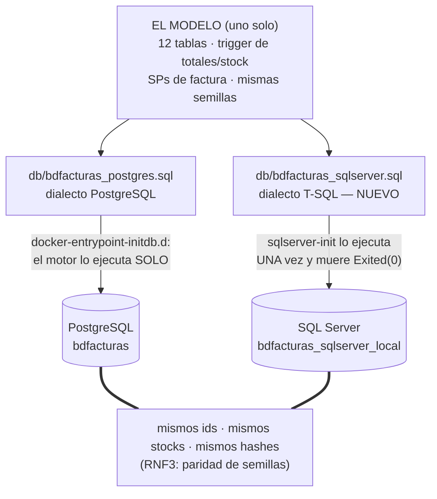

# Modelo de datos — Versión 4: la MISMA bdfacturas, en SQL Server

> La v4 no agrega ni una tabla ni una columna: agrega un DIALECTO.
> `db/bdfacturas_sqlserver.sql` crea en SQL Server la misma base que
> `db/bdfacturas_postgres.sql` crea en PostgreSQL: 12 tablas, el trigger
> de totales/stock, los SPs de factura y las mismas semillas (mismos
> ids). La BD se llama `bdfacturas_sqlserver_local`.

---

## 1. Equivalencias de dialecto (lo que cambia al portar el DDL)

| Concepto | PostgreSQL (v1) | SQL Server (v4) |
|---|---|---|
| Autonumérico | `SERIAL` (secuencia `tabla_col_seq`) | `INT IDENTITY(1,1)` |
| Insertar ids explícitos | insertar y luego `setval('t_col_seq', MAX)` | `SET IDENTITY_INSERT t ON/OFF` |
| Texto | `VARCHAR` (UTF-8 nativo) | `NVARCHAR(n)` |
| Decimal | `NUMERIC` | `DECIMAL(18,2)` |
| Fecha-hora | `TIMESTAMP` + `CURRENT_TIMESTAMP` | `DATETIME2` + `GETDATE()` |
| Error de negocio | `RAISE EXCEPTION 'mensaje'` (SQLSTATE `P0001`, sin número) | `THROW 5000x, 'mensaje', 1` (¡numerado!) |
| Abrir JSON de entrada | `json_array_elements(p_json)` | `OPENJSON(@json)` |
| Armar JSON de salida | `json_build_object` / `json_agg` / `row_to_json` | `FOR JSON PATH` |
| SP con salida | `INOUT p_resultado JSON` (el `CALL` la devuelve como fila) | `@p_resultado NVARCHAR(MAX) OUTPUT` |
| Top-N | `LIMIT @n` (al final) | `SELECT TOP (@n)` (al principio) |
| Auto-ejecuta scripts montados | **sí** (docker-entrypoint-initdb.d) | **NO** — nace `sqlserver-init` |

Las 12 tablas, sus PKs, FKs, el `UNIQUE(ruta)`, el default de `credito`,
el `ON DELETE CASCADE` de `productosporfactura` — **idénticos** en
estructura y nombre. Los modelos C# no notan la diferencia.

## 2. El trigger y los SPs (los mismos actores, otro acento)

- **Los triggers** (`trg_prodfact_*`): mismos papeles que el trigger de
  PostgreSQL — validar stock (THROW 50001), calcular `subtotal`,
  descontar/restaurar `stock`, recalcular el `total`.
- **Los 6 SPs de factura** conservan nombre y semántica:
  `sp_insertar_factura_y_productosporfactura` (mínimo de renglones,
  THROW 50002), `sp_consultar…` (THROW **50003** si no existe),
  `sp_listar…` (nombres resueltos, detalle adentro), `sp_actualizar…`,
  `sp_borrar…` y **`sp_anular_factura`** (THROW **50010**: "no existe" /
  "ya está anulada" — los que la API traduce a 404/409).
- **Los SPs de usuarios/roles/permisos** también viajan en el script:
  la v4 no los llama, pero mantienen la paridad entre los dos dialectos
  — y quedan listos para el login del front (v6).

## 2b. Un modelo, dos scripts (Mermaid)

El **diagrama entidad-relación NO cambia**: es el de la
[v1](../v1_producto_postgres/5_data_model.md) (las 12 tablas) — esa es la
gracia de la v4. Lo que se duplica es el CAMINO del DDL a cada motor:

**Guía de lectura:** un solo modelo lógico, dos dialectos físicos, dos
mecanismos de siembra. La línea gruesa de abajo es el requisito que
gobierna la versión: si las semillas difirieran, el smoke test único
sería mentira.

## 3. Los mensajes que la API traduce (paridad de negocio)

| Situación | PostgreSQL (v2/v3) | SQL Server (v4) | API |
|---|---|---|---|
| Consultar factura inexistente | `Factura N no existe` (P0001) | THROW **50003** `…no existe` | **404** |
| Anular factura inexistente | `Factura N no existe` (P0001) | THROW **50010** `…no existe` | **404** |
| Anular factura ya anulada | `…ya está anulada` (P0001) | THROW **50010** `…ya está anulada` | **409** |
| Stock insuficiente | trigger (P0001) | THROW **50001** (trigger) | **500** |
| Mínimo de renglones | `requiere minimo…` | THROW **50002** | (no llega: la petición corta en 422) |
| FK / PK / UNIQUE violadas | SQLSTATE 23xxx | error del motor | **500** |

## 4. Semillas (idénticas a PostgreSQL — RNF3)

| Tabla | Filas | Igual que en PostgreSQL |
|---|---|---|
| producto | 8 | PR001 stock 17 … PR008 |
| persona | 6 | P001 Ana Torres … P006 |
| empresa | 3 | E001, E002, E999 |
| cliente | 4 | ids **1, 2, 3, 5** (el hueco del 4 incluido) |
| vendedor | 3 | ids 1-3, carnets 1001-1003 |
| factura | 6 | numeros 1-6 con su detalle (12 renglones) |
| rol · ruta | 5 · 15 | Administrador… · /home… (UNIQUE) |
| usuario | 8 | 2 hash costo 12, 2 TEXTO PLANO (la lección), 4 hash 10/11 |
| rol_usuario · rutarol | 21 · 25 | las mismas parejas |

Tras cada bloque con ids explícitos, `IDENTITY_INSERT` deja el contador
alineado — así el próximo insert da el mismo id que daría PostgreSQL
(cliente nuevo → 6, vendedor nuevo → 4, factura nueva → 7).
