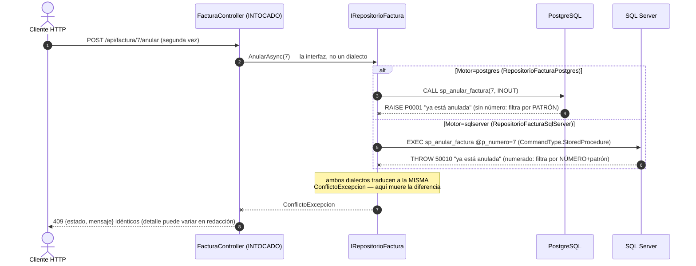

# Contratos — Versión 4: CERO endpoints nuevos (esa es la gracia)

> El contrato de la API es EXACTAMENTE el de las versiones anteriores:
> los 51 endpoints de [v1](../v1_producto_postgres/6_contracts.md),
> [v2](../v2_persona_factura/6_contracts.md) y
> [v3](../v3_resto_entidades/6_contracts.md) siguen vigentes **tal cual,
> con ambos motores**. Esta página existe para decir formalmente qué NO
> cambió — y la única línea que sí.

---

## 1. Lo único que cambia: el diagnóstico

```
GET /
```

**200**
```json
{
  "mensaje": "API Facturas funcionando",
  "version": "v4",
  "motor": "postgres",
  "contratos": "docs/spec_kit/versiones/v4_sqlserver/6_contracts.md"
}
```

`motor` refleja la configuración activa (`postgres` por defecto en
Docker; `sqlserver` con el interruptor `MOTOR_BD`). Es el único campo
nuevo de toda la versión.

## 2. Lo que formalmente NO cambia (y el criterio 3 verifica)

| Grupo | Endpoints | Con `motor=postgres` | Con `motor=sqlserver` |
|---|---|---|---|
| producto (v1) | 6 | idénticos | idénticos |
| persona (v2) | 6 | idénticos | idénticos |
| factura (v2) | 4 | idénticos (SPs `CALL`/INOUT) | idénticos (SPs OUTPUT) |
| empresa, cliente, vendedor, rol, ruta (v3) | 30 | idénticos | idénticos |
| usuario + verificar-contrasena (v3) | 7 | idénticos (mismo BCrypt) | idénticos |
| rol-usuario, rutarol (v3) | 10 | idénticos | idénticos |

Los códigos son los mismos: 200 · 204 lista vacía · 400 parámetros · 404
no existe · 409 conflicto de negocio · 422 la petición · 500 el motor.

### 2b. La MISMA secuencia de error, en los dos dialectos (Mermaid)

El 409 de la doble anulación, dibujado UNA vez con las dos rutas — la
mitad de arriba es idéntica sin importar el motor:



**Guía de lectura:** el bloque `alt` es el ÚNICO tramo donde los motores
se distinguen, y queda encerrado en el repositorio. Del repositorio hacia
arriba viaja una sola excepción de negocio — por eso el controller no
supo, no sabe y no sabrá qué motor respondió.

**Matiz honesto del contrato:** el campo `detalle` de los errores 500
transporta el mensaje del MOTOR, y cada motor redacta distinto
(PostgreSQL: "inserción o actualización en la tabla «cliente» viola la
llave foránea…" · SQL Server: "Instrucción INSERT en conflicto con la
restricción FOREIGN KEY…"). El contrato fija `estado` y `mensaje`;
`detalle` es informativo y depende del dialecto — igual que desde la v1.
