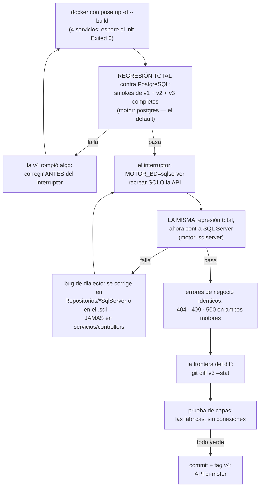

# Quickstart — Versión 4: arranque y la regresión DOBLE

> **Versión 4** · Validación rápida de la versión ya construida. Si aún no
> hay nada construido, empiece por [8_tasks.md](8_tasks.md).

---

## 1. Arrancar TODO (ahora con 4 servicios)

```powershell
docker compose up -d --build
```

La primera vez tarda: SQL Server pide su tiempo. Al final: `postgres`
(healthy — se siembra solo, como siempre), `sqlserver` (healthy),
**`sqlserver-init` (Exited 0 — hizo su trabajo y murió: la lección del
inicializador, prometida desde la v1)** y `api-facturas` arriba.

> ⚠️ SQL Server necesita ~2 GB de RAM libres en Docker Desktop.

## 2. La regresión doble (criterios 1 y 2 — el corazón de la v4)

### 2a. TODO contra PostgreSQL (el motor por defecto)

```powershell
curl.exe http://localhost:8065/     # → "version":"v4", "motor":"postgres"
```

Correr COMPLETOS los smoke tests de la
[v1](../v1_producto_postgres/7_quickstart.md) §2, la
[v2](../v2_persona_factura/7_quickstart.md) §3 y la
[v3](../v3_resto_entidades/7_quickstart.md) §3. **Pasan tal cual.**

### 2b. El interruptor: los MISMOS tests contra SQL Server

```powershell
$env:MOTOR_BD = "sqlserver"
docker compose up -d api-facturas       # recrea SOLO la API (segundos)
curl.exe http://localhost:8065/         # → "motor":"sqlserver"
```

Correr la MISMA regresión completa. Pasa igual — mismos ids, mismos
stocks, mismos 404/409/422/500. **Eso** — ninguna línea de código cambió
entre 2a y 2b — es la demostración de que las capas eran verdad.

> ⚠️ Cada motor guarda lo suyo: lo que usted creó en 2a vive solo en
> PostgreSQL. Para el estado semilla exacto:
> `docker compose down -v && docker compose up -d`.

Para volver al default (PostgreSQL):

```powershell
Remove-Item Env:MOTOR_BD
docker compose up -d api-facturas
```

## 3. Los errores de negocio en el motor nuevo (criterio 3)

```powershell
curl.exe -i http://localhost:8065/api/factura/999                 # → 404 (THROW 50003 traducido)
curl.exe -i -X POST http://localhost:8065/api/factura -H "Content-Type: application/json" -d "{\"fkidcliente\":1,\"fkidvendedor\":1,\"productos\":[{\"codigo\":\"PR001\",\"cantidad\":9999}]}"   # → 500 "Stock insuficiente…"
# (anule dos veces cualquier factura suya: la segunda → 409, THROW 50010)
```

## 4. La frontera del diff (criterio 4)

```powershell
git diff v3 --stat
```

NADA de `Controllers/`, `Servicios/`, `Peticiones/`, `Modelos/` ni
`Excepciones/` aparece en la lista. La v4 vive de repositorios hacia
abajo (+ el ensamblador, que para eso existe).

## 5. La prueba de capas (criterio 5)

```powershell
docker compose exec api-facturas dotnet run --project pruebas
# → … CRITERIO 5 OK: cada fábrica entrega los repositorios de su motor, sin abrir conexiones
```

## 5b. El ciclo de validación, dibujado (la regresión DOBLE)



**Guía de lectura:** es UNA regresión ejecutada DOS veces — no dos
regresiones. Si el camino rojo del motor nuevo lo lleva a editar un
servicio o un controller, deténgase: el bug está en el dialecto (abajo),
no en el diseño (arriba).

## 6. Si algo falla

| Síntoma | Causa probable |
|---|---|
| Los de v1/v2/v3 | Aplican todos igual (sus quickstarts) |
| `sqlserver` nunca queda healthy | Le falta RAM (~2 GB) o el disco de Docker está lleno |
| `sqlserver-init` en Exited (1) | La clave de `sa` no coincide o el motor no estaba sano — `docker compose logs sqlserver-init` |
| Todo 500 con `motor=sqlserver` | ¿El init corrió? `docker compose logs sqlserver-init` debe decir "inicializado correctamente" |
| `GET /` dice un motor y usted esperaba el otro | La variable `MOTOR_BD` quedó fija en su PowerShell: `Remove-Item Env:MOTOR_BD` y recree la API |
| "Motor desconocido: …" en los logs | Valor inválido en `MOTOR_BD` (solo `postgres` o `sqlserver`) |
| Factura da 500 en vez de 404/409 en sqlserver | El repositorio no está filtrando por número + patrón — ver [3_plan.md](3_plan.md) §3 |
| RAM justa | `docker compose stop sqlserver sqlserver-init` libera el motor pesado mientras trabaja con postgres |
