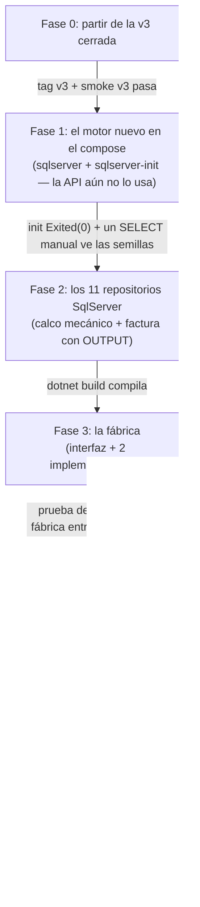

# Tareas — Versión 4: orden de construcción por fases verificables

> Cada fase termina en un estado COMPROBABLE. No avance con una fase en
> rojo. El detalle de diseño está en [3_plan.md](3_plan.md).

---

**El orden de fases con sus compuertas:**



**Guía de lectura:** la fase 1 sube el motor SIN tocar la API — así, si
algo falla ahí, es Docker, no C#. El código solo empieza a cambiar en la
fase 2, y siempre por debajo de la frontera de repositorios.

## Fase 0 — Punto de partida

- [ ] La v3 corre y pasa su smoke test (tag `v3` presente).
- [ ] `git diff v3` limpio (se parte de la versión cerrada).

**Verificar:** diagnóstico responde `"version":"v3"`.

## Fase 1 — El motor nuevo en el compose (sin tocar la API)

- [ ] `db/bdfacturas_sqlserver.sql` (cópielo del proyecto del curso — es
      dato, no código a generar) e `db/init_sqlserver.sh`.
- [ ] `docker-compose.yml`: servicios `sqlserver` (2022, :11459,
      healthcheck con sqlcmd y `start_period`) y `sqlserver-init`
      (entrypoint al .sh, `restart: "no"`).
- [ ] `docker compose up -d` — la API sigue en v3 contra PostgreSQL:
      **nada se rompe por agregar contenedores**.

**Verificar:**
```powershell
docker compose logs sqlserver-init | Select-String "correctamente"
docker compose exec sqlserver /opt/mssql-tools18/bin/sqlcmd -S localhost -U sa -P "Diseno123!" -C -d bdfacturas_sqlserver_local -Q "SELECT COUNT(*) FROM producto"   # 8
```

## Fase 2 — Los repositorios SqlServer (el calco mecánico)

- [ ] Paquete **Microsoft.Data.SqlClient** en `ApiFacturas.csproj`
      (+ recrear el contenedor para que restaure).
- [ ] Los 10 repositorios calcados (todos menos factura): tabla de
      traducción del [plan §2](3_plan.md) — `Sql*`, `TOP (@limite)` al
      principio, resto idéntico. BCrypt intacto en el de usuario.
- [ ] `RepositorioFacturaSqlServer`: `CommandType.StoredProcedure` +
      `@p_resultado OUTPUT` + traducción por número y patrón
      ([plan §3](3_plan.md)).

**Verificar:** compila (`docker compose logs api-facturas` sin errores).
Nada los usa todavía — el ensamblador sigue en PostgreSQL.

## Fase 3 — La fábrica

- [ ] `Fabricas/IFabricaRepositorios.cs` (11 métodos `CrearRepositorioX`).
- [ ] `Fabricas/FabricaPostgres.cs` y `Fabricas/FabricaSqlServer.cs`.
- [ ] `pruebas/Programa.cs`: criterio 5 (cada fábrica entrega SU
      dialecto, con cadenas de mentira — construir no conecta).

**Verificar:** `docker compose exec api-facturas dotnet run --project
pruebas` → todos los criterios OK.

## Fase 4 — El ensamblador con interruptor

- [ ] `appsettings.json`: cadena `SqlServer` + clave `Motor`
      (default local `postgres`).
- [ ] `docker-compose.yml`: variables `Motor: ${MOTOR_BD:-postgres}` y
      `ConnectionStrings__SqlServer` en la API + depends_on del init.
- [ ] `Program.cs`: el switch de fábricas + los 11 registros vía fábrica
      + diagnóstico `"version":"v4"` con `"motor"`.

**Verificar:** `GET /` → `"motor":"postgres"` · con
`$env:MOTOR_BD="sqlserver"` y recrear la API → `"motor":"sqlserver"`.

## Fase 5 — Verificación total y cierre

- [ ] **Regresión doble completa** ([7_quickstart.md](7_quickstart.md)
      §2): v1+v2+v3 contra postgres, interruptor, v1+v2+v3 contra
      sqlserver.
- [ ] Errores de negocio idénticos en ambos motores (criterio 3).
- [ ] `git diff v3 --stat` respeta la frontera (criterio 4).
- [ ] Colección Postman: nota de la v4 (mismos endpoints, campo `motor`).
- [ ] Commit + tag `v4` + push.

**Verificar:** los 5 criterios de [2_spec.md](2_spec.md) §5 en verde.
