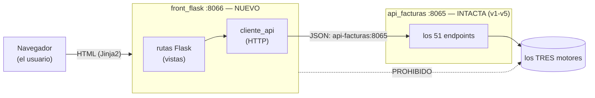

# Especificación — Versión 6: el front NACE (marca + login + producto en el navegador)

> **Versión 6** ([mapa](../0_mapa_versiones.md)) · Rige la
> [constitución](../../1_constitution.md). **Acumulativa:** la API v1–v5
> (tri-motor) NO se toca — la v6 le pone encima el primer cliente visual.
> El front también crece por versiones: v6 producto, v7 todas las
> entidades, v8 la facturación.
>
> | Documento | Contenido |
> |---|---|
> | **2_spec.md** (este) | QUÉ agrega la v6 y sus criterios |
> | [3_plan.md](3_plan.md) | CÓMO: la arquitectura del front (distinta a la del back) |
> | [4_research.md](4_research.md) | Decisiones: sesión vs JWT, Flask, la marca |
> | [5_data_model.md](5_data_model.md) | El front NO tiene datos propios |
> | [6_contracts.md](6_contracts.md) | Las PANTALLAS y sus rutas (el contrato del front) |
> | [7_quickstart.md](7_quickstart.md) | Arranque y smoke test |
> | [8_tasks.md](8_tasks.md) | Orden por fases verificables |
> | [HISTORIAS_DE_USUARIO.md](HISTORIAS_DE_USUARIO.md) | Las historias de la v6 (formato del curso) |
> | [GUIA_IA6.md](GUIA_IA6.md) | Construirla con IA |

---

## 1. Propósito

Estrenar la **capa de presentación** del sistema: una aplicación web
Flask + Jinja2 (`front_flask/`, puerto **8066**) con la identidad del
[Manual de Marca](../../../MANUAL_DE_MARCA.md), que habla con la API por
HTTP y **jamás** con la base de datos. Como la v1 lo hizo con la API, la
v6 construye UNA rebanada completa del front: producto.

**El contexto, dibujado:**

## 2. Alcance

**Incluye:** `front_flask/` en el compose (8066) · la marca (base.html +
marca.css según el manual) · **login/logout con sesión de Flask** sobre
`verificar-contrasena` de la API · páginas de producto: listar, crear,
editar (la pareja PUT/PATCH visible), eliminar · manejo visible de los
errores de la API (422/400/404/500 traducidos a mensajes con la marca).

**NO incluye (deliberado):** las demás entidades y el menú por roles
(v7) · la facturación en pantalla (v8) · JWT (decisión D1 de
[4_research](4_research.md)) · JavaScript de framework (server-side
rendering puro).

## 3. Requisitos funcionales

- **RF1 — Login:** `/login` con la marca; valida contra
  `POST /api/usuario/verificar-contrasena`; 200 → sesión iniciada; 401 →
  "credenciales incorrectas"; 404 → "usuario no existe". Logout en
  `/logout`. TODA otra ruta exige sesión (redirige a /login).
- **RF2 — Listar:** `/productos` muestra la tabla (marca aplicada) con
  los productos de `GET /api/producto`.
- **RF3 — Crear:** `/productos/nuevo` formulario → `POST /api/producto`;
  el 422 de la API se muestra campo a campo.
- **RF4 — Editar:** `/productos/PR001/editar` precarga y envía **PATCH**
  (solo lo diligenciado). La página explica la pareja: reemplazar todo
  sería PUT.
- **RF5 — Eliminar:** botón con confirmación → `DELETE`; el 404 y el 500
  de la API se muestran como mensajes de marca, no como pantallazos.
- **RF6 — La marca:** paleta, tipografías y logosímbolo del manual;
  header Azul Cordillera con el logo en negativo y el ▲ Ámbar.

## 4. Requisitos no funcionales

- **RNF1 — El front NO toca la BD:** ni cadenas de conexión ni SQL en
  `front_flask/` (la frontera del sistema).
- **RNF2 — La API queda INTACTA:** el diff de la v6 no toca
  `api_facturas/` salvo el diagnóstico (`version: "v6"`).
- **RNF3 — La sesión vive en el servidor** (cookie firmada de Flask);
  la clave viaja por variable de entorno en el compose.
- **RNF4 — Sin anticipación:** nada de v7/v8 (otras entidades, roles,
  facturas).

## 5. Criterios de aceptación

1. **Regresión:** `docker compose up -d --build` y el smoke de la API
   ([v5](../v5_mariadb/7_quickstart.md)) pasa igual (solo cambia
   `"version":"v6"`).
2. **Login:** crear un usuario de prueba por la API → entrar en
   `http://localhost:8066/login` → redirige a productos; con clave mala
   → mensaje 401; `/productos` sin sesión → redirige a login.
3. **CRUD desde el navegador:** crear PR050 en el formulario → aparece
   en la tabla → editarle solo el stock (PATCH) → eliminarlo → la tabla
   vuelve a 8. Los datos viajaron por la API (verificable con `curl` a
   la API en paralelo).
4. **Errores vestidos:** crear con stock negativo → los errores del 422
   aparecen junto a los campos; eliminar dos veces → mensaje de "no
   existe" (404), nunca una traza.
5. **La marca:** el header, botones y tabla usan la paleta del manual
   (variables CSS con los nombres del manual en `marca.css`).

## 6. Definición de TERMINADA

Los 5 criterios pasan → commit + tag `v6` → recién entonces se especifica
la v7 (todas las entidades + roles).

## 7. Clarificaciones

> **Qué es esta sección:** el registro de las ambigüedades detectadas ANTES
> de planear, con la respuesta que se acordó y su razón. Es **la compuerta
> 1** del método (ver [SDD_SPECKIT](../../../SDD_SPECKIT.md)): mientras
> quede un `[NECESITA ACLARACIÓN: …]` en los requisitos de arriba, esta
> versión no pasa a la planeación.
>
> Las entradas de abajo se reconstruyeron **al cerrar la versión**, a
> partir de las decisiones que sus propios contratos ya dejaban fijadas.
> De aquí en adelante esta sección se llena **en vivo**, antes del
> `3_plan.md` — que es como debe ser.

| # | La pregunta | La respuesta acordada, con su razón | Dónde quedó |
|---|---|---|---|
| C1 | Anular dos veces la misma factura, ¿qué responde? | **409**: el conflicto es de estado, no de forma ni de existencia. La factura existe (no es 404) y el body está bien (no es 422). | Contrato de anular |

**Cómo se escribe una entrada nueva:** la pregunta tal como se hizo (no
"revisar el borrado", sino "¿físico o lógico?"), la respuesta **con su
razón**, y el documento donde quedó plasmada. Si la respuesta cambia un
requisito, se corrige el requisito allá arriba: esta sección lo registra,
no lo reemplaza.
