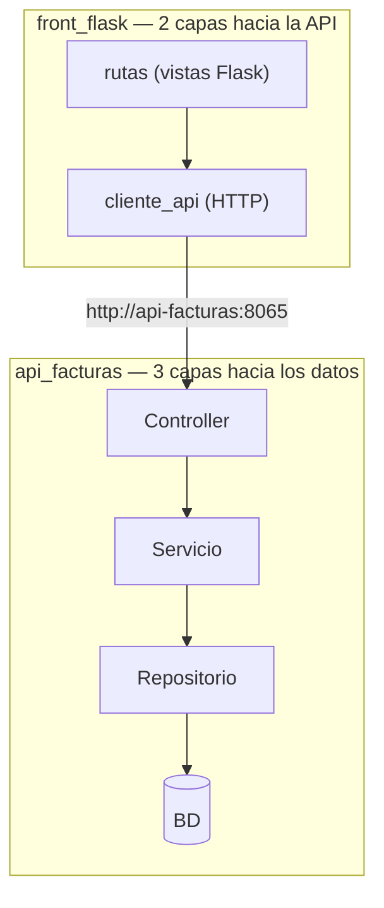
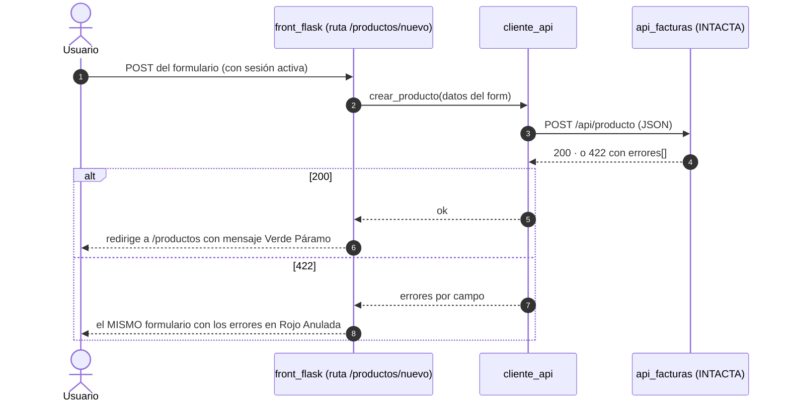

# Plan — Versión 6: la arquitectura del front (que NO es la del back)

> Cómo se construye lo especificado en [2_spec.md](2_spec.md). Stack
> nuevo y deliberadamente distinto: **Python + Flask + Jinja2** (el back
> es C#) — para que se vea que el contrato HTTP es la única frontera que
> importa.

---

## 1. La lección central: DOS arquitecturas distintas en un mismo sistema

| | api_facturas (el back) | front_flask (el front) |
|---|---|---|
| Su trabajo | Decidir y persistir | Mostrar y pedir |
| Sus capas | Controller → Servicio → Repositorio | Ruta (vista) → Cliente API |
| Su "base de datos" | PostgreSQL/SQL Server/MariaDB | **LA API** (no tiene otra fuente) |
| Su estado | La BD | La **sesión** (quién está logueado) |
| Su salida | JSON + códigos HTTP | HTML (Jinja2) + redirecciones |
| Reglas de negocio | TODAS | **NINGUNA** (si el front decide negocio, está mal) |



**Guía de lectura:** el front no tiene servicio ni repositorio porque no
tiene negocio ni datos: su capa honda es un cliente HTTP. El `cliente_api`
es al front lo que el repositorio es al back — la única pieza que sabe
dónde viven los datos.

## 2. Inventario (todo NUEVO; la API intacta salvo el diagnóstico)

```
front_flask/
├── Dockerfile                  ← python:3.12-slim + flask + requests (puerto 8066)
├── requirements.txt            ← flask, requests
├── app.py                      ← el ensamblador: crea la app, registra rutas, lee env
├── cliente_api.py              ← la capa de datos del front: GET/POST/PUT/PATCH/DELETE a la API
├── seguridad.py                ← @login_requerido (si no hay sesión → /login)
├── rutas_autenticacion.py      ← /login (verificar-contrasena) · /logout
├── rutas_productos.py          ← /productos · /nuevo · /{codigo}/editar · /{codigo}/eliminar
├── templates/
│   ├── base.html               ← LA MARCA: header, mensajes flash, bloques
│   ├── login.html
│   └── productos/lista.html · formulario.html
└── static/marca.css            ← la paleta del MANUAL_DE_MARCA como variables CSS
```

**Crecen:** `docker-compose.yml` (★ servicio `front-flask` :8066,
`API_FACTURAS_URL` y `CLAVE_SESION` por entorno) · `api_facturas/Program.cs`
(★ solo `version: "v6"`).

## 3. Las decisiones de diseño aterrizadas

- **Sesión de Flask, no JWT** ([4_research D1](4_research.md)): tras el
  200 de `verificar-contrasena`, `session["usuario"] = email`; la cookie
  va firmada con `CLAVE_SESION` (variable de entorno). `@login_requerido`
  protege todas las rutas menos /login.
- **El cliente API traduce, no decide:** convierte respuestas HTTP en
  `(ok, datos, errores)`; los mensajes 422 de la API se reparten por
  campo en el formulario. Si la API no responde, el front lo dice con la
  marca ("el servicio no está disponible"), sin trazas.
- **PATCH en editar:** el formulario de edición envía SOLO los campos
  diligenciados — la pareja didáctica de la v1, ahora con botones.
- **La marca es CSS puro:** `marca.css` define `--azul-cordillera`,
  `--verde-paramo`, `--ambar-cosecha`, `--rojo-anulada`, `--piedra`,
  `--niebla` (los nombres del manual). El logosímbolo es texto (versalitas
  Georgia) + el ▲ — cero imágenes.

## 4. Secuencia del camino feliz (crear un producto desde el navegador)



## 5. Docker

Servicio `front-flask`: build `./front_flask`, puerto **8066** (estudiante
8166), `API_FACTURAS_URL=http://api-facturas:8065` (el hostname interno),
`depends_on: api-facturas`, `restart: unless-stopped`. El navegador usa
`localhost:8066`; el front usa el DNS interno — nunca localhost.

## 6. Chequeo de constitución

> **La compuerta 2** del método (ver [SDD_SPECKIT](../../../SDD_SPECKIT.md)):
> antes de pasar a `8_tasks.md` se revisa la
> [constitución](../../1_constitution.md) **artículo por artículo**. Si algo
> no cumple, o se corrige el plan, o se enmienda la constitución. Nunca se
> deja pasar "por esta vez".

| Artículo | Cómo lo cumple esta versión |
|---|---|
| **1** — El curso es POR VERSIONES y la especificación manda | El alcance de esta versión es el que declara [2_spec.md](2_spec.md) §2, y **no anticipa** nada de las siguientes. Cierra con commit y tag. |
| **2** — Stack: C# y ASP.NET Core, con el SQL a la vista | C# sobre ASP.NET Core, SQL escrito a mano y **siempre parametrizado**, sin ORM de entidades. Los paquetes son los que el artículo permite (§1 de este plan). |
| **3** — Arquitectura en capas con interfaces, desde el día 1 | Controlador → interfaz de servicio → interfaz de repositorio → repositorio (§3 de este plan). Solo el ensamblador conoce clases concretas. |
| **4** — Un solo comando | `docker compose up -d --build` deja la versión funcionando (§5 de este plan). |
| **5** — La base de datos viene DADA | La BD `bdfacturas` viene dada por los scripts de `db/`; esta versión solo nombra las tablas que su alcance le permite ([5_data_model.md](5_data_model.md)). |
| **6** — Todo en español, comentado para principiantes | Nombres, rutas y mensajes en español, con comentarios línea a línea en el código. |
| **7** — Contratos exactos | [6_contracts.md](6_contracts.md) fija verbos, rutas, códigos y formatos exactos, incluidos los desenlaces de error. |
| **8** — Convenciones fijas | Puertos, rutas, sobre de respuesta y catálogo de errores, tal como los fija el artículo. |

**Complejidad justificada:** si esta versión se desvía de algún artículo,
la desviación va aquí, con la alternativa más simple que se descartó y por
qué no sirvió. Sin desviaciones anotadas, se entiende que no las hay.
