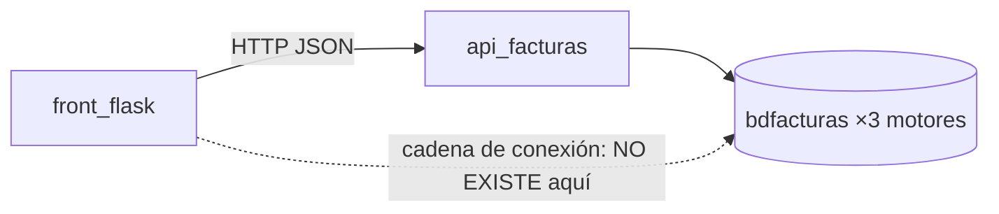

# Modelo de datos — Versión 6: el front NO tiene datos propios

> La lección de este documento es su brevedad: **el front no tiene base de
> datos, ni tablas, ni migraciones.** Su única "fuente de datos" es la API
> (v1–v5), y su único estado propio es la **sesión**.

## 1. Lo que el front LEE y ESCRIBE (siempre vía API)

| Recurso | Endpoints que consume la v6 |
|---|---|
| producto | `GET /api/producto` · `GET/POST/PATCH/DELETE /api/producto/{codigo}` |
| usuario | `POST /api/usuario/verificar-contrasena` (el login) |

## 2. El único estado propio: la sesión

| Clave en `session` | Qué guarda | Cuándo muere |
|---|---|---|
| `usuario` | el email autenticado | logout, o al expirar la cookie |

La cookie viaja **firmada** con `CLAVE_SESION` (variable de entorno): el
navegador la porta, no puede alterarla, y el servidor no guarda nada en
disco.

## 3. La frontera (RNF1, dibujada)

Si en `front_flask/` aparece una cadena de conexión o un `SELECT`, la
arquitectura del sistema se rompió — ese es el criterio de revisión más
fácil de verificar de toda la v6.
