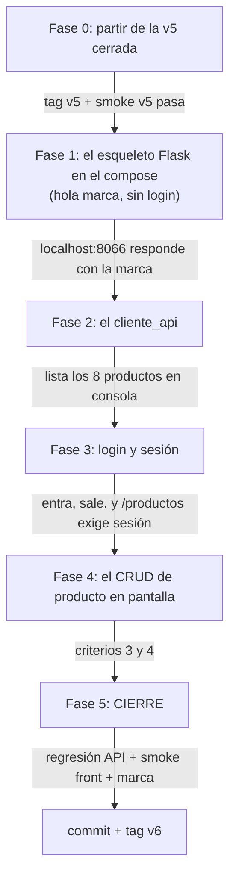

# Tareas — Versión 6: el front, por fases verificables

**El orden con sus compuertas:**

## Fase 0 — Punto de partida
- [ ] `git tag` muestra v5; smoke v5 OK.

## Fase 1 — El esqueleto con la marca
- [ ] `front_flask/` con Dockerfile, `app.py` mínimo, `base.html` y
      `marca.css` (paleta del [manual](../../../MANUAL_DE_MARCA.md)).
- [ ] Servicio `front-flask` (:8066) en el compose, con
      `API_FACTURAS_URL` y `CLAVE_SESION` por entorno.

**Verificar:** `http://localhost:8066` muestra el header Azul Cordillera
con el logosímbolo.

## Fase 2 — La capa de datos del front
- [ ] `cliente_api.py`: get/post/patch/delete contra la API, devolviendo
      `(ok, datos, errores)` — y el caso "API caída" contemplado.

**Verificar:** una ruta temporal (o consola) lista los 8 productos.

## Fase 3 — Autenticación
- [ ] `rutas_autenticacion.py` (login/logout) + `seguridad.py`
      (`@login_requerido`).

**Verificar (criterio 2):** entra con el usuario de prueba; sin sesión,
todo redirige a /login.

## Fase 4 — Producto en pantalla
- [ ] `rutas_productos.py` + `lista.html` + `formulario.html` (crear y
      editar comparten plantilla; editar envía PATCH con lo diligenciado).
- [ ] Los errores de la API vestidos con la marca (422 por campo).

**Verificar (criterios 3 y 4):** el ciclo PR050 completo del
[quickstart](7_quickstart.md) §3b.

## Fase 5 — Cierre
- [ ] Regresión de la API (v5) + smoke del front + revisión de marca
      (criterio 5) → `Program.cs` a `"v6"` → commit + tag `v6`.
