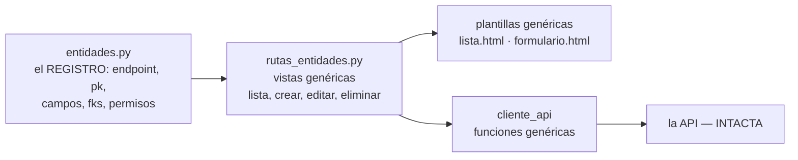

# Plan — Versión 7: el registro de metadatos y las rutas genéricas

## 1. La idea, dibujada

**Ojo:** esto NO es la API genérica descartada — el registro vive en el
FRONT y consume los endpoints por-entidad de siempre.

## 2. Inventario
**Nuevos:** `entidades.py` · `rutas_entidades.py` (blueprint) ·
`templates/entidades/{lista,formulario}.html`.
**Crecen:** `cliente_api.py` (genéricas + es_administrador) · `app.py`
(blueprint, es_admin al entrar, menú por contexto) · `base.html` (menú
desde el registro) · `Program.cs` (version v7).

## 3. Decisiones aterrizadas
- El rol se consulta UNA vez al entrar (`rol-usuario/usuario/{email}`,
  rol 1 = admin) y vive en la sesión.
- FK = select con etiqueta "pk — nombre" (RF2).
- Puentes: ruta especial `/e/<clave>/<a>/<b>/eliminar` — el DELETE de
  pareja exacta de la v3, ahora con botón.

## 4. Chequeo de constitución

> **La compuerta 2** del método (ver [SDD_SPECKIT](../../../SDD_SPECKIT.md)):
> antes de pasar a `8_tasks.md` se revisa la
> [constitución](../../1_constitution.md) **artículo por artículo**. Si algo
> no cumple, o se corrige el plan, o se enmienda la constitución. Nunca se
> deja pasar "por esta vez".

| Artículo | Cómo lo cumple esta versión |
|---|---|
| **1** — El curso es POR VERSIONES y la especificación manda | El alcance de esta versión es el que declara [2_spec.md](2_spec.md) §2, y **no anticipa** nada de las siguientes. Cierra con commit y tag. |
| **2** — Stack: C# y ASP.NET Core, con el SQL a la vista | C# sobre ASP.NET Core, SQL escrito a mano y **siempre parametrizado**, sin ORM de entidades. Los paquetes son los que el artículo permite (§1 de este plan). |
| **3** — Arquitectura en capas con interfaces, desde el día 1 | Controlador → interfaz de servicio → interfaz de repositorio → repositorio (§3 de este plan). Solo el ensamblador conoce clases concretas. |
| **4** — Un solo comando | `docker compose up -d --build` deja la versión funcionando (§5 de este plan). |
| **5** — La base de datos viene DADA | La BD `bdfacturas` viene dada por los scripts de `db/`; esta versión solo nombra las tablas que su alcance le permite ([5_data_model.md](5_data_model.md)). |
| **6** — Todo en español, comentado para principiantes | Nombres, rutas y mensajes en español, con comentarios línea a línea en el código. |
| **7** — Contratos exactos | [6_contracts.md](6_contracts.md) fija verbos, rutas, códigos y formatos exactos, incluidos los desenlaces de error. |
| **8** — Convenciones fijas | Puertos, rutas, sobre de respuesta y catálogo de errores, tal como los fija el artículo. |

**Complejidad justificada:** si esta versión se desvía de algún artículo,
la desviación va aquí, con la alternativa más simple que se descartó y por
qué no sirvió. Sin desviaciones anotadas, se entiende que no las hay.
