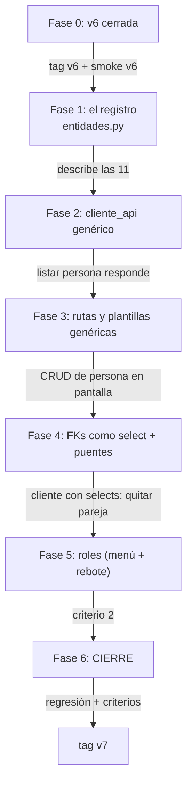

# Tareas — Versión 7

```mermaid
flowchart TD
    F0["Fase 0: v6 cerrada"] -->|"tag v6 + smoke v6"| F1["Fase 1: el registro<br/>entidades.py"]
    F1 -->|"describe las 11"| F2["Fase 2: cliente_api genérico"]
    F2 -->|"listar persona responde"| F3["Fase 3: rutas y plantillas genéricas"]
    F3 -->|"CRUD de persona en pantalla"| F4["Fase 4: FKs como select + puentes"]
    F4 -->|"cliente con selects; quitar pareja"| F5["Fase 5: roles (menú + rebote)"]
    F5 -->|"criterio 2"| F6["Fase 6: CIERRE"] -->|"regresión + criterios"| TAG["tag v7"]
```

No se avanza con una fase en rojo (el Verificar va en cada flecha).
