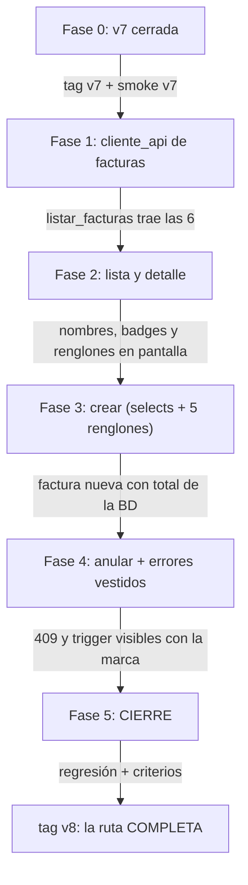

# Tareas — Versión 8

```mermaid
flowchart TD
    F0["Fase 0: v7 cerrada"] -->|"tag v7 + smoke v7"| F1["Fase 1: cliente_api de facturas"]
    F1 -->|"listar_facturas trae las 6"| F2["Fase 2: lista y detalle"]
    F2 -->|"nombres, badges y renglones en pantalla"| F3["Fase 3: crear (selects + 5 renglones)"]
    F3 -->|"factura nueva con total de la BD"| F4["Fase 4: anular + errores vestidos"]
    F4 -->|"409 y trigger visibles con la marca"| F5["Fase 5: CIERRE"] -->|"regresión + criterios"| TAG["tag v8: la ruta COMPLETA"]
```
